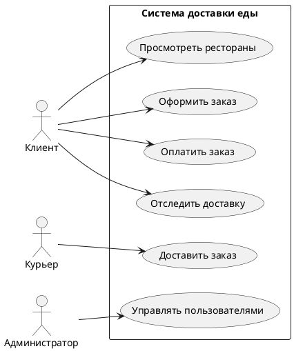
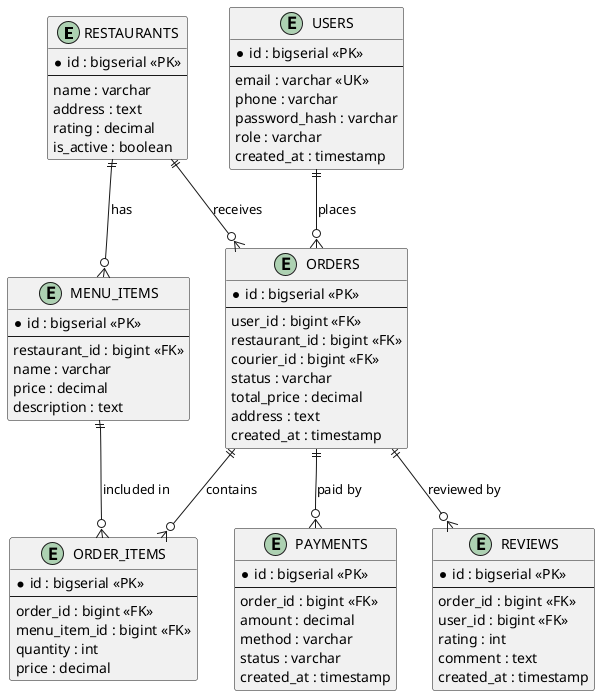

# FoodDelivery — Спецификация требований к ПО (SRS)

## 1. Введение

### 1.1. Назначение

Настоящий документ описывает функциональные и нефункциональные требования к информационной системе доставки еды «FoodDelivery». Документ предназначен для:

- **заказчика** — для согласования объёма работ и приёмки;
- **команды разработки** — как основа для проектирования архитектуры (HLD/LLD), БД и API;
- **тестировщиков** — как база для составления тест-планов;
- **архитектора** — для последующей декомпозиции на микросервисы (раздел 4) и проектирования БД (раздел 6).

### 1.2. Область действия

Система «FoodDelivery» — это веб- и мобильное приложение (B2C), позволяющее:

- пользователям просматривать рестораны и меню, оформлять и оплачивать заказы, отслеживать доставку в реальном времени;
- ресторанам управлять меню, принимать и обрабатывать заказы;
- курьерам получать заказы и отмечать этапы доставки;
- администраторам управлять пользователями, ресторанами, курьерами и аналитикой.

Система не включает в себя собственную логистическую инфраструктуру и не занимается производством еды — она выступает посредником между клиентом, рестораном и курьером.

### 1.3. Определения и сокращения

**Таблица 1 – Глоссарий терминов**

| Термин | Определение |
|---|---|
| SRS | Software Requirements Specification — спецификация требований к ПО |
| FR | Functional Requirement — функциональное требование |
| NFR | Non-Functional Requirement — нефункциональное требование |
| DAU | Daily Active Users — активные пользователи в день |
| RPS | Requests Per Second — запросов в секунду |
| API | Application Programming Interface |
| СУБД | Система управления базами данных |
| MoSCoW | Must have, Should have, Could have, Won't have — метод приоритизации |
| ETA | Estimated Time of Arrival — ожидаемое время доставки |
| PCI DSS | Payment Card Industry Data Security Standard |

---

## 2. Общее описание

### 2.1. Перспектива продукта

Система доставки еды является частью более широкой экосистемы, включающей:

- внешние платёжные шлюзы — для проведения онлайн-оплаты;
- картографические сервисы — для расчёта маршрута и ETA;
- SMS/Push-провайдеры — для уведомлений;
- сервис аутентификации — OAuth 2.0 / JWT.

Система должна предоставлять открытый REST API для интеграции с партнёрскими приложениями ресторанов.

### 2.2. Функции продукта

Высокоуровневый список функций:

1. Регистрация и аутентификация пользователей (клиенты, рестораны, курьеры, админы).
2. Просмотр каталога ресторанов с фильтрацией по кухне, рейтингу, времени доставки.
3. Просмотр меню и добавление блюд в корзину.
4. Оформление заказа с выбором адреса и способа оплаты.
5. Онлайн-оплата или оплата при получении.
6. Передача заказа ресторану и подтверждение.
7. Назначение курьера и отслеживание заказа на карте.
8. Уведомления о статусах заказа (push/SMS).
9. История заказов и повторный заказ.
10. Оценка и отзывы о ресторане и курьере.
11. Панель администратора: управление ресторанами, курьерами, акциями, аналитика.

### 2.3. Характеристики пользователей

**Таблица 2 – Характеристики пользователей**

| Роль | Описание | Ключевые потребности |
|---|---|---|
| Клиент | Пользователь, заказывающий еду | Быстрый поиск, прозрачные цены, отслеживание |
| Ресторан | Партнёр, готовящий еду | Управление меню, приём заказов, статистика |
| Курьер | Исполнитель доставки | Получение заказов, навигация, отметка статусов |
| Администратор | Сотрудник сервиса | Модерация, поддержка, аналитика |

### 2.4. Ограничения

- **Технические:** система должна работать в браузерах Chrome/Firefox/Safari последних версий и на iOS/Android; интеграция с внешними платёжными и картографическими API.
- **Бюджетные:** MVP должен быть реализован в рамках ограниченного бюджета — приоритет отдаётся функциям Must have.
- **Временные:** MVP — 3 месяца; полноценный релиз — 6 месяцев.
- **Правовые:** соответствие 152-ФЗ «О персональных данных», PCI DSS для платежей.

---

## 3. Специфические требования

### 3.1. Функциональные требования

**Таблица 3 – Функциональные требования**

| ID | Требование | Приоритет (MoSCoW) |
|---|---|---|
| R-001 | Система должна позволять пользователю зарегистрироваться по email/телефону и войти в систему | Must |
| R-002 | Система должна отображать список ресторанов с фильтрацией по кухне, рейтингу и времени доставки | Must |
| FR-003 | Система должна отображать меню выбранного ресторана с ценами и описанием блюд | Must |
| FR-004 | Система должна позволять добавлять блюда в корзину и изменять их количество | Must |
| FR-005 | Система должна позволять оформлять заказ с указанием адреса доставки и способа оплаты | Must |
| FR-006 | Система должна интегрироваться с платёжным шлюзом для онлайн-оплаты | Must |
| FR-007 | Система должна передавать заказ в панель ресторана и позволять подтверждать/отклонять его | Must |
| FR-008 | Система должна назначать курьера на заказ (автоматически или вручную) | Must |
| FR-009 | Система должна отображать статус заказа в реальном времени (принят, готовится, в пути, доставлен) | Must |
| FR-010 | Система должна отправлять push/SMS-уведомления о смене статуса заказа | Should |
| FR-011 | Система должна позволять клиенту оценить ресторан и курьера после доставки | Should |
| FR-012 | Система должна хранить историю заказов пользователя и позволять повторный заказ | Should |
| FR-013 | Система должна предоставлять администратору панель управления ресторанами и курьерами | Should |
| FR-014 | Система должна поддерживать промокоды и акции | Could |
| FR-015 | Система должна строить аналитические отчёты (заказы, выручка, средний чек) | Could |

### 3.2. Нефункциональные требования

**Таблица 4 – Нефункциональные требования**

| ID | Требование | Метрика |
|---|---|---|
| NFR-001 | Время отклика API при просмотре меню | < 300 мс (95-й перцентиль) |
| NFR-002 | Время оформления заказа | < 1 с |
| NFR-003 | Доступность системы (uptime) | 99.9% |
| NFR-004 | Поддержка одновременных пользователей | до 100 000 DAU, 500 RPS на чтение |
| NFR-005 | Горизонтальное масштабирование сервисов | до 10 узлов |
| NFR-006 | Шифрование персональных данных и платежей | AES-256, TLS 1.3 |
| NFR-007 | Соответствие PCI DSS для платежей | обязательное |
| NFR-008 | Восстановление после сбоя (RTO/RPO) | RTO ≤ 15 мин, RPO ≤ 5 мин |
| NFR-009 | Мобильное приложение | iOS 14+, Android 10+ |
| NFR-010 | Локализация | русский, английский (Could) |

---

## 4. Приложения

### 4.1. Use Case диаграмма (PlantUML)

**Актёры и варианты использования:**

| Актёр | Use Case |
|---|---|
| Клиент | Просмотреть рестораны |
| Клиент | Оформить заказ |
| Клиент | Оплатить заказ |
| Клиент | Отследить доставку |
| Курьер | Доставить заказ |
| Администратор | Управлять пользователями |

### 4.2. Основные сущности (ER-диаграмма)

**Сущности и атрибуты:**

**RESTAURANTS**
- id (bigserial, PK)
- name (varchar)
- address (text)
- rating (decimal)
- is_active (boolean)

**USERS**
- id (bigserial, PK)
- email (varchar, UK)
- phone (varchar)
- password_hash (varchar)
- role (varchar)
- created_at (timestamp)

**MENU_ITEMS**
- id (bigserial, PK)
- restaurant_id (bigint, FK)
- name (varchar)
- price (decimal)
- description (text)

**ORDERS**
- id (bigserial, PK)
- user_id (bigint, FK)
- restaurant_id (bigint, FK)
- courier_id (bigint, FK)
- status (varchar)
- total_price (decimal)
- address (text)
- created_at (timestamp)

**ORDER_ITEMS**
- id (bigserial, PK)
- order_id (bigint, FK)
- menu_item_id (bigint, FK)
- quantity (int)
- price (decimal)

**PAYMENTS**
- id (bigserial, PK)
- order_id (bigint, FK)
- amount (decimal)
- method (varchar)
- status (varchar)
- created_at (timestamp)

**REVIEWS**
- id (bigserial, PK)
- order_id (bigint, FK)
- user_id (bigint, FK)
- rating (int)
- comment (text)
- created_at (timestamp)

**Связи:**
- RESTAURANTS → MENU_ITEMS: `has` (1:N)
- RESTAURANTS → ORDERS: `receives` (1:N)
- USERS → ORDERS: `places` (1:N)
- MENU_ITEMS → ORDER_ITEMS: `included in` (1:N)
- ORDERS → ORDER_ITEMS: `contains` (1:N)
- ORDERS → PAYMENTS: `paid by` (1:N)
- ORDERS → REVIEWS: `reviewed by` (1:N)

### 4.3. Фрагмент API-спецификации

**Таблица 5 – API-спецификации**

| Endpoint | Метод | Описание |
|---|---|---|
| `/api/v1/restaurants` | GET | Список ресторанов с фильтрами |
| `/api/v1/restaurants/{id}/menu` | GET | Меню ресторана |
| `/api/v1/cart` | POST | Добавить блюдо в корзину |
| `/api/v1/orders` | POST | Создать заказ |
| `/api/v1/orders/{id}` | GET | Статус заказа |
| `/api/v1/orders/{id}/pay` | POST | Оплатить заказ |
| `/api/v1/orders/{id}/status` | PATCH | Обновить статус (ресторан/курьер) |
| `/api/v1/reviews` | POST | Оставить отзыв |