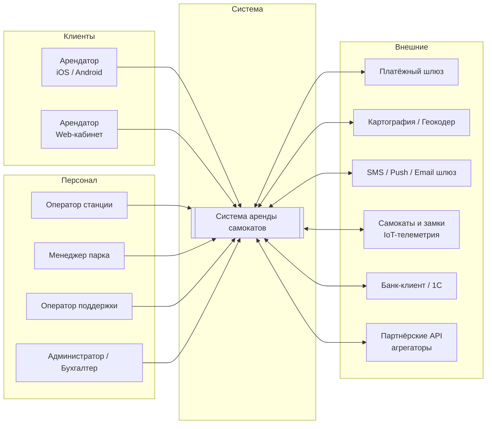
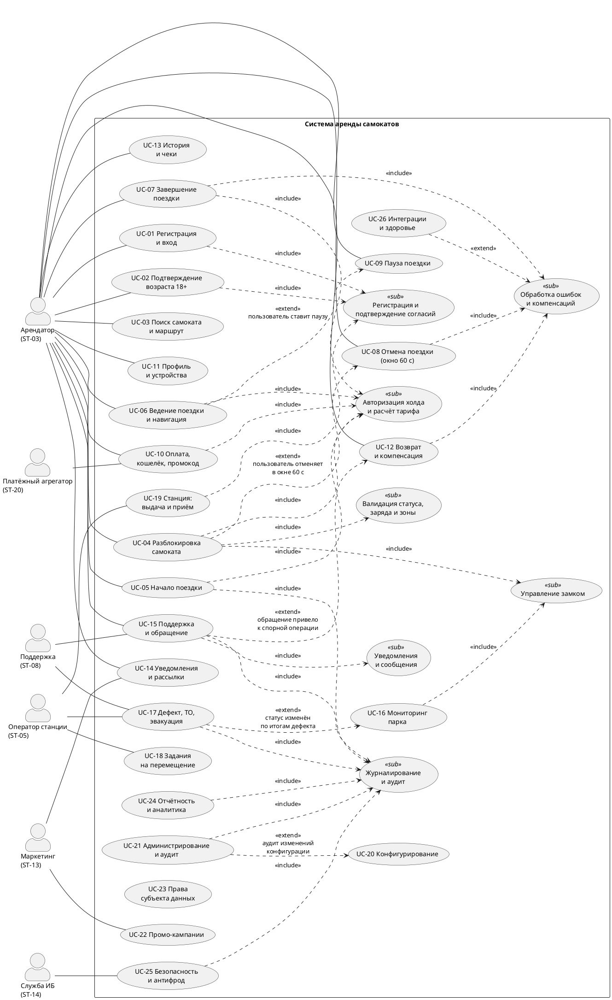
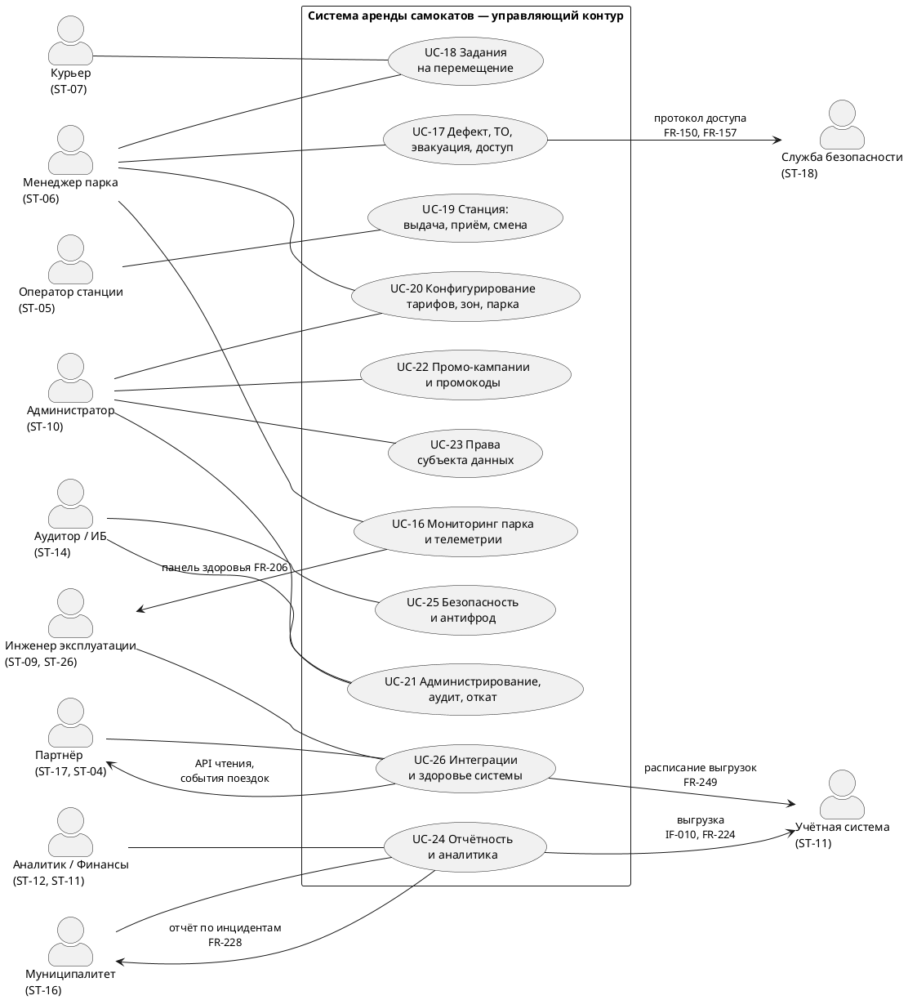
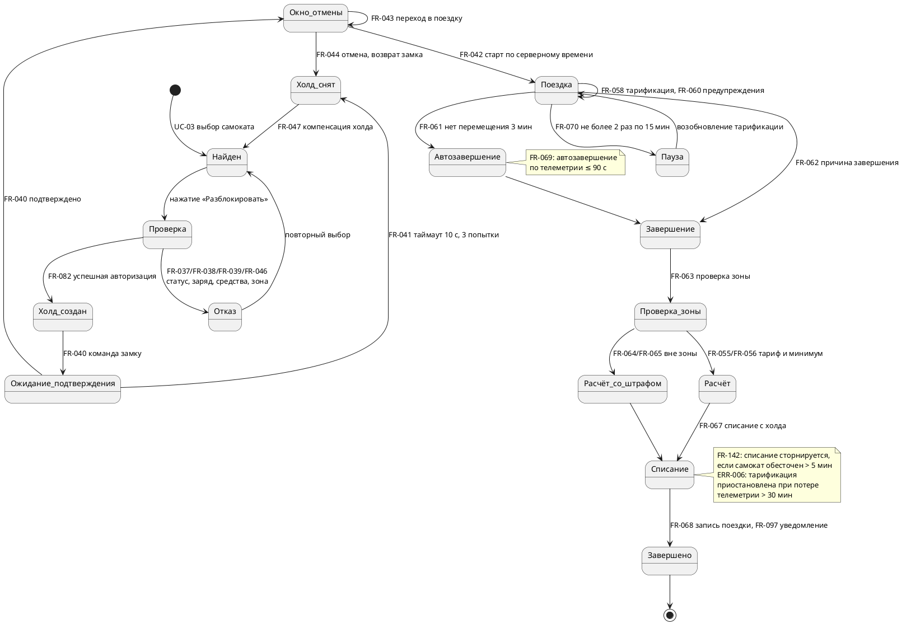

# Программные требования к системе (SRS)

## «Система аренды самокатов»

| Поле | Значение |
| --- | --- |
| Проект | Scooter Rental Platform |
| Документ | Software Requirements Specification (SRS) |
| Стандарт | IEEE Std 830-1998 (структура), ISO/IEC/IEEE 29148:2018 (практики написания) |
| Версия | 1.0 |
| Статус | На согласовании стейкхолдерам |
| Дата | 03.10.2026 |
| Автор | А. А. Кочетков, аналитик группы разработки |
| Рецензент | М. В. Дворянчиков (технический лидер) |

---

# 1. Введение

## 1.1 Назначение документа

Настоящий документ определяет полный, однозначный и проверяемый набор требований к программной системе аренды электрических самокатов (далее — **Система**). Документ разработан в соответствии с IEEE Std 830-1998.

Документ предназначен для:

- **Разработчиков** — для проектирования, реализации и оценки трудоёмкости.
- **Тестировщиков (QA)** — для разработки тест-плана, тест-кейсов и критериев приёмки.
- **Архитектора** — для определения архитектурных ограничений и качественных атрибутов.
- **Менеджера продукта** — для приоритизации бэклога и планирования релизов.
- **Заказчика и стейкхолдеров** — для проверки, что потребности бизнеса отражены полно и корректно.
- **Комплаенс и юристов** — для демонстрации соответствия требованиям законодательства о персональных данных и платёжных данных.

Документ **не** является планом разработки, дизайном архитектуры, техническим заданием на разработку или описанием UI-дизайна. Он определяет **что** должна делать Система и **какими измеримыми критериями** оценивается её корректность.

## 1.2 Область действия

### 1.2.1 В область действия входит

| № | Подсистема / функциональный блок | Описание |
| --- | --- | --- |
| 1 | Мобильное приложение арендатора | iOS и Android: поиск, разблокировка, оплата, завершение поездки |
| 2 | Личный кабинет арендатора (Web) | История поездок, чеки, карты, промокоды, удаление аккаунта, экспорт данных |
| 3 | Панель управления оператора (Web) | Станции, самокаты, инвентаризация, инциденты, пользователи, роли |
| 4 | Панель администратора (Web) | Тарифы, зоны, промо, разблокировки, конфигурация, аудит |
| 5 | Бэкенд и API | Бизнес-логика, тарификация, расчёт стоимости, интеграции |
| 6 | Управление парком самокатов | Телеметрия, балансировка, статусы, техобслуживание, списание |
| 7 | Терминал станции | Выдача/приём самоката на станции, привязка к слоту, self-service |
| 8 | Интеграции | Платёжный шлюз, картография, СМС/Push, банк-клиент/1С, партнёрские API, агрегаторы такси |
| 9 | Уведомления и поддержка | Push, СМС, email, in-app чат, база знаний |
| 10 | Аналитика и отчётность | Дашборды, выгрузки, отчёты для бухгалтерии и городских властей |

### 1.2.2 В область действия **не** входит

Данные пункты сознательно исключены. Их случайная реализация — типичная ошибка «расплывшегося» SRS, поэтому границы зафиксированы явно.

| № | Исключённый пункт | Обоснование |
| --- | --- | --- |
| О1 | Продажа и обслуживание автомобилей, каршеринга, велосипедов | Другая бизнес-модель и оборудование; допускает расширение слоя оборудования в R2 |
| О2 | Собственный e-commerce магазина запчастей | Нет бизнес-ценности для аренды; при наличии — отдельная система |
| О3 | Криптовалютные платежи | Регуляторные и комплаенс-риски, не входит в лицензированную схему |
| О4 | Регистрация юридических лиц и B2B-тарифы по умолчанию | В R1 поддерживается только физлицо; корпоративный тариф — Could |
| О5 | Собственная операционная система устройства самоката и прошивка | Устройство — закупленное изделие с закрытой прошивкой; в системе реализуется телеметрия и управление |
| О6 | Мобильная версия панели оператора | Панели — desktop/планшет; отдельная мобильная версия — Could |
| О7 | Реализация платёжного шлюза и хранения данных карт | Только интеграция с сертифицированным провайдером (PCI DSS SAQ-A) |
| О8 | On-premise развёртывание для клиента | Модель — облачная SaaS; on-premise клиента вне рамок |
| О9 | Автономное вождение (self-driving) самокатов | Технологически и юридически не реализуемо в горизонте проекта |

## 1.3 Определения, термины и сокращения

| Термин / сокращение | Определение |
| --- | --- |
| Арендатор (пользователь) | Физическое лицо старше 18 лет, использующее Систему для аренды самоката |
| Самокат | Электрический самокат, оснащённый замком, GNSS-модулем, модулем LTE-M/NB-IoT, датчиками |
| Замок | Механическое устройство, фиксирующее самокат; управляется через BLE и удалённо по GSM/LTE |
| Станция | Специализированная точка выдачи с фиксированными слотами для самокатов |
| Слот | Конкретное посадочное место на станции |
| Парк (fleet) | Совокупность всех самокатов, принадлежащих оператору |
| Тариф | Правило начисления стоимости: базовая плата, минимальная длительность, шаг времени, таймаут |
| Зона | Географическая область с особым правилом (парковка запрещена, обязательная парковка, иной тариф) |
| Таймаут (grace period) | Бесплатный период после завершения поездки, в течение которого можно завершить поездку без дополнительных штрафов |
| Lock-free / оставлен вне зоны | Самокат, завершённый вне допустимой зоны парковки |
| Пробная поездка | Короткая поездка до 60 секунд без тарификации (окно отмены) |
| Кошелёк | Внутренний баланс пользователя для оплаты поездок |
| Холд (hold) | Авторизационное удержание средств на карте без фактического списания |
| ПДн | Персональные данные (152-ФЗ, GDPR) |
| KYC | Know Your Customer — идентификация и проверка клиента (в объёме возрастной проверки) |
| MoSCoW | Метод приоритизации: Must / Should / Could / Won’t |
| Criticality (Crit) | Бизнес-критичность требования: 1 — блокирует запуск, 2 — критично, 3 — важно, 4 — желательно |
| SLA | Service Level Agreement — согласованный уровень качества сервиса |
| RPO / RTO | Recovery Point Objective / Recovery Time Objective — допустимая потеря данных / время восстановления |
| p95 / p99 | 95-й / 99-й перцентиль времени отклика |
| WCAG | Web Content Accessibility Guidelines — рекомендации по доступности интерфейсов |

## 1.4 Ссылки

1. IEEE Std 830-1998. IEEE Recommended Practice for Software Requirements Specifications.
2. ISO/IEC/IEEE 29148:2018. Systems and software engineering — Life cycle processes — Requirements engineering.
3. ISO/IEC 25010:2011. Systems and software quality requirements and evaluation (SQuaRE) — модель качества.
4. ГОСТ Р ИСО/МЭК 25010-2015. Требования и оценка качества программных средств.
5. ГОСТ 19.201-78. Единая система программной документации. Программа и методика испытаний.
6. Федеральный закон от 27.07.2006 № 152-ФЗ «О персональных данных».
7. Федеральный закон от 06.04.2011 № 63-ФЗ «Об электронной подписи».
8. PCI DSS v3.2.1 — стандарт безопасности индустрии платёжных карт.
9. Правила дорожного движения РФ: требования к средствам индивидуальной мобильности (СИМ).
10. ГОСТ Р 50571 (серия) — обеспечение доступности для МГН.
11. Внутренние документы компании: `CONOPS-A «Аренда самокатов» v1`, `SWT-1 интервью с оператором станции`, `Политика обработки ПДн v3`.

## 1.5 Обзор структуры документа

| Раздел | Содержание | Соответствие IEEE 830 |
| --- | --- | --- |
| 1 | Введение: назначение, область, термины, ссылки | §1 Introduction |
| 2 | Общее описание: перспектива, функции, пользователи и стейкхолдеры, ограничения, допущения | §2 Overall Description |
| 3 | Специфические требования: интерфейсы, функциональные требования, варианты использования, производительность, хранилище, безопасность и др. | §3 Specific Requirements |
| 4 | Матрица трассировки «требование → вариант использования → тест» | §3.7 Sample Use Cases (расширение) |
| 5 | Контроль качества документа и защита от типичных ошибок | Проектное дополнение |
| 6 | Открытые вопросы и решения, принятые по ходу согласования | Проектное дополнение |
| Прил. А | Глоссарий бизнес-терминов | — |
| Прил. Б | Реестр отклонённых расплывчатых формулировок | — |
| Прил. В | Диаграммы (Use Case, контекст, состояния поездки) | — |

## 1.6 Соглашения по требованиям (как читать документ)

Этот подраздел существует, чтобы устранить неоднозначность — одну из главных причин дефектов в требованиях.

**1. Ключевые слова.** Используются в оригинальном виде согласно RFC 2119/RFC 8179:

- **MUST / MUST NOT / SHALL / SHALL NOT** — обязательное требование. Нарушение = дефект, блокирующий релиз.
- **SHOULD / SHOULD NOT** — рекомендуемое требование. Нарушение допускается только с письменным обоснованием в разделе 6 (журнал решений).
- **MAY** — необязательное требование (свода проектирования).
- Требования без ключевого слова (описания, контекст) **не являются** нормативными.

**2. Идентификаторы.**

| Префикс | Область |
| --- | --- |
| `FR-xxx` | Функциональные требования |
| `IF-xxx` | Требования к внешним интерфейсам |
| `UI-xxx` | Требования к пользовательскому интерфейсу |
| `PF-xxx` | Требования к производительности и масштабируемости |
| `REL-xxx` | Требования к надёжности и корректности |
| `DR-xxx` | Требования к резервному копированию и восстановлению |
| `CAP-xxx` | Требования к ёмкости и объёму данных |
| `PORT-xxx` | Требования к портабельности и совместимости |
| `ST-xxx` | Требования к хранилищу данных |
| `HW-xxx` | Требования к аппаратному обеспечению |
| `SW-xxx` | Требования к программной среде |
| `NET-xxx` | Требования к коммуникациям |
| `SEC-xxx` | Требования к безопасности и защите ПДн |
| `AV-xxx` | Требования к доступности, надёжности и восстановлению |
| `AUD-xxx` | Требования к аудиту, журналированию, наблюдаемости |
| `USX-xxx` | Требования к юзабилити |
| `A11Y-xxx` | Требования к доступности для МГН |
| `LOC-xxx` | Требования к локализации |
| `OPS-xxx` | Требования к эксплуатации и сопровождению |
| `REG-xxx` | Нормативные и юридические ограничения |
| `CON-xxx` | Технологические и проектные ограничения |
| `ERR-xxx` | Требования к обработке ошибок |
| `ASM-xxx` | Допущения |
| `RISK-xxx` | Риски проекта |
| `ST-xx` (двузначный) | **Стейкхолдер** (раздел 2.3.2). Не путать с `ST-xxx` — требованиями к хранилищу |
| `UC-xx` | Вариант использования |
| `QA-xx` | Открытый вопрос |

**3. Приоритизация** — метод **MoSCoW**, обязательна для каждого требования:

| Приоритет | Значение | Правило принятия в релиз |
| --- | --- | --- |
| **M** (Must) | Без этого система не выполняет назначение либо не может быть запущена в эксплуатацию | Обязательно, первый релиз |
| **S** (Should) | Важно для ценности и снижения риска, но есть обходной путь | Обязательно, если не зафиксировано письменное исключение |
| **C** (Could) | Полезно, но не влияет на ключевые сценарии | Включается при наличии ресурса |
| **W** (Won’t) | Сознательно не реализуется в текущем периоде | Не планируется |

Дополнительно указывается **Crit (1–4)** — бизнес-влияние: 1 — блокирует запуск (регуляторное или безопасность), 2 — критично для выручки/удержания, 3 — улучшает эффективность, 4 — косметика/удобство.

**4. Правила написания требования (самопроверка автора).**

Каждое требование в документе проверено по правилу **SMART-RA**:

| Проверка | Вопрос к автору требования |
| --- | --- |
| **S** — Single | Требование выражает одну обязанность, а не список? |
| **M** — Measurable | Есть измеримый критерий (число, время, процент, состояние)? |
| **A** — Atomic | Требование можно независимо реализовать и протестировать? |
| **R** — Realistic | Требование реализуемо существующими технологиями? |
| **T** — Traceable | Указаны источник и вариант использования? |
| **A** — Agreed | Требование согласовано со стейкхолдером-источником? |

Требования, не прошедшие проверку, в документ **не попадают** — они выносятся в раздел 6 как открытые вопросы.

---

# 2. Общее описание

## 2.1 Перспектива продукта

Система представляет собой **платформу микромобильности (micromobility)**: она соединяет владельцев парка самокатов и арендаторов через приложение, управляет жизненным циклом самокатов и рассчитывает стоимость поездок.

### 2.1.1 Тип системы и архитектурный стиль

- Категория: **SaaS-платформа с элементами PaaS** для управления парком.
- Стиль: клиент-серверная трёхуровневая система, микросервисная архитектура на границе доменов, событийно-ориентированная интеграция (очереди событий) для телеметрии и уведомлений.
- Система включает 4 контура: клиентские приложения, панели управления, бэкенд, контур устройств (IoT).

### 2.1.2 Контекстная диаграмма (уровень 0)



### 2.1.3 Назначение и роль

Система является **ядром бизнес-процесса**: без неё невозможно ни выдать самокат, ни начислить корректную стоимость, ни сформировать отчётность. Отказ компонента тарификации останавливает выдачу самокатов (см. `AV-001`).

### 2.1.4 Доменные границы

| Домен | Ответственность | Владелец домена |
| --- | --- | --- |
| Аренда (Ride) | Поездка, тарификация, расчёт стоимости | Владелец продукта |
| Аккаунт и доступ (Identity) | Регистрация, аутентификация, роли, профиль | Ведущий QA / Архитектор |
| Парк (Fleet) | Самокаты, телеметрия, статусы, техобслуживание | Менеджер парка |
| Логистика (Logistics) | Балансировка, перемещения, склад, станции | Менеджер парка |
| Оплата (Payment) | Платежи, кошелёк, холды, возвраты, промо | Бухгалтерия / Финансы |
| Поддержка (Support) | Обращения, споры, обращения к самокату | Оператор поддержки |
| Аналитика (Analytics) | Отчёты, витрины данных, выгрузки | Аналитик данных |
| Нотификация (Notification) | Push, СМС, email, шаблоны | Маркетинг |
| Интеграции | Платёжный шлюз, карты, партнёры | Архитектор / DevOps |

## 2.2 Функции продукта (сводное описание)

Ключевые функции с указанием вариантов использования, реализующих их, и приоритета.

| № | Функция | Описание | Связанные UC | Приоритет |
| --- | --- | --- | --- | --- |
| Ф1 | Онбординг и идентификация | Регистрация, аутентификация, возрастная проверка, профиль, согласия, удаление аккаунта | UC-01, UC-02, UC-11, UC-23 | M |
| Ф2 | Поиск и навигация | Карта, поиск ближайших самокатов, фильтры, маршрут до самоката, зоны парковки | UC-03 | M |
| Ф3 | Разблокировка и старт | Сканирование QR, проверка баланса/зоны/заряда, отмена в окне отмены | UC-04, UC-08 | M |
| Ф4 | Поездка и тарификация | Старт поездки, live-трекинг, контроль зон/таймаута, завершение, парковка | UC-05, UC-06, UC-07, UC-09 | M |
| Ф5 | Оплата и кошелёк | Карта, СБП, кошелёк, холд, автосписание, возвраты, штрафы, промокоды | UC-10, UC-12 | M |
| Ф6 | Уведомления и поддержка | Push/СМС/email, in-app чат, база знаний, оформление обращения | UC-14, UC-15 | S |
| Ф7 | Управление парком | Телеметрия, статусы, заряд, дефекты, техобслуживание, списание, физический доступ | UC-16, UC-17 | M |
| Ф8 | Логистика и станции | Балансировка парка, задания курьерам, приём/выдача на станции, инвентаризация | UC-18, UC-19 | M |
| Ф9 | Администрирование | Пользователи, роли, тарифы, зоны, промо, конфигурация, аудит | UC-20, UC-21, UC-22 | S |
| Ф10 | Аналитика и отчётность | Дашборд KPI, отчёты по поездкам/выручке/парку, выгрузка для бухгалтерии, отчёт для муниципалитета | UC-13, UC-24 | M |
| Ф11 | Безопасность и фрод-мониторинг | Антифрод-правила, лимиты, блокировки, аудит доступа | UC-25 | S |
| Ф12 | Интеграции | Платёжный шлюз, картография, СМС/Push, партнёрские API, выгрузка в учётную систему | UC-26 | M |

## 2.3 Характеристики пользователей и идентификация стейкхолдеров

### 2.3.1 Методика идентификации

Стейкхолдеры выявлялись тремя независимыми способами, результаты объединены (это защищает от «пропущенных стейкхолдеров»):

1. **Технологический анализ** (SWT — Stakeholder Identification Technique): перечень всех внешних и внутренних сущностей, читаемых из архитектурного контура.
2. **Функциональный анализ:** сущности, использующие или изменяющие данные каждого домена (см. 2.1.4) — 9 доменов × 4 направления (создание/чтение/изменение/удаление).
3. **Анализ бизнес-процесса (CONOPS / BPMN):** сущности, участвующие в процессах «выдача самоката», «завершение поездки», «ремонт», «спор по списанию», «отчётность», «инцидент с самокатом».

> **Полнота.** Каждый идентифицированный стейкхолдер сопоставлен минимум с одним вариантом использования или функциональным требованием. Стейкхолдеры, не влияющие ни на одну функцию, вынесены в 2.3.5 и обоснованы как исключённые.

### 2.3.2 Реестр стейкхолдеров

Обозначения: **Влияние** (High/Med/Low) — степень возможности изменить или заблокировать проект; **Заинтересованность** — частота и критичность контакта с Системой; **Стратегия** по матрице Power/Interest.

| ID | Стейкхолдер | Тип | Влияние | Заинтересованность | Стратегия | Ключевые потребности и ожидания | Форма участия | Канал связи |
| --- | --- | --- | --- | --- | --- | --- | --- | --- |
| **ST-01** | Владелец продукта (Product Owner) | Внутренний | High | High | **Управлять плотно** | Единая система вместо 6 разрозненных самокатных парков; снижение операционных издержек; владение клиентской базой; метрики | Владелец бэклога, приоритизация требований, приёмка релизов | Еженедельный продуктовый синк, трекер задач |
| **ST-02** | Спонсор / инвестор (владелец бизнеса) | Внешний | High | Low | **Информировать** | Unit-экономика поездки; окупаемость парка; отчётность по KPI; отсутствие юридических рисков | Утверждение бюджета и вех, квартальный обзор | Квартальный бизнес-ревью, дашборд руководителя |
| **ST-03** | **Арендатор (массовый пользователь, 18+)** | Внешний | Low (в одиночку) / High (коллективно) | **High** | **Управлять плотно** | Аренда ≤ 15 секунд; честный расчёт без спорных списаний; предсказуемая стоимость; понятная карта; работа без интернета в сети; быстрая поддержка | Массовый потребитель продукта | Приложение, чат поддержки, отзывы в магазинах приложений, NPS-опрос |
| **ST-04** | Арендатор-корпоративный клиент (HR/пропуск в офис) | Внешний | Low | Med | Информировать | Счёт для юрлица, лимиты по сотрудникам, отчётность поездок | Небольшой пул пользователей | Отдельные обращения, B2B-письмо |
| **ST-05** | **Оператор станции** (выдача/приём) | Внешний (аутсорс) | Med | **High** | **Управлять плотно** | Интуитивный интерфейс; работа в перчатках и на улице; учёт сдвигов и расхождений с фактом; быстрый ответ на ошибку «самокат не открывается» | Ежедневная работа в поле | Терминал станции, обучение, чат поддержки |
| **ST-06** | **Менеджер парка / флотовщик** | Внешний | Med | **High** | **Управлять плотно** | Видимость: где самокаты, сколько заряда, какие дефектные; автоматизация балансировки; минимизация «мёртвых зон»; отчёт по простою | Планирование перемещений 2 раза в сутки | Панель парка, утренняя сводка, дашборд парка |
| **ST-07** | Техник сервиса / курьер логистики | Внешний (аутсорс) | Low | **High** | **Управлять плотно** | Маршруты без лишних точек; точные данные о состоянии самоката; фото-подтверждение; экономия времени на станции | 10–20 заданий в смену | Мобильное приложение персонала |
| **ST-08** | Оператор поддержки 1-го уровня | Внешний (аутсорс) | Low | **High** | **Управлять плотно** | Полная картина поездки и платежа на экране; возможности удалённой разблокировки; быстрый скрипт ответа; отсутствие необходимости передавать клиенту пароль | 40–80 обращений в сутки | Панель поддержки, внутренний чат |
| **ST-09** | Оператор поддержки 2-го уровня / инженер эксплуатации | Внутренний | Med | Med | **Управлять плотно** | Логи, трассировка запроса, корреляционные идентификаторы, доступ к метрикам | Эскалация инцидентов | Grafana, runbook, чат |
| **ST-10** | Администратор системы | Внутренний | Med | Med | **Управлять плотно** | Управление пользователями, ролями, конфигурацией без разработки; аудит изменений; откат настроек | Администрирование, дежурства | Панель администратора, RBAC |
| **ST-11** | Бухгалтер / финансовый контролёр | Внешний | **High** (право вето на выплаты) | Med | **Управлять плотно** | Точная фискальная трассировка поездки; выгрузка в 1С/банк-клиент без ручной обработки; закрытие периода; сверка; акт поездки | Ежемесячное закрытие, квартальный отчёт | Регламентные выгрузки, отчёт «Финансы» |
| **ST-12** | Аналитик данных / BI / Data Scientist | Внутренний | Med | Med | **Управлять плотно** | Витрина с событиями поездок и телеметрии; качество данных; историческая глубина; самостоятельность в ad-hoc запросах | Еженедельный продуктовый анализ | SQL-доступ к витрине, выгрузки |
| **ST-13** | Маркетолог / CRM-менеджер | Внутренний | Low | Med | Информировать (с участием) | Сегменты пользователей; промокоды и акции; push-кампании с контролем оттока; отчёт по эффективности | Ежемесячные кампании | Панель маркетинга, выгрузки сегментов |
| **ST-14** | Специалист по информационной безопасности / антифрод | Внутренний | **High** (право вето на запуск) | Med | **Управлять плотно** | Снижение мошенничества; правила лимитов; отчёты об аномалиях; журнал действий пользователей и персонала; соответствие 152-ФЗ | Непрерывный мониторинг, ежеквартальный аудит | Панель безопасности, SIEM, письма-алерты |
| **ST-15** | Юрист / комплаенс-специалист | Внешний | **High** (право вето) | Med | **Управлять плотно** | Законность обработки ПДн; тексты согласий и оферты; возрастная проверка; обработка запросов субъектов ПДн; договоры с подрядчиками | Релизы, новые интеграции, инциденты ПДн | Проверка документов до релиза, оповещения |
| **ST-16** | Регулятор / муниципалитет / владельцы городской инфраструктуры | Внешний (регуляторный) | **High** (ограничения) | Low | **Информировать, соблюдать** | Соблюдение зон и правил парковки; ограничение скорости; отсутствие самокатов на запрещённых территориях; отчётность по инцидентам | Разрешения на размещение станций, согласование зон | Письма, согласования, ежеквартальный отчёт по инцидентам |
| **ST-17** | Владелец площадки-партнёра (ТЦ, вуз, бизнес-центр) | Внешний | Med | Low | Информировать | Партнёрские станции, выручка/бонусы, отсутствие нарушений на прилегающей территории | Редкие | Договор, квартальный отчёт |
| **ST-18** | Служба безопасности / расследование инцидентов (утерянные, повреждённые самокаты) | Внешний | Med | Low | Информировать (вовлекать при инцидентах) | Данные: где был самокат, кто разблокировал, маршрут поездки, фото | Открытие расследования | Служебный доступ к данным инцидента, выгрузка |
| **ST-19** | Производитель самокатов / поставщик IoT-модулей | Внешний | Med | Low | **Управлять плотно** | Протокол телеметрии; доступ к диагностике; SLA на замену модулей; версия прошивки | Интеграционные тесты, приёмка партий | Техническая документация, тикеты, приёмочные тесты |
| **ST-20** | Банк-эквайер / платёжный агрегатор (внешний сервис) | Внешний | **High** (зависимость) | Med | **Управлять плотно** | Стабильные платежи; корректные чеки; 3-D Secure; актуальная схема API; SLA поддержки; бесперебойность | Ежемесячные сверки, инциденты платежей | Кабинеты провайдеров, техподдержка 24/7 |
| **ST-21** | Провайдер картографии / геокодера | Внешний | Med | Low | Информировать | Точность координат; тарифы по объёму; SLA карт; поддержка офлайн-тайлов | — | Технические заявки |
| **ST-22** | Провайдер каналов связи (SMS, Push, email) | Внешний | Low | Med | Информировать | Доставляемость сообщений, согласованные шаблоны, отчётность о доставке | Рассылки | Кабинеты провайдеров |
| **ST-23** | Облачный хостинг / провайдер инфраструктуры | Внешний | **High** (зависимость) | Low | **Управлять плотно** | SLA на доступность, регион размещения (152-ФЗ), бэкапы, стоимость | Дежурства, инциденты | Консоль облака, SLA-документ |
| **ST-24** | Разработчик / архитектор команды | Внутренний | Med | High | **Управлять плотно** | Полнота и тестируемость требований; стабильность контрактов; реализуемость в срок | Реализация | Трекер, код-ревью, настоящий документ |
| **ST-25** | Ведущий QA / тестировщик | Внутренний | Med | **High** | **Управлять плотно** | Критерии приёмки; покрытие требований тестами; тестовые данные; дефект-менеджмент | Верификация | Тест-план, настоящий документ, стенд |
| **ST-26** | DevOps / SRE | Внутренний | Med | High | **Управлять плотно** | Наблюдаемость, авторазвёртывание, инфраструктура как код, дешёвые тестовые стенды | Эксплуатация CI/CD, дежурства | Git, мониторинг, runbook |
| **ST-27** | Служба клининга / уборка территории (партнёр) | Внешний | Low | Low | Информировать | Доступный доступ к разбросанным самокатам; простая инструкция; заявка на эвакуацию | Разовое | Инструкция, контакт менеджера |
| **ST-28** | Пользователь с ограниченными возможностями (МГН) | Внешний | Low | Med | **Управлять плотно** (в части доступности) | Доступный интерфейс: экранные дикторы, контраст, увеличенные шрифты, отсутствие цветовой кодировки как единственного признака | Часть аудитории ST-03 | Обращения поддержки, аудит доступности |
| **ST-29** | Жители города / пешеходы (не пользователи) | Внешний | Med | Low | **Информировать** | Меньше самокатов на тротуарах; соблюдение ПДД и парковки; чистые стоянки; тишина (самокаты не должны ездить по ночам в жилых зонах) | Массово, но не пользователи | Жалобы через муниципалитет/картографический сервис |
| **ST-30** | Страховщик | Внешний | Low | Low | Информировать | Данные об инцидентах для расследования | — | Запросы по инцидентам |

> **Наблюдение по результатам анализа.** 30 стейкхолдеров. Из них 6 имеют право вето на запуск (ST-02, ST-11, ST-14, ST-15, ST-16, ST-20) — их требования не могут быть объявлены «Should», если они касаются юридического или финансового соответствия.

### 2.3.3 Матрица «влияние × заинтересованность» (сводная стратегия)

| | Заинтересованность Low | Заинтересованность Med | Заинтересованность High |
| --- | --- | --- | --- |
| **Влияние High** | ST-02, ST-16 — информировать + жёстко соблюдать ограничения | ST-11, ST-15, ST-20, ST-23 — управлять плотно, ежемесячный контакт | — |
| **Влияние Med** | ST-21, ST-29 — информировать, раз в квартал | ST-06, ST-09, ST-10, ST-12, ST-18, ST-19 — управлять плотно | ST-05, ST-07, ST-08 — управлять плотно, ежедневный контакт |
| **Влияние Low** | ST-04, ST-22, ST-27, ST-30 — информировать | ST-13, ST-17, ST-28 — информировать + вовлекать | ST-03, ST-24, ST-25, ST-26 — управлять плотно, ежедневно |

### 2.3.4 Вовлечение стейкхолдеров: риски и плановые мероприятия

| Риск вовлечения | Вероятность | Влияние | Мера | Стейкхолдер | Срок |
| --- | --- | --- | --- | --- | --- |
| Оператор станции не использует новый терминал (привычка) | Высокая | Высокое | Терминал ≤ 3 шагов на выдачу, пилот на 2 станциях, обучение с наставником | ST-05 | До пилота R1 |
| Юрист не успевает согласовать тексты согласий к спринту | Средняя | **Блокер релиза** | Шаблоны правок от бухгалтера; выделенный юридический ресурс 0,5 FTE | ST-15 | Итерация 1 |
| Бухгалтерия не может принять схему выгрузки (1С) | Средняя | Высокое | Прототип выгрузки и тест на их учётной системе в итерации 1 | ST-11 | Итерация 1–2 |
| Муниципалитет вводит новые ограничения по зонам | Средняя | Среднее | Зоны — конфигурируемые данные, а не код | ST-16 | Постоянно |
| Регуляторное изменение без уведомления | Низкая | Высокое | Подписка на правовые новости, юрист в группе риска | ST-15, ST-16 | Ежеквартально |
| Арендатор не проходит возрастную проверку на iOS | Средняя | Среднее | Fallback-верификация на паспорт и через саппорт | ST-03, ST-15 | Итерация 2 |
| Персонал поддержки перегружен при сбое платёжного шлюза | Средняя | Высокое | Статус-страница, шаблоны ответов, лимит регистрации обращений | ST-08 | Итерация 2 |

### 2.3.5 Стейкхолдеры, сознательно исключённые из анализа

| Стейкхолдер | Почему исключён |
| --- | --- |
| Арендаторы младше 18 лет | Правовое ограничение: услуга только для 18+ (REG-002). Требования к их опыту не проектируются |
| Арендаторы самокатов с ДВС / мопедов | Другая категория транспорта и лицензия; в scope не входит |
| Иностранные арендаторы | Локализация только ru/en; при выходе на новый рынок документ расширяется |
| Конкурирующие сервисы аренды | Не являются стороной проекта |
| Производители конкурирующих самокатов | Не являются стороной проекта |

### 2.3.6 Карта пользователей (персоны)

| Персона | Описание | Потребность | Связанные UC |
| --- | --- | --- | --- |
| **«Ирина, 26, дизайнер»** | Арендует 2–3 раза в неделю на работу, карта, путь до метро | Максимальная скорость старта, честный счёт, понятная стоимость | UC-03, UC-04, UC-07, UC-10 |
| **«Ахмет, 41, курьер фуд-сервиса»** | Арендует на 6–10 часов в день, СБП, нужен большой запас хода | Долгая поездка, несколько разблокировок в сутки, приоритет в часы пик | UC-04, UC-05, UC-06, UC-09 |
| **«Мария, 34, турист»** | Арендует нерегулярно, не знает сервис, оплачивает картой иностранного банка | Понятная инструкция, карта с отеля, поддержка на русском/английском | UC-01, UC-02, UC-03, UC-15 |
| **«Дмитрий, 52, сотрудник IT»** | Опаздывает, ценит точность: карта не должна списать лишнее | Предсказуемый расчёт, чеки, быстрый возврат | UC-07, UC-10, UC-12 |
| **«Оператор станции Павел»** | 8-часовая смена, телефон в перчатках, солнце | Минимум шагов, офлайн-режим при потере связи | UC-19, UC-16 |
| **«Менеджер парка Ольга»** | Утром строит маршруты курьеров | Полнота данных о заряде и дефектах, приоритезация задач | UC-18, UC-16 |
| **«Администратор Егор»** | Настраивает тарифы и зоны | Изменения без релиза, аудит, откат | UC-20, UC-21, UC-22 |
| **«Бухгалтер Ирина»** | Закрывает месяц 5-го числа | Выгрузка без ручной обработки, акт поездки | UC-24 |

## 2.4 Ограничения

### 2.4.1 Технологические и проектные ограничения

| ID | Ограничение | Влияние на требования |
| --- | --- | --- |
| CON-001 | Прошивка самоката и протокол замка — закрытые, предоставляются производителем (ST-19) | Набор команд самокату ограничен документацией: разблокировка, телеметрия, самодиагностика |
| CON-002 | Мобильные приложения публикуются в App Store и Google Play; время обзора iOS — до 24–72 ч | Нужна предрелизная проверка (AV-005, OPS-012) |
| CON-003 | Разрешение камеры и геолокации требует явного согласия пользователя ОС | Отказ в разрешении блокирует ключевые сценарии — предусмотрены fallback-сценарии (FR-031, FR-049) |
| CON-004 | Приложение работает через Интернет; при отсутствии сети доступен только офлайн-режим терминала | Реализация офлайн-режима терминала (FR-166) |
| CON-005 | Платёжные операции возможны только через сертифицированного провайдера | Нет самостоятельной обработки карт; нет хранения PAN/CVV (SEC-006) |
| CON-006 | Система разворачивается в облаке на территории РФ (требование 152-ФЗ) | Запрещено хранение ПДн и журналов за рубежом без отдельных оснований (SEC-020) |
| CON-007 | Бюджет проекта ограничен: команда ≤ 12 человек, срок R1 — 6 месяцев | Приоритизация MoSCoW обязательна; C-требования могут не попасть в R1 |
| CON-008 | Домены 2.1.4 независимы; изменение контракта одного не должно ломать другие | Обязательны версионированные контракты (CON-021) |

### 2.4.2 Организационные ограничения

| ID | Ограничение |
| --- | --- |
| CON-010 | Все изменения тарифов согласуются с бухгалтерией (ST-11) и требуют предупреждения пользователей за 7 дней |
| CON-011 | Персонал станций и поддержки — подрядные организации; их доступ ограничен по ролям |
| CON-012 | Закупка новых парков самокатов требует сертификации соответствия (ST-19, ST-16) |
| CON-013 | Релизы — еженедельно, окно выката ограничено временем низкой нагрузки (03:00–06:00 МСК) |

## 2.5 Допущения и зависимости

| ID | Допущение / зависимость | Риск при нарушении | Проверка |
| --- | --- | --- | --- |
| ASM-001 | Доступен платёжный провайдер с API и договором на приём платежей | Невозможность запуска оплаты → блокер | Договор подписан до итерации 2 |
| ASM-002 | Мобильная сеть покрывает 92% площади эксплуатации; при отсутствии сети самокат использует BLE-связь со смартфоном | Потерянные в поездке «острова» без сети | Замер покрытия пилотного парка |
| ASM-003 | Заряд батареи самоката обеспечивает ≥ 25 км хода | Частые отказы в выдаче → недовольство | Приёмочные тесты партии (ST-19) |
| ASM-004 | Городская администрация согласовывает зоны парковки | Необходимость ручного режима «вне зон» | Согласование до пилота (ST-16) |
| ASM-005 | Арендатор имеет банковскую карту, поддерживающую 3-D Secure / СБП | Отказы оплаты для части пользователей | Мониторинг доли отказов, метрика PF-014 |
| ASM-006 | Юридический текст согласия согласован до релиза | Блокер релиза | Реестр открытых вопросов, раздел 6.1 |
| ASM-007 | Телеметрия самоката доступна с задержкой ≤ 90 секунд | Неточная витрина парка и лишние поездки персонала | Пилот на 100 самокатах |
| ASM-008 | Самокаты застрахованы | Финансовые риски при ДТП | Договор страхования, FR-260 |

## 2.6 Риски проекта (влияют на требования по качеству)

| ID | Риск | Вероятность | Влияние | Требования-смягчения |
| --- | --- | --- | --- | --- |
| RISK-001 | Пользователь не может открыть самокат из-за дефекта замка | Средняя | **Критическое** (репутация) | FR-041 (таймаут и повторы), FR-140 (автоснятие в выдаче), FR-141 (удалённая разблокировка), FR-047 (снятие холда), FR-142 (сторнирование списаний), UC-08 |
| RISK-002 | Списание средств без поездки (двойной тариф, зависшая сессия) | Средняя | Критическое | FR-043, FR-047, FR-057, FR-074, FR-091, FR-092, ERR-006 |
| RISK-003 | Самокат оставлен вне зоны парковки | Высокая | Высокое | FR-063, FR-064, FR-065, FR-179 |
| RISK-004 | «Мёртвая зона» — в центре мало самокатов | Средняя | Высокое | FR-168, FR-169, FR-226 |
| RISK-005 | Утечка ПДн / комплаенс-инцидент | Низкая | **Критическое** | SEC-001…SEC-028 |
| RISK-006 | Фрод: систематическая кража самокатов, обход оплаты | Средняя | Высокое | FR-266…FR-268, FR-157, FR-260 |
| RISK-007 | Устройство теряет связь посреди поездки | Средняя | Среднее | FR-049, FR-143, FR-270, ERR-006, FR-134 |
| RISK-008 | Перегрузка платёжного шлюза в пик (18:00–20:00) | Средняя | Высокое | PF-012, FR-241 (очереди и ретраи), AV-001, AV-006 |

---

# 3. Специфические требования

Раздел 3 — ядро документа. Каждое требование имеет: идентификатор, нормативный текст с ключевым словом, приоритет MoSCoW, бизнес-критичность, источник и покрываемый вариант использования. Столбец «Приёмка» содержит проверяемый критерий — именно он используется QA для написания тест-кейса (ST-25).

Обозначения столбцов таблиц требований:

- **Приоритет** — MoSCoW: M / S / C / W
- **Crit** — бизнес-критичность 1…4
- **Источник** — стейкхолдер-инициатор или документ (ST-xx, CONOPS-x, REG-x)
- **UC** — покрываемый вариант использования
- **Приёмка** — измеримый критерий проверки

## 3.1 Требования к внешним интерфейсам

### 3.1.1 Пользовательские интерфейсы (UI-xxx)

| ID | Требование | Приоритет | Crit | Источник | Приёмка |
| --- | --- | --- | --- | --- | --- |
| UI-001 | Мобильное приложение SHALL быть доступно для iOS 15+ и Android 9+ | M | 2 | ST-01, CON-002 | Сборка выходит в обеих магазинах; minSdk/targetSdk соответствуют |
| UI-002 | Приложение SHALL поддерживать работу на экранах от 320×568 до планшетных, без горизонтальной прокрутки | M | 3 | ST-03 | Отсутствие горизонтального скролла на 5 референсных устройствах |
| UI-003 | Критические действия (оплата, завершение поездки, удаление аккаунта) SHALL требовать подтверждения | M | 1 | ST-03, ST-15 | Диалог подтверждения с однозначной формулировкой; отменяем |
| UI-004 | Все суммы SHALL отображаться с указанием валюты и с копейками при расчёте поездки | M | 1 | ST-11, ST-03 | Формат `1 234,50 ₽`; сумма списания равна значению в чеке |
| UI-005 | Состояние самоката на карте SHALL кодироваться не только цветом, но и текстовым значением и пиктограммой | M | 2 | ST-03, ST-28 | Читаемость при дальтонизме подтверждена тестом |
| UI-006 | Приложение SHALL работать в тёмной теме с контрастом текста ≥ 7:1 (WCAG AAA) | S | 3 | ST-28 | Валидация автоматическим аудитом + ручная проверка |
| UI-007 | Приложение SHALL поддерживать экранный диктор VoiceOver (iOS) и TalkBack (Android) на ключевых экранах | M | 2 | ST-28 | 100% ключевых экранов проходят чек-лист доступности |
| UI-008 | Размер основных интерактивных элементов SHALL быть ≥ 44×44 pt для работы в перчатках и на улице | M | 2 | ST-05 | Аудит размеров в терминале станции |
| UI-009 | Панели оператора, поддержки, парка и администратора SHALL быть web-приложениями с адаптивной вёрсткой ≥ 1024 px и поддержкой планшета 10" | M | 2 | ST-05…ST-10 | Работа без горизонтальной прокрутки на 1024×768 |
| UI-010 | Терминал станции SHALL показывать основные операции (выдача, приём) не более чем в 3 шага | M | 2 | ST-05 | Хронометраж операции: медиана ≤ 20 с |
| UI-011 | Терминал станции SHALL отображать состояние сети и индикатор режима офлайн | M | 2 | ST-05 | Индикатор виден на всех экранах терминала |
| UI-012 | Система SHALL показывать пользователю оценку ожидания (ETA) до самоката и до парковочной зоны | S | 3 | ST-03 | ETA рассчитывается через картографический сервис |
| UI-013 | Приложение SHALL показывать текущую стоимость и время поездки крупным шрифтом (≥ 24 pt) на экране поездки | M | 2 | ST-03, UI-007 | Проверка на реальном устройстве |
| UI-014 | Интерфейс SHALL быть полностью локализован (ru/en) без смешивания языков в одном экране | M | 2 | ST-03 | Проверка всех экранов в en |
| UI-015 | Веб-панели SHALL отображать таблицу результатов с сортировкой по клику и сохранением сортировки в сессии | S | 3 | ST-05…ST-10 | Сортировка работает на 5 списках панелей |

### 3.1.2 Внешние программные интерфейсы (IF-xxx)

| ID | Интерфейс | Требование | Приоритет | Crit | Источник | Приёмка |
| --- | --- | --- | --- | --- | --- | --- |
| IF-001 | Платёжный агрегатор (ST-20) | Система SHALL интегрироваться с платёжным провайдером по документированному REST API для операций: создать холд, подтвердить списание, отменить холд, вернуть | M | 1 | ST-11, ST-20 | Интеграционный тест проходит 100% сценариев |
| IF-002 | Платёжный провайдер → Система | Система SHALL обрабатывать webhook-уведомления о платежах с проверкой HMAC-подписи | M | 1 | ST-14, ST-20 | Подделанный webhook отклоняется |
| IF-003 | Банковская карта → Платёжный провайдер | Платёж SHALL выполняться в режиме 3-D Secure/SBOP при необходимости | S | 2 | ST-20, REG-004 | Проверка на картах, требующих 3DS |
| IF-004 | Геокодер / картографический сервис (ST-21) | Система SHALL получать пешеходный маршрут и адресную точку для самоката | M | 2 | ST-03 | Точность пешеходного маршрута ≥ 85% по контрольным точкам |
| IF-005 | Картографический тайловый сервис | Панели и приложение SHALL отображать базовую карту с кэшированием тайлов для 5-километровой зоны | S | 3 | ASM-002 | Карта отображается при 100 kbit/s |
| IF-006 | SMS-шлюз (ST-22) | Система SHALL отправлять OTP-код через SMS-шлюз | M | 1 | ST-03 | Доставляемость ≥ 97% при 5 повторах |
| IF-007 | Push-провайдеры APNs / FCM | Система SHALL отправлять сервисные push-уведомления через APNs и FCM | M | 2 | ST-03 | Доставляемость ≥ 95% на 10 000 устройств |
| IF-008 | IoT-телеметрия самоката (ST-19) | Система SHALL принимать телеметрию по MQTT/CoAP согласно протоколу производителя | M | 1 | ST-19, CON-001 | Контрактный тест с партией из 50 устройств |
| IF-009 | Замок самоката | Система SHALL отправлять команду разблокировки и получать подтверждение | M | 1 | CON-001 | Команда подтверждена ≤ 5 с; таймаут обрабатывается |
| IF-010 | Учётная система (1С / банк-клиент) (ST-11) | Система SHALL формировать выгрузку поездок и платежей по согласованной спецификации файла | M | 1 | ST-11 | Приёмка файла в тестовой базе 1С |
| IF-011 | Внешние партнёры (ST-17) | Система SHALL предоставлять API чтения для партнёра: список станций и доступность самокатов | C | 3 | ST-17 | Спецификация опубликована; SLA 99% |
| IF-012 | Такси-агрегатор / картоподобные партнёры | Система SHALL принимать события старта и финиша поездки от партнёра с идентификатором клиента | C | 3 | ST-04 | Сверка с внутренними данными: расхождение ≤ 0,5% |
| IF-013 | Облачная инфраструктура (ST-23) | Система SHALL размещаться в регионе РФ с резервным регионом | M | 1 | CON-006, REG-001 | Размещение подтверждено актом |
| IF-014 | Источник точного времени (NTP) | Все компоненты SHALL синхронизировать время с NTP, расхождение ≤ 100 мс | M | 1 | ST-14 | Проверка логов: отклонение ≤ 100 мс |
| IF-015 | Служба поддержки (внутренняя) | Система SHALL предоставлять панели запрошенного уровня доступа | M | 2 | ST-08 | Негативный тест доступа (оператор не видит чужую заявку) |
| IF-016 | Агрегатор логирования / SIEM | Система SHALL отправлять события безопасности в SIEM | M | 1 | ST-14 | 100% событий из SEC-001…SEC-028 поступают в SIEM |

### 3.1.3 Ограничения интерфейсов

| ID | Ограничение |
| --- | --- |
| CON-021 | Контракты API версионируются (`/api/v1/...`); удаление или несовместимое изменение поля возможно только через 2 релиза с предупреждением |
| CON-022 | Все внешние вызовы ограничены таймаутом 5 с и числом повторов 3 с экспоненциальной задержкой |
| CON-023 | Ошибки внешних сервисов не приводят к потере согласованности финансовых данных: расчёт идемпотентен по идентификатору операции |
| CON-024 | Ответы API для мобильного клиента ограничены 200 КБ; списки — постранично, максимум 100 записей |

## 3.2 Функциональные требования

### 3.2.1 Идентификация, профиль и согласия пользователя

| ID | Требование | Приоритет | Crit | Источник | UC | Приёмка |
| --- | --- | --- | --- | --- | --- | --- |
| FR-001 | Система SHALL регистрировать пользователя по номеру телефона с подтверждением OTP | M | 1 | ST-03, REG-002 | UC-01 | Регистрация завершается за ≤ 90 с; тест на 20 номерах |
| FR-002 | Система SHALL принимать OTP-код длиной 4 цифры со сроком действия 5 минут | M | 1 | ST-03 | UC-01 | Код не принимается на 6-й минуте |
| FR-003 | Система SHALL ограничивать 5 попытками ввода OTP; после 5-й неудачи блокировать ввод на 15 минут | M | 1 | ST-14 | UC-01 | 6-я попытка блокируется |
| FR-004 | Система SHALL поддерживать аутентификацию по номеру телефона и OTP при каждом входе | M | 1 | ST-03 | UC-01 | Вход с нового устройства требует OTP |
| FR-005 | Система SHALL выпускать токен сессии со сроком действия 30 дней с ротацией refresh-токена | M | 1 | ST-14 | UC-01 | Использование старого refresh-токена отклоняется |
| FR-006 | Система SHALL автоматически завершать сеанс после 12 часов бездействия в приложении | S | 2 | ST-14 | UC-01 | Повторный вход по PIN/биометрии |
| FR-007 | Система SHALL поддерживать разблокировку приложения биометрией (FaceID/TouchID/отпечаток) без повторного ввода OTP | S | 2 | ST-03 | UC-01 | Вход по биометрии ≤ 2 с |
| FR-008 | Система MUST требовать подтверждения возраста 18+ при регистрации | M | 1 | ST-03, REG-002 | UC-02 | Регистрация с датой рождения < 18 лет отклоняется |
| FR-009 | Система SHALL проверять возраст по документу (паспорт) для аккаунтов с признаками несовершеннолетия или при ручном флаге; результат проверки хранится без изображения документа | S | 1 | ST-15, ST-03 | UC-02 | Изображение документа не сохраняется — подтверждается запросом к БД |
| FR-010 | Система SHALL фиксировать версию и дату согласия пользователя с условиями использования и политикой ПДн | M | 1 | ST-15, REG-001 | UC-01 | Запись в журнале согласий с хэшем документа |
| FR-011 | Система SHALL хранить реквизиты карты только в виде токена платёжного провайдера, бренда и последних 4 цифр | M | 1 | ST-11, ST-14, SEC-006 | UC-01 | В БД отсутствуют PAN и CVV — проверка выборкой 10 записей |
| FR-012 | Система SHALL формировать чек поездки с возможностью отправки на email пользователя | M | 1 | ST-11 | UC-10, UC-13 | Чек содержит период, маршрут, тариф, скидки, итог, реквизиты продавца |
| FR-013 | Система SHALL обрабатывать запрос пользователя на экспорт его персональных данных в течение 15 календарных дней | M | 1 | ST-15, REG-001 | UC-23 | Экспорт содержит все данные аккаунта и истории поездок |
| FR-014 | Система SHALL удалять или обезличивать персональные данные в течение 30 календарных дней с момента запроса на удаление аккаунта | M | 1 | ST-15, REG-001 | UC-23 | По истечении срока ПДн отсутствуют в выборке |
| FR-015 | Система SHALL приостанавливать возможность аренды при отрицательном балансе кошелька, не блокируя доступ к приложению | M | 2 | ST-11 | UC-10 | При балансе < 0 кнопка разблокировки заблокирована с объяснением |
| FR-016 | Система SHALL позволять смену номера телефона с подтверждением обоих номеров | S | 3 | ST-03 | UC-11 | Смена возможна только после OTP на оба номера |
| FR-017 | Система MAY поддерживать вход через внешний идентификатор (Яндекс ID, Госуслуги ESIA) с привязкой к существующему аккаунту | S | 2 | ST-03, REG-003 | UC-11 | Привязка не создаёт дубль аккаунта — тест на 50 парах |
| FR-018 | Система SHALL ограничивать число доверенных устройств для одного аккаунта до 3 с возможностью отзыва устройства пользователем | C | 3 | ST-14 | UC-11 | 4-е устройство не активируется без отзыва существующего |

### 3.2.2 Поиск, карта, навигация

| ID | Требование | Приоритет | Crit | Источник | UC | Приёмка |
| --- | --- | --- | --- | --- | --- | --- |
| FR-020 | Система SHALL отображать на карте все доступные для аренды самокаты в радиусе до 5 км от положения пользователя | M | 2 | ST-03, CONOPS-1 | UC-03 | На карте видны самокаты в радиусе; при выборе радиуса 1 км — только соответствующие |
| FR-021 | Система SHALL отображать на карте только самокаты в статусе «Свободен»; самокаты в статусах «в поездке», «ТО», «неисправен», «на зарядке» скрывать из выдачи | M | 1 | ST-03, ST-06 | UC-03 | Самокат в статусе ТО не отображается в выдаче |
| FR-022 | Система SHALL кодировать уровень заряда самоката в 3 градации цветом и пиктограммой: высокий (≥ 60%), средний (20–59%), низкий (< 20%) | M | 2 | ST-03 | UC-03 | Классификация соответствует значениям тест-самокатов |
| FR-023 | Система SHALL отображать парковочные зоны и зоны ограничений на карте отдельным слоем | M | 1 | ST-16, REG-005 | UC-03, UC-07 | Все активные зоны видны; выбранная зона подсвечена |
| FR-024 | Система SHALL отображать зоны с обязательной парковкой и зоны с запретом движения визуально отлично от обычных зон парковки | M | 1 | REG-005, ST-16 | UC-07 | Тест: самокат в зоне обязательной остановки — приложение показывает предупреждение |
| FR-025 | Система SHALL отображать время последнего обновления данных по каждому самокату | S | 3 | ST-06, ASM-007 | UC-03 | Значение «обновлено N мин назад» совпадает с телеметрией |
| FR-026 | Система SHALL формировать пешеходный маршрут от пользователя к выбранному самокату | M | 2 | ST-03 | UC-03 | Маршрут строится; расхождение с эталоном ≤ 10% по длине |
| FR-027 | Система SHALL рассчитывать время прибытия (ETA) к самокату и к ближайшей парковочной зоне | S | 3 | ST-03 | UC-03, UC-07 | ETA отображается в минутах, округление до 1 мин |
| FR-028 | Система SHALL сортировать список самокатов по расстоянию от пользователя по умолчанию | M | 2 | ST-03 | UC-03 | Порядок списка соответствует расстоянию |
| FR-029 | Система SHALL предоставлять фильтры: минимальный заряд, наличие станции рядом, допустимая стоимость первой минуты | S | 3 | ST-03 | UC-03 | Фильтр применяется ≤ 1 с |
| FR-030 | Система SHALL кэшировать карту и статусы самокатов на 5 минут для работы при нестабильном соединении | M | 2 | ASM-002, ST-03 | UC-03 | При разрыве сети отображается кэш с пометкой «данные могут быть неактуальны» |
| FR-031 | Система SHALL предоставлять fallback-сценарий без геолокации: ручной выбор станции из списка ближайших | M | 2 | CON-003, ST-03 | UC-03 | При отказе в доступе к геолокации сценарий доступен |
| FR-032 | Система SHALL отображать самокаты, для которых телеметрия не поступает более 10 минут, как недоступные | M | 1 | ST-06, ASM-007, FR-134 | UC-03 | Искусственная остановка телеметрии → самокат скрыт из выдачи через ≤ 10 мин |

### 3.2.3 Разблокировка самоката и старт поездки

| ID | Требование | Приоритет | Crit | Источник | UC | Приёмка |
| --- | --- | --- | --- | --- | --- | --- |
| FR-035 | Система SHALL идентифицировать самокат сканированием QR-кода, размещённого на самокате | M | 2 | ST-03, CONOPS-1 | UC-04 | Сканирование 20 тест-кодов: успех 100% |
| FR-036 | Система SHALL предоставлять ручной ввод кода самоката из 8 символов как альтернативу сканированию | S | 3 | ST-03 | UC-04 | Ввод кода эквивалентен сканированию |
| FR-037 | Система MUST отклонить разблокировку, если самокат находится в статусе «в поездке», «на ТО», «неисправен», «заблокирован администратором» или «списан» | M | 1 | ST-06, ST-10 | UC-04 | 5 негативных тестов: попытка отклонена с понятным сообщением |
| FR-038 | Система MUST отклонить разблокировку при заряде самоката ниже порога выдачи (по умолчанию 20%) | M | 2 | ST-06, FR-144 | UC-04 | Самокат с зарядом 15% не выдаётся |
| FR-039 | Система MUST проверить наличие авторизованных средств (холда) не менее стартовой стоимости тарифа до разблокировки | M | 1 | ST-11, ST-20 | UC-04 | При нулевом холде — отказ до команды замку |
| FR-040 | Система SHALL отправлять команду разблокировки на замок и фиксировать факт подтверждения | M | 1 | ST-19, CON-001, IF-009 | UC-04 | Подтверждение получено; время ≤ 5 с (PF-003) |
| FR-041 | Система SHALL ожидать подтверждение разблокировки до 10 секунд с 2 автоматическими повторами команды | M | 2 | ST-03, RISK-001 | UC-04 | При таймауте — 3 попытки, далее FR-047 |
| FR-042 | Система SHALL переводить самокат в статус «В поездке» с фиксацией времени старта по серверному времени | M | 1 | ST-11 | UC-05 | Время старта равно серверному; расхождение ≤ 100 мс (IF-014) |
| FR-043 | Система SHALL предоставлять окно отмены 60 секунд с момента разблокировки без начисления платы | M | 1 | ST-03, RISK-002 | UC-08 | При отмене на 59-й секунде списания нет |
| FR-044 | Система SHALL корректно отменять разблокировку: вернуть замок, снять холд, присвоить статус «Свободен» | M | 1 | ST-11, ST-03 | UC-08 | Статус самоката свободен, холд = 0 |
| FR-045 | Система SHALL фиксировать старт поездки только при подтверждённой разблокировке | M | 1 | ST-11 | UC-05 | При неуспешной разблокировке поездки в базе нет |
| FR-046 | Система MUST отклонить разблокировку самоката, находящегося вне разрешённой зоны эксплуатации | M | 1 | ST-16, REG-005 | UC-04 | Самокат в запрещённой зоне не выдаётся |
| FR-047 | Система SHALL автоматически снять стартовое списание и вернуть холд при подтверждённой неуспешной разблокировке | M | 1 | ST-11, RISK-001 | UC-04, UC-12 | Баланс совпадает с состоянием до попытки в пределах 100 мс |
| FR-048 | Система SHALL регистрировать каждую попытку разблокировки с указанием результата и причины отказа | M | 2 | ST-08, ST-14 | UC-04 | 100% попыток в журнале с correlation id |
| FR-049 | Система SHALL поддерживать старт поездки по BLE-каналу при отсутствии сети у самоката с обязательной последующей синхронизацией данных | S | 3 | ST-03, ST-19, ASM-002, CON-004 | UC-05 | Поездка синхронизируется в течение 24 ч после появления сети |
| FR-050 | Система SHALL поддерживать повторную разблокировку уже активного самоката без повторного сканирования при доверенном устройстве | C | 3 | ST-03 | UC-05 | Повторное нажатие «Открыть» открывает замок активного самоката |

### 3.2.4 Поездка, тарификация, завершение

| ID | Требование | Приоритет | Crit | Источник | UC | Приёмка |
| --- | --- | --- | --- | --- | --- | --- |
| FR-055 | Система SHALL рассчитывать стоимость поездки поминутно с шагом, заданным тарифом (по умолчанию 1 минута), с округлением вверх до целого шага | M | 1 | ST-11, CONOPS-2 | UC-05, UC-07 | Расчёт 1 мин 30 с при шаге 1 мин = 2 мин |
| FR-056 | Система SHALL применять минимальную длительность поездки по тарифу (по умолчанию 3 минуты), если поездка короче | M | 1 | ST-11 | UC-07 | Поездка 40 с = стоимость 3 минут |
| FR-057 | Система SHALL не начислять плату за поездку, которая не включала перемещения (скорость < 1 км/ч) | M | 1 | ST-11, RISK-002 | UC-05 | Поездка без движения = 0 ₽, если не было стартовой платы |
| FR-058 | Система SHALL отображать текущую стоимость и длительность поездки с обновлением не реже 1 раза в 5 секунд | M | 2 | ST-03 | UC-05 | Интервал обновления на устройстве ≤ 5 с |
| FR-059 | Система SHALL отображать зону парковки на карте во время поездки и подсвечивать ближайшую допустимую зону | M | 2 | ST-03, REG-005 | UC-06, UC-07 | Ближайшая зона доступна одним нажатием |
| FR-060 | Система SHALL предупреждать пользователя за 200 метров о входе в зону обязательной парковки | S | 2 | ST-03, ST-16, REG-005 | UC-06 | Тест на геозоне: уведомление получено |
| FR-061 | Система SHALL автоматически завершать поездку при отсутствии событий движения в течение 3 минут с предупреждением за 60 секунд до закрытия | M | 1 | ST-11, RISK-002 | UC-06 | Таймаут срабатывает на 181-й секунде после последнего движения |
| FR-062 | Система SHALL позволять пользователю завершить поездку с указанием причины: «прибыл», «самокат неисправен», «другое» | M | 2 | ST-03, ST-08 | UC-07 | Причина сохраняется в поездке и видна поддержке |
| FR-063 | Система MUST проверять нахождение самоката в допустимой парковочной зоне при завершении поездки | M | 1 | REG-005, ST-16 | UC-07 | Тест: самокат вне зоны — поездка завершается с признаком «вне зоны» |
| FR-064 | Система SHALL уведомлять пользователя о штрафе за завершение вне парковочной зоны с указанием суммы и срока оплаты | S | 1 | ST-11 | UC-07, UC-12 | Уведомление отправлено; сумма соответствует тарифу зоны |
| FR-065 | Система SHALL начислять штраф за оставление самоката в зоне, где движение запрещено, в размере, заданном тарифом (по умолчанию 500 ₽) | M | 1 | REG-005, ST-16 | UC-07 | Сумма штрафа соответствует настройке тарифа |
| FR-066 | Система MAY применять скидку 100% к первому нарушению правил парковки в течение 30 календарных дней с момента регистрации | S | 3 | ST-03 | UC-07 | Первое нарушение не списывается; второе — списывается |
| FR-067 | Система SHALL списывать рассчитанную стоимость с холда и возвращать остаток холда в течение 60 секунд после завершения поездки | M | 1 | ST-11, ST-20 | UC-07 | Остаток холда = 0 в пределах 60 с |
| FR-068 | Система SHALL сохранять итоговую запись поездки: идентификатор, пользователь, самокат, станция (если применимо), время старта и финиша, длительность, маршрут (начальная и конечная точки), стоимость, скидки, штрафы, способ оплаты | M | 1 | ST-11, REG-006 | UC-07 | Поля присутствуют; стоимость = сумма составляющих |
| FR-069 | Система SHALL поддерживать завершение поездки без открытия приложения по факту выхода самоката из парковочной зоны по телеметрии с задержкой не более 90 секунд | M | 2 | ST-03, ASM-007 | UC-07 | Поездка закрыта автоматически в течение 90 с после покидания зоны |
| FR-070 | Система MAY поддерживать паузу поездки длительностью до 15 минут, не более 2 раз за поездку, без начисления платы | S | 3 | ST-11, ST-03 | UC-09 | Время паузы исключено из биллинга |
| FR-071 | Система SHALL предупреждать пользователя за 5 минут до окончания бесплатного периода завершения поездки | S | 3 | ST-03 | UC-06 | Уведомление приходит за 5 ± 1 мин |
| FR-072 | Система SHALL ограничивать максимальную длительность одной поездки 24 часами | M | 2 | ST-11, ST-14 | UC-05 | По истечении 24 ч поездка завершается автоматически |
| FR-073 | Система SHALL применять разные тарифы при пересечении границ зон с разными ставками, пропорционально времени в каждой зоне | S | 3 | ST-11 | UC-05 | Расчёт по 2 зонам сходится с эталоном |
| FR-074 | Система SHALL отменять тарификацию поездки при её длительности менее 60 секунд | M | 1 | ST-11, RISK-002 | UC-08 | Поездка 45 с = 0 ₽ |

### 3.2.5 Оплата, кошелёк, промо, возвраты

| ID | Требование | Приоритет | Crit | Источник | UC | Приёмка |
| --- | --- | --- | --- | --- | --- | --- |
| FR-080 | Система SHALL принимать оплату банковской картой через сертифицированного платёжного провайдера | M | 1 | ST-11, ST-20, REG-004 | UC-10 | Успешная оплата на 5 картах разных типов |
| FR-081 | Система SHALL принимать оплату через СБП | M | 1 | ST-03, ST-20 | UC-10 | Полный цикл QR-оплаты без ошибок |
| FR-082 | Система SHALL авторизовывать холд на карте при разблокировке на сумму не менее расчётного максимума стоимости поездки по тарифу | M | 1 | ST-11 | UC-10 | Сумма холда = максимум по тарифу; при нехватке средств — отказ |
| FR-083 | Система SHALL позволять пользователю задать лимит одной поездки в диапазоне 500…10 000 ₽ (по умолчанию 2 000 ₽) | S | 2 | ST-03, ST-11 | UC-10 | Значение вне диапазона отклоняется с пояснением |
| FR-084 | Система SHALL списывать стоимость поездки с внутреннего кошелька при его ненулевом балансе | S | 2 | ST-11 | UC-10 | Баланс уменьшается на стоимость поездки |
| FR-085 | Система SHALL позволять пополнять кошелёк картой и через СБП | S | 2 | ST-11 | UC-10 | Баланс увеличивается на сумму платежа после подтверждения |
| FR-086 | Система SHALL отражать все операции по кошельку в истории с указанием типа, суммы, даты и остатка | M | 2 | ST-11 | UC-10, UC-13 | История сходится с остатком |
| FR-087 | Система SHALL применять промокод на скидку в процентах, фиксированную сумму или бесплатные минуты | M | 2 | ST-13, ST-11 | UC-10 | Три типа промокодов рассчитаны верно |
| FR-088 | Система SHALL проверять срок действия промокода, минимальную сумму чека и привязку к аккаунту перед применением | M | 2 | ST-13 | UC-10 | Просроченный промокод отклоняется с указанием причины |
| FR-089 | Система SHALL применять не более одного промокода на поездку | M | 2 | ST-11 | UC-10 | Второй промокод не применяется, сумма скидок ≤ 70% |
| FR-090 | Система MAY автоматически применять действующий промокод пользователя без ручного ввода | C | 3 | ST-13 | UC-10 | Скидка применена автоматически; ручное применение отображается в чеке |
| FR-091 | Система SHALL автоматически возвращать средства в течение 60 секунд при обнаружении двойного списания за одну поездку | M | 1 | ST-11, RISK-002 | UC-12 | Два списания → одно корректное, лишнее возвращено ≤ 60 с |
| FR-092 | Система SHALL автоматически возвращать полную стоимость поездки, если поездка длилась менее 60 секунд и не включала перемещений | M | 1 | ST-11, RISK-002 | UC-12 | Возврат зафиксирован в истории |
| FR-093 | Система SHALL полностью компенсировать поездку при подтверждённой технической неисправности самоката | M | 1 | ST-03, RISK-001 | UC-12 | Возврат 100%; основание: дефект самоката в журнале |
| FR-094 | Система MAY компенсировать 50% стоимости при завершении поездки в зоне без корректной разметки, подтверждённой пользователем | S | 3 | ST-03 | UC-12 | Компенсация начисляется после модерации |
| FR-095 | Система SHALL позволять администратору оформить ручной возврат с обязательным указанием причины, примечания и суммы, не превышающей стоимость поездки | S | 1 | ST-10, ST-11 | UC-12 | Запись в журнале аудита; превышение невозможно |
| FR-096 | Система SHALL отменять незавершённые платёжные операции по таймауту 15 минут и освобождать холд | S | 2 | ST-11 | UC-10 | Через 16 мин холд отсутствует |
| FR-097 | Система SHALL уведомлять пользователя о списании за поездку в течение 60 секунд после завершения | M | 2 | ST-03 | UC-07 | Push приходит в окне 60 ± 15 с |
| FR-098 | Система SHALL выполнять повторную авторизацию и, при невозможности, переводить стоимость поездки на кошелёк при отказе банка-эквайера | S | 2 | ST-11, ST-20 | UC-12 | После 2 неудачных попыток поездка оплачивается из кошелька, пользователь уведомлён |
| FR-099 | Система MUST NOT выполнять списания по аккаунту, заблокированному правилами антифрода | M | 1 | ST-14 | UC-25 | Попытка списания отклоняется и логируется |
| FR-100 | Система SHALL рассчитывать стоимость только в рублях; конвертацию по карте иностранного банка выполняет эквайер | S | 2 | ST-11, ST-03 | UC-10 | В интерфейсе нет иных валют |
| FR-101 | Система SHALL отклонять платёж, если сумма превышает установленный пользователем лимит поездки | M | 1 | ST-11 | UC-10 | При лимите 500 ₽ поездка дороже 500 ₽ не списывается без подтверждения |
| FR-102 | Система MAY реализовать реферальную программу с начислением бонуса пригласившему после 3 завершённых поездок приглашённого | C | 3 | ST-13 | UC-10 | Бонус начислен один раз на приглашённого |
| FR-103 | Система SHALL предупреждать пользователя о приближении к лимиту поездки при достижении 80% суммы | S | 2 | ST-03 | UC-05 | Уведомление при 80% лимита |

### 3.2.6 Уведомления и поддержка

| ID | Требование | Приоритет | Crit | Источник | UC | Приёмка |
| --- | --- | --- | --- | --- | --- | --- |
| FR-110 | Система SHALL отправлять push-уведомление при успешной разблокировке с указанием самоката и времени начала поездки | M | 2 | ST-03 | UC-04, UC-05 | Уведомление доставлено ≤ 30 с |
| FR-111 | Система SHALL отправлять push-уведомление при завершении поездки с указанием длительности и стоимости | M | 2 | ST-03 | UC-07 | Уведомление доставлено ≤ 60 с (FR-097) |
| FR-112 | Система SHALL отправлять push-уведомление при приближении к границе зоны парковки | S | 2 | ST-03, REG-005 | UC-06 | Тест на геозоне подтверждён |
| FR-113 | Система SHALL отправлять SMS с OTP-кодом при регистрации, входе и смене номера телефона | M | 1 | ST-03, ST-22 | UC-01 | Код доставлен ≤ 30 с, доставляемость ≥ 97% |
| FR-114 | Система SHALL позволять пользователю отписаться от маркетинговых рассылок, сохранив сервисные уведомления | S | 2 | ST-03, ST-15 | UC-14 | После отписки маркетинг не приходит, сервисные — приходят |
| FR-115 | Система SHALL создавать обращение из приложения с автоматическим приложением контекста: идентификатор поездки, платежа, последние 20 событий | M | 2 | ST-08 | UC-15 | Контекст виден оператору без дополнительных запросов |
| FR-116 | Система SHALL предоставлять чат с оператором поддержки внутри приложения | M | 2 | ST-03, ST-08 | UC-15 | Первое сообщение оператора ≤ 2 мин в рабочее время |
| FR-117 | Система SHALL гарантировать первый ответ поддержки не позднее 2 минут в дневное время и 5 минут в ночное | M | 2 | ST-03, ST-08 | UC-15 | Замер по 100 обращениям: SLA выполнен ≥ 95% |
| FR-118 | Система SHALL позволять оператору видеть историю обращений пользователя и статус заблокированных аккаунтов | M | 2 | ST-08 | UC-15 | Данные видны только в рамках прав роли |
| FR-119 | Система SHALL привязывать обращение к аккаунту, поездке и платежу | M | 2 | ST-08 | UC-15 | Связи отображаются в карточке обращения |
| FR-120 | Система SHALL предоставлять базу знаний с поиском по ключевым словам | S | 3 | ST-03 | UC-15 | Поиск возвращает результаты по 30 запросам |
| FR-121 | Система SHALL уведомлять пользователя о решении по обращению и о сроке ответа | M | 2 | ST-08 | UC-15 | Уведомление отправлено при смене статуса |
| FR-122 | Система MAY позволять оператору закрыть обращение с указанием решения и возможностью продолжения пользователем | C | 3 | ST-08 | UC-15 | Пользователь может возобновить обращение |
| FR-123 | Система SHALL фиксировать SLA-таймеры обращения и предупреждать оператора за 50% времени реакции | S | 3 | ST-08 | UC-15 | Предупреждение в панели |

### 3.2.7 Парк самокатов, телеметрия, техническое обслуживание

| ID | Требование | Приоритет | Crit | Источник | UC | Приёмка |
| --- | --- | --- | --- | --- | --- | --- |
| FR-130 | Система SHALL регистрировать каждый самокат с серийным номером, моделью, датой ввода в эксплуатацию, стоимостью приобретения и текущим статусом | M | 1 | ST-06, ST-11, ST-19 | UC-20 | Карточка самоката содержит все поля |
| FR-131 | Система SHALL принимать телеметрию самоката: координаты, уровень заряда, скорость, статус, время, версия прошивки, идентификатор устройства | M | 1 | ST-19, IF-008 | UC-16 | Приём пакета телеметрии; сверка значений с устройством |
| FR-132 | Система SHALL получать телеметрию в движении с периодом ≤ 60 секунд и на стоянке с периодом ≤ 15 минут | M | 1 | ST-06, ST-19, ASM-007 | UC-16 | Замер 30 минут: интервалы соответствуют |
| FR-133 | Система SHALL фиксировать события старта и финиша поездки от устройства как событийные записи | M | 2 | ST-19 | UC-04, UC-07 | Событие присутствует с точностью ≤ 2 с |
| FR-134 | Система SHALL переводить самокат в статус «Недоступен» при отсутствии телеметрии более 10 минут в движении или 45 минут на стоянке | M | 1 | ST-06, ASM-007, RISK-007 | UC-16 | Статус меняется в течение 11 минут |
| FR-135 | Система SHALL рассчитывать уровень заряда в процентах из данных батареи по калибровочной таблице модели | S | 3 | ST-19 | UC-16 | Погрешность ≤ 5% на 20 тестовых значениях |
| FR-136 | Система MAY рассчитывать прогноз доступного пробега в километрах | C | 3 | ST-06 | UC-16 | Точность ±20% на выборке из 50 самокатов |
| FR-137 | Система SHALL поддерживать статусы самоката: свободен, в поездке, зарядка, техническое обслуживание, неисправен, списан, вне зоны | M | 1 | ST-06 | UC-16 | Переходы между статусами соответствуют регламенту |
| FR-138 | Система SHALL позволять назначать самокат на станцию и слот и снимать с эксплуатации через панель менеджера парка | M | 1 | ST-06 | UC-20 | Операция фиксируется в журнале |
| FR-139 | Система SHALL принимать дефект самоката с обязательным указанием категории (шины, тормоза, батарея, корпус, связь, замок) и фотографией | M | 2 | ST-06, ST-07 | UC-17 | Приём дефекта без фото невозможен |
| FR-140 | Система SHALL автоматически переводить самокат в статус «Неисправен» при критической категории дефекта (тормоза, батарея, замок) | M | 1 | ST-06, RISK-001 | UC-17 | Самокат исключается из выдачи |
| FR-141 | Система SHALL позволять администратору или поддержке выполнить удалённую разблокировку самоката с двойным подтверждением и обязательным протоколированием | M | 1 | ST-08, ST-10, RISK-001 | UC-17 | Команда выполнена; в журнале — оператор, время, причина |
| FR-142 | Система SHALL автоматически снять списания за поездку, в ходе которой самокат был обесточен или потерял связь более чем на 5 минут | M | 1 | ST-11, RISK-007 | UC-17 | Списание сторнируется автоматически и уведомляется пользователь |
| FR-143 | Система SHALL отправлять накопленные команды устройству после восстановления связи, но не позднее чем через 24 часа | M | 2 | ST-19, ASM-002 | UC-16 | Команда доставлена в течение 24 ч |
| FR-144 | Система SHALL позволять задавать порог заряда для выдачи (по умолчанию 20%) без изменения кода | S | 2 | ST-06 | UC-20 | Изменение порога влияет на выдачу в течение 5 минут |
| FR-145 | Система SHALL вести счётчик пробега самоката в километрах с округлением до 0,1 км на основе телеметрии | M | 2 | ST-11, ST-06 | UC-16 | Счётчик растёт монотонно, расхождение с данными устройства ≤ 5% |
| FR-146 | Система SHALL планировать техническое обслуживание по наработке (пробег) и по времени с момента последнего обслуживания | M | 2 | ST-06 | UC-17 | Заявка на ТО создаётся автоматически при достижении порога |
| FR-147 | Система SHALL вести историю обслуживания самоката: вид работ, исполнитель, дата, стоимость | M | 2 | ST-11 | UC-17 | История доступна в карточке самоката |
| FR-148 | Система SHALL поддерживать заявку на списание самоката с оформлением акта и указанием причины | M | 1 | ST-11, ST-19 | UC-17 | Акт содержит самокат, причину, дату, подписанта |
| FR-149 | Система SHALL отражать стоимость парка и амортизацию в отчётности по парку | S | 3 | ST-11, ST-02 | UC-24 | Отчёт содержит балансовую стоимость |
| FR-150 | Система SHALL фиксировать предоставление доступа к самокату по обращению пользователя с протоколом (кто, когда, на каком основании) | M | 1 | ST-15, REG-001 | UC-17 | Запись в журнале; данные не хранятся дольше срока обращения |
| FR-151 | Система SHALL вести журнал доступа к персональным данным и геолокации поездок с указанием пользователя системы, времени и цели | M | 1 | ST-14, ST-15, REG-001 | UC-17 | 100% обращений к ПДн журналируются |
| FR-152 | Система SHALL предоставлять сводку по парку: количество по статусам, средний заряд, доля неисправных за период | M | 1 | ST-06, ST-01 | UC-24 | Сводка сходится с детальными данными |
| FR-153 | Система SHALL рассчитывать и отображать суммарный простой самокатов по статусам ТО, неисправен, недоступен | S | 2 | ST-02, ST-06 | UC-24 | Простой = сумма интервалов в соответствующих статусах |
| FR-154 | Система MAY выгружать телеметрию выбранного самоката за период в CSV | C | 3 | ST-06 | UC-24 | Файл содержит поля FR-131 |
| FR-155 | Система SHALL поддерживать режим «зимний» с пониженным порогом заряда и ограничением максимальной скорости | S | 2 | ST-06, ASM-003 | UC-20 | Настройка применяется к парку и влияет на выдачу |
| FR-156 | Система SHALL выполнять инвентаризацию парка со сверкой фактического наличия и системы и формированием акта расхождений | M | 2 | ST-06 | UC-18 | Акт содержит перечень расхождений |
| FR-157 | Система SHALL позволять найти самокат по серийному номеру для службы безопасности | S | 2 | ST-18 | UC-17 | Поиск возвращает карточку с историей перемещений |

### 3.2.8 Станции, логистика, персонал

| ID | Требование | Приоритет | Crit | Источник | UC | Приёмка |
| --- | --- | --- | --- | --- | --- | --- |
| FR-160 | Система SHALL хранить данные станции: идентификатор, адрес, координаты, часы работы, количество и схема слотов | M | 1 | ST-06 | UC-19 | Карточка станции заполнена; схема слотов редактируется |
| FR-161 | Система SHALL отображать схему станции со слотами и текущим статусом самокатов | M | 2 | ST-05, ST-06 | UC-19 | Схема обновляется без перезагрузки страницы |
| FR-162 | Система SHALL регистрировать выдачу самоката на станции оператором с подтверждением арендатора и привязкой к слоту | M | 1 | ST-05, CONOPS-1 | UC-19 | Поездка создаётся и содержит слот и оператора |
| FR-163 | Система SHALL регистрировать приём самоката оператором с указанием состояния (норма, дефект, неисправен) | M | 1 | ST-05, ST-06 | UC-19 | Статус самоката соответствует указанному состоянию |
| FR-164 | Система SHALL позволять оператору начать поездку за арендатора по QR-коду самоката | M | 2 | ST-05 | UC-19 | Поездка создаётся от имени арендатора с логированием |
| FR-165 | Система SHALL рассчитывать наряд/вознаграждение оператора по выполненным операциям за смену | S | 2 | ST-05, ST-11 | UC-19 | Наряд сходится с журналом операций |
| FR-166 | Система SHALL обеспечивать работу терминала станции в офлайн-режиме с локальной очередью операций и последующей синхронизацией | M | 2 | ST-05, CON-004 | UC-19 | При разрыве сети операции принимаются и применяются после восстановления |
| FR-167 | Система SHALL поддерживать выдачу самоката арендатором без оператора (self-service) с идентификацией по QR-коду слота | S | 2 | ST-05 | UC-19 | Арендатор открывает слот самостоятельно |
| FR-168 | Система SHALL создавать задание на перемещение самокатов с указанием точки забора, точки назначения, приоритета и срока | M | 1 | ST-06, ST-07 | UC-18 | Задание создаётся и отображается в списке |
| FR-169 | Система SHALL формировать задания по балансировке автоматически на основе текущего распределения и заданных минимальных остатков по зонам | S | 3 | ST-06 | UC-18 | При дефиците в зоне создаётся задание в течение 15 минут |
| FR-170 | Система SHALL позволять назначать задания курьерам с учётом их географии и текущей загрузки | M | 2 | ST-07 | UC-18 | Назначение доступно только для свободных курьеров |
| FR-171 | Система SHALL принимать отчёт курьера о выполнении задания с фото подтверждения, кодом самоката и фактической точкой | M | 2 | ST-07 | UC-18 | Задание закрывается только при успешном отчёте |
| FR-172 | Система SHALL вести историю перемещений каждого самоката: кто, откуда, куда, когда, задание | M | 2 | ST-18, ST-06 | UC-18 | История доступна в карточке самоката |
| FR-173 | Система SHALL регистрировать приёмку самоката на складе с проверкой комплектности и начального состояния | M | 2 | ST-07 | UC-19 | Самокат получает статус и дату ввода |
| FR-174 | Система SHALL позволять вводить партию новых самокатов в эксплуатацию с присвоением идентификаторов | S | 3 | ST-19 | UC-20 | Партия из 100 самокатов импортируется |
| FR-175 | Система SHALL реализовать ролевую модель доступа: арендатор, оператор станции, курьер, менеджер парка, поддержка, администратор, аудитор | M | 1 | ST-05…ST-10, ST-14 | UC-25 | Матрица прав: 7 ролей × 42 операции проверена |
| FR-176 | Система SHALL ограничивать доступ оператора станции данными только своей станции | M | 1 | ST-05, ST-14 | UC-19 | Негативный тест: доступ к чужой станции запрещён |
| FR-177 | Система SHALL вести учёт смен персонала и ограничивать доступ к панели периодом смены | S | 3 | ST-05 | UC-19 | Вне смены доступ закрыт |
| FR-178 | Система SHALL фиксировать вход сотрудника в систему и все его действия с привязкой к устройству | M | 1 | ST-14, REG-001 | UC-25 | Журнал содержит все действия пользователя системы |
| FR-179 | Система SHALL создавать задачу эвакуации с приоритетом «Срочно» для самоката в запрещённой или критичной зоне | M | 1 | ST-16, ST-29 | UC-18 | Задача создаётся автоматически при обнаружении нарушения |
| FR-180 | Система SHALL уведомлять ответственных лиц о самокате, оставленном в запрещённом месте более 6 часов | S | 2 | ST-16, ST-29 | UC-18 | Уведомление отправлено на 7-м часу |
| FR-181 | Система SHALL формировать отчёт по простою самокатов и по результативности персонала за период | S | 2 | ST-06, ST-05 | UC-24 | Отчёт по 3 станциям за месяц |

### 3.2.9 Администрирование и конфигурирование

| ID | Требование | Приоритет | Crit | Источник | UC | Приёмка |
| --- | --- | --- | --- | --- | --- | --- |
| FR-190 | Система SHALL позволять создавать тариф с параметрами: базовая плата, включённые минуты, шаг тарификации, таймаут парковки, минимальная длительность, ставка по зонам | M | 1 | ST-01, ST-11 | UC-20 | Тариф сохранён; применяется к новым поездкам |
| FR-191 | Система SHALL версионировать тарифы; изменение тарифа SHALL NOT применяться к поездкам, начатым до изменения | M | 1 | ST-11 | UC-20 | Поездка, начатая до изменения, рассчитана по старому тарифу |
| FR-192 | Система SHALL уведомлять пользователей об изменении стоимости аренды не позднее чем за 7 календарных дней | M | 1 | ST-15, ST-03, CON-010 | UC-14 | Уведомление отправлено за 7 дней; текст согласован юристом |
| FR-193 | Система SHALL позволять создавать географические зоны с типом: парковка разрешена, обязательная остановка, движение запрещено | M | 1 | ST-16, REG-005 | UC-20 | Зона создаётся полигоном или радиусом |
| FR-194 | Система SHALL применять изменения зон к новым поездкам немедленно после публикации | M | 1 | ST-16, REG-005 | UC-06 | Поездка после публикации учитывает новую зону |
| FR-195 | Система SHALL позволять задавать для зоны штраф за нарушение парковки и лимит бесплатного времени | M | 2 | ST-11, ST-16 | UC-20 | Значения применяются к расчёту |
| FR-196 | Система SHALL позволять создавать промокоды с типом скидки, сроком действия, лимитом активаций, минимальным чеком и привязкой к аккаунту или карте | M | 2 | ST-13 | UC-20, UC-22 | Промокод настроен; лимит учитывается |
| FR-197 | Система SHALL позволять создавать push-кампании по сегментам с предпросмотром списка получателей и обязательным подтверждением | M | 1 | ST-13, ST-15 | UC-22 | Кампания не отправляется без подтверждения |
| FR-198 | Система SHALL требовать два независимых подтверждения (маркетинг и администратор) для кампаний с аудиторией более 10 000 получателей | M | 1 | ST-13, ST-15 | UC-22 | Попытка отправки без второго подтверждения отклоняется |
| FR-199 | Система SHALL позволять искать пользователей, блокировать и разблокировать аккаунт, снимать холды с указанием причины | M | 2 | ST-10, ST-14 | UC-21 | Операция фиксируется в журнале аудита |
| FR-200 | Система SHALL позволять управлять ролями и матрицей прав доступа | M | 1 | ST-10, ST-14 | UC-21 | Изменение прав применяется в течение 5 минут |
| FR-201 | Система SHALL вести аудит всех административных изменений с указанием пользователя, времени, действия и значений до/после | M | 1 | ST-14, REG-001 | UC-21 | 100% изменений в журнале; запись неизменяема |
| FR-202 | Система SHALL позволять откатить конфигурационное изменение к предыдущей версии | S | 2 | ST-10 | UC-21 | Откат возвращает предыдущие значения |
| FR-203 | Система SHALL позволять изменять операционные параметры (таймауты, пороги, лимиты) без выпуска новой версии | S | 2 | ST-10 | UC-20 | Изменение применяется без деплоя |
| FR-204 | Система SHALL позволять вести чёрный список устройств (IMEI, идентификаторы самокатов) | S | 2 | ST-14 | UC-25 | Устройство из списка блокирует операцию |
| FR-205 | Система SHALL позволять выгружать журнал аудита за выбранный период в CSV | S | 2 | ST-14, ST-11 | UC-21 | Выгрузка содержит все поля записи |
| FR-206 | Система SHALL предоставлять панель здоровья системы: состояние интеграций, очередей сообщений, устройств и последних ошибок | M | 2 | ST-09, ST-26 | UC-26 | Панель обновляется не реже 1 раза в минуту |
| FR-207 | Система SHALL позволять включать и выключать отдельные функции системы (feature flags) без выпуска версии | S | 3 | ST-01 | UC-20 | Флаг отключает функцию в течение 5 минут |

### 3.2.10 Отчётность и аналитика

| ID | Требование | Приоритет | Crit | Источник | UC | Приёмка |
| --- | --- | --- | --- | --- | --- | --- |
| FR-220 | Система SHALL предоставлять операционный дашборд: активные поездки, самокаты в поездке, доступность парка, состояние интеграций | M | 1 | ST-01, ST-06 | UC-24 | Данные совпадают с оперативной проверкой |
| FR-221 | Система SHALL предоставлять бизнес-дашборд: выручка, число поездок, средний чек, доход на 1 самокат в сутки | M | 1 | ST-02, ST-01 | UC-24 | Значения сходятся с финансовым отчётом |
| FR-222 | Система SHALL формировать отчёт по выручке с разбивкой по тарифам, зонам, способам оплаты и каналам привлечения | M | 1 | ST-02, ST-11 | UC-24 | Суммы по разбивкам равны итогу |
| FR-223 | Система SHALL формировать детализацию поездок за период до идентификатора поездки | M | 1 | ST-11 | UC-24 | Выгрузка содержит все поездки периода |
| FR-224 | Система SHALL формировать выгрузку для 1С/банк-клиента по согласованной спецификации с разделением на оплаты, возвраты и штрафы | M | 1 | ST-11 | UC-24 | Файл принят тестовой базой 1С |
| FR-225 | Система SHALL формировать отчёт по парку: состав, заряд, дефекты, простои, списания, закупочная стоимость | M | 1 | ST-06, ST-11 | UC-24 | Отчёт сходится с данными парка |
| FR-226 | Система SHALL формировать отчёт по зонам: покрытие самокатами, «мёртвые» зоны, доля завершений вне парковочных зон | S | 2 | ST-01, ST-06 | UC-24 | Список зон с нулевым покрытием за период |
| FR-227 | Система SHALL формировать отчёт по инцидентам: количество, типы, зоны, время реакции, принятые меры | S | 2 | ST-16, ST-18 | UC-24 | Отчёт за квартал предоставлен муниципалитету |
| FR-228 | Система SHALL предоставлять отчёт для муниципалитета по инцидентам и нарушениям правил парковки | S | 2 | ST-16, REG-005 | UC-24 | Форма отчёта утверждена ST-16 |
| FR-229 | Система SHALL предоставлять отчёт по удержанию пользователей по когортам (retention) | C | 3 | ST-01, ST-12 | UC-24 | Когорты по месяцам за 12 месяцев |
| FR-230 | Система SHALL предоставлять витрину данных с доступом на чтение для аналитиков, содержащую данные поездок, платежей и телеметрии | M | 1 | ST-12 | UC-24 | Запрос аналитика возвращает согласованные данные |
| FR-231 | Система SHALL обеспечивать расхождение между суммой в отчёте и в выгрузке не более 0,1% | M | 1 | ST-11 | UC-24 | Сверка 10 отчётов: расхождение ≤ 0,1% |
| FR-232 | Система SHALL формировать отчёт по персоналу: число операций, часы на смене, доля выявленных дефектов | S | 2 | ST-05, ST-07 | UC-24 | Отчёт по 3 станциям за месяц |
| FR-233 | Система SHALL предоставлять дашборд антифрода: число срабатываний, заблокированные операции, суммы | S | 2 | ST-14 | UC-25 | Данные обновляются ежедневно до 10:00 |
| FR-234 | Система SHALL позволять формировать отчёты по расписанию и отправлять их на email получателя | S | 3 | ST-11, ST-02 | UC-24 | Отчёт приходит в заданное время 5 рабочих дней подряд |
| FR-235 | Система SHALL формировать отчёт по подтверждению возраста пользователями для внутреннего контроля комплаенса | S | 3 | ST-15 | UC-24 | Отчёт содержит число аккаунтов с подтверждённым возрастом |

### 3.2.11 Внешние интеграции

| ID | Требование | Приоритет | Crit | Источник | UC | Приёмка |
| --- | --- | --- | --- | --- | --- | --- |
| FR-240 | Система SHALL поддерживать операции платёжного провайдера: создание холда, подтверждение списания, отмена, возврат | M | 1 | ST-11, ST-20 | UC-10 | Контрактные тесты всех операций |
| FR-241 | Система SHALL обрабатывать webhook платёжного провайдера идемпотентно: повторное уведомление не должно приводить к двойной проводке | M | 1 | ST-11, ST-20 | UC-10 | Отправка одного webhook дважды: одна операция в базе |
| FR-242 | Система SHALL использовать единый идентификатор операции для дедупликации платёжных запросов | M | 1 | ST-11 | UC-10 | 100% операций имеют уникальный ключ |
| FR-243 | Система SHALL получать адресную точку и пешеходный маршрут через картографический сервис | M | 2 | ST-03, ST-21 | UC-03 | Точность адресной точки ≥ 90% |
| FR-244 | Система SHALL применять к вызовам внешних сервисов таймаут 5 секунд и не более 3 повторов с экспоненциальной задержкой | S | 2 | ST-09, CON-022 | UC-26 | Негативный тест: сервис недоступен → контролируемая деградация |
| FR-245 | Система SHALL преобразовывать технические ошибки внешних сервисов в понятные пользователю сообщения без кодов и внутренних идентификаторов | M | 2 | ST-03, ST-15 | UC-15 | 100% пользовательских текстов проверены; идентификаторы не утекают |
| FR-246 | Система SHALL отправлять OTP через SMS-шлюз, а сервисные уведомления через APNs и FCM | M | 1 | ST-22 | UC-01, UC-14 | Каналы работают по 10 000 тестовым событиям |
| FR-247 | Система SHALL вести очередь недоставленных сообщений с повтором до 3 раз и переходом в ручной разбор после исчерпания | S | 2 | ST-22 | UC-14 | Очередь видна в панели здоровья |
| FR-248 | Система SHALL предоставлять внешним партнёрам API чтения данных о станциях и доступности самокатов | C | 3 | ST-17 | UC-26 | Спецификация опубликована; SLA 99% |
| FR-249 | Система SHALL формировать регулярную выгрузку данных в учётную систему по расписанию | M | 1 | ST-11 | UC-24 | 5 успешных выгрузок по расписанию |
| FR-250 | Система SHALL поддерживать обмен событиями старта и финиша поездки с партнёрскими агрегаторами с идентификацией клиента | C | 3 | ST-04 | UC-26 | Расхождение с внутренними данными ≤ 0,5% |

### 3.2.12 Инциденты, безопасность, антифрод

| ID | Требование | Приоритет | Crit | Источник | UC | Приёмка |
| --- | --- | --- | --- | --- | --- | --- |
| FR-260 | Система SHALL позволять пользователю зарегистрировать инцидент поездки (ДТП, травма, вред имуществу) с временем, координатой и обязательным фото | M | 1 | ST-03, ST-15 | UC-15 | Регистрация без фото невозможна |
| FR-261 | Система SHALL уведомлять службу безопасности и менеджера парка немедленно (≤ 60 с) после регистрации инцидента | M | 1 | ST-18, ST-06 | UC-15 | Уведомление получено в течение 60 с |
| FR-262 | Система SHALL замораживать поездку и любые списания по аккаунту при подтверждённом инциденте до ручного решения уполномоченного сотрудника | M | 1 | ST-11, ST-18 | UC-12 | Попытка списания отклоняется (FR-099) |
| FR-263 | Система SHALL автоматически открывать внутреннее дело и журнал событий по каждому инциденту | S | 2 | ST-18 | UC-15 | Дело содержит полную хронологию |
| FR-264 | Система SHALL принимать заявку на компенсацию с фиксацией срока рассмотрения 10 рабочих дней | M | 2 | ST-11 | UC-12 | Срок отображается пользователю; решение фиксируется |
| FR-265 | Система MUST NOT выполнять списание по незавершённой поездке старше 24 часов без ручного подтверждения | M | 1 | ST-11 | UC-12 | Автосписание поездки 25-часовой давности не выполняется |
| FR-266 | Система SHALL ограничивать 10 неуспешных попыток разблокировки в час с одного IP или устройства с временной блокировкой на 1 час | M | 1 | ST-14 | UC-25 | 11-я попытка блокируется |
| FR-267 | Система SHALL обнаруживать аномальные паттерны использования: множественные поездки без перемещения, систематические отмены в окне отмены, смена устройства чаще 2 раз в 30 дней | M | 2 | ST-14 | UC-25 | Правила срабатывают на тестовых наборах |
| FR-268 | Система SHALL автоматически блокировать аккаунт при срабатывании правила антифрода с уведомлением пользователя и ссылкой на процедуру оспаривания | S | 1 | ST-14, ST-15 | UC-25 | Блокировка с уведомлением и ссылкой на оспаривание |
| FR-269 | Система SHALL вести журнал всех финансовых операций с возможностью сверки по идентификатору операции | M | 1 | ST-11, ST-14 | UC-24 | Сверка 100% операций за период |
| FR-270 | Система SHALL уведомлять пользователя при потере связи самоката во время поездки и переводить поездку в режим «данные не поступают» | S | 2 | ST-03, RISK-007 | UC-06 | Уведомление при отсутствии телеметрии 5 мин |
| FR-271 | Система SHALL применять лимит на число активных поездок пользователя: не более 1 одновременно | M | 2 | ST-11 | UC-05 | Попытка второй поездки отклоняется |
| FR-272 | Система SHALL фиксировать согласие пользователя с правилами использования при первом запуске приложения | M | 1 | ST-15, REG-001 | UC-01 | Запись в журнале согласий |

### 3.2.13 Требования к обработке ошибок (ERR-xxx)

| ID | Требование | Приоритет | Crit | Источник | Приёмка |
| --- | --- | --- | --- | --- | --- |
| ERR-001 | Любая операция, изменяющая финансовое состояние, SHALL быть идемпотентна по идентификатору операции | M | 1 | ST-11 | Повтор запроса с тем же ключом не меняет баланс |
| ERR-002 | При недоступности платёжного провайдера Система SHALL деградировать в режим «только кошелёк» и информировать пользователя | M | 1 | ST-20, FR-100 | Тест: провайдер недоступен → оплата картой недоступна, кошелёк работает |
| ERR-003 | При потере связи с самокатом в поездке Система SHALL продолжать начисление по последней подтверждённой телеметрии и останавливать тарификацию при потере данных более 30 минут | M | 1 | RISK-007, FR-142 | Тест на разрыве связи: тарификация возобновляется после восстановления |
| ERR-004 | Все пользовательские ошибки SHALL сопровождаться кодом ошибки, текстом и действием восстановления | M | 2 | ST-03 | 100% сценариев имеют текст и восстановление |
| ERR-005 | Система SHALL различать 4 класса ошибок: ошибка пользователя (исправима), системная (повтор), внешний сервис (деградация), критическая (блокировка операции) | M | 2 | ST-03, ST-15 | Каждый класс имеет определённый шаблон сообщения |
| ERR-006 | При недоступности телеметрии более 30 минут в активной поездке тарификация SHALL быть приостановлена с уведомлением пользователя | M | 1 | RISK-007, FR-270 | Проверка: при остановке телеметрии стоимость не растёт |
| ERR-007 | Система SHALL обеспечивать откат финансовой операции при частичном сбое: при ошибке после списания — автоматическая компенсация | M | 1 | ST-11, ERR-001 | Инъекция сбоя на каждом шаге: итог баланса корректен |

---

## 3.3 Варианты использования (UC-xx)

### 3.3.1 Сводная таблица вариантов использования

| UC | Название | Основной актёр | Предусловия | Ключевые требования | Приоритет |
| --- | --- | --- | --- | --- | --- |
| UC-01 | Регистрация и вход пользователя | Арендатор (ST-03) | Установлено приложение | FR-001…FR-007, FR-113, UI-003 | M |
| UC-02 | Подтверждение возраста 18+ | Арендатор (ST-03) | Аккаунт создан | FR-008, FR-009, FR-272 | M |
| UC-03 | Поиск самоката и построение маршрута | Арендатор (ST-03) | Пользователь аутентифицирован | FR-020…FR-032, FR-243 | M |
| UC-04 | Разблокировка самоката | Арендатор (ST-03) | Самокат найден, есть средства | FR-035…FR-048, FR-039 | M |
| UC-05 | Начало поездки | Арендатор (ST-03) | Самокат разблокирован | FR-042, FR-045, FR-071, FR-272 | M |
| UC-06 | Ведение поездки и навигация | Арендатор (ST-03) | Поездка активна | FR-058…FR-061, FR-112, FR-270 | M |
| UC-07 | Завершение поездки | Арендатор (ST-03) | Поездка активна | FR-062…FR-069, FR-097 | M |
| UC-08 | Отмена поездки в окне отмены | Арендатор (ST-03) | С момента разблокировки < 60 с | FR-043, FR-044, FR-074 | M |
| UC-09 | Пауза поездки | Арендатор (ST-03) | Поездка активна | FR-070 | S |
| UC-10 | Оплата, пополнение кошелька, промокод | Арендатор (ST-03) | Аккаунт активен | FR-080…FR-103, FR-240…FR-242 | M |
| UC-11 | Управление профилем и устройствами | Арендатор (ST-03) | Пользователь аутентифицирован | FR-016…FR-018, FR-006 | S |
| UC-12 | Возврат, компенсация, спорная операция | Арендатор, Поддержка (ST-08) | Есть поездка или платёж | FR-091…FR-095, FR-264, FR-265 | M |
| UC-13 | История поездок и чеки | Арендатор (ST-03) | Есть завершённые поездки | FR-012, FR-086 | M |
| UC-14 | Управление уведомлениями и рассылками | Арендатор, Маркетинг (ST-13) | Аккаунт создан | FR-114, FR-197, FR-198, FR-246 | S |
| UC-15 | Поддержка, обращение, инцидент | Арендатор, Поддержка (ST-08, ST-18) | Поездка активна или завершена | FR-115…FR-123, FR-260…FR-263 | M |
| UC-16 | Мониторинг парка и телеметрии | Менеджер парка (ST-06) | Самокаты в эксплуатации | FR-131…FR-137, FR-145 | M |
| UC-17 | Дефект, ТО, эвакуация, доступ к самокату | Менеджер парка, Поддержка (ST-06, ST-08) | Самокат в эксплуатации | FR-139…FR-143, FR-146…FR-148, FR-150, FR-157 | M |
| UC-18 | Задания на перемещение самокатов | Менеджер парка, Курьер (ST-06, ST-07) | Самокат вне зоны | FR-168…FR-172, FR-179, FR-180 | M |
| UC-19 | Станция: выдача, приём, смена | Оператор станции (ST-05) | Станция работает | FR-160…FR-167, FR-173 | M |
| UC-20 | Конфигурирование тарифов, зон, парка | Администратор (ST-10) | Авторизован | FR-190…FR-196, FR-203, FR-207 | M |
| UC-21 | Администрирование, аудит, откат | Администратор, Аудитор (ST-10, ST-14) | Авторизован | FR-199…FR-205 | M |
| UC-22 | Промо-кампании и промокоды | Маркетинг, Администратор (ST-13, ST-10) | Согласование получено | FR-196…FR-198, FR-102 | S |
| UC-23 | Права субъекта данных | Арендатор, Администратор (ST-03, ST-15) | Есть аккаунт | FR-013, FR-014, FR-010 | M |
| UC-24 | Отчётность и аналитика | Аналитик, Финансы (ST-12, ST-11, ST-02) | Период закрыт или текущий | FR-220…FR-235 | M |
| UC-25 | Безопасность, РБ, антифрод | Служба ИБ (ST-14) | Инцидент или правило сработало | FR-266…FR-268, FR-204, FR-271 | M |
| UC-26 | Интеграции и здоровье системы | Инженер эксплуатации (ST-09, ST-26) | Система в работе | FR-206, FR-244, FR-247…FR-250 | S |

### 3.3.2 Описание вариантов использования

Формат описания: идентификатор, название, основной актёр, предусловия, триггер, основной сценарий (шаги), альтернативные сценарии, постусловия, связанные требования.

#### UC-01 Регистрация и вход пользователя

| Элемент | Описание |
| --- | --- |
| Основной актёр | Арендатор (ST-03) |
| Предусловия | Приложение установлено; пользователь ранее не регистрировался |
| Триггер | Пользователь впервые открывает приложение и нажимает «Войти» |
| Основной сценарий | 1) Приложение запрашивает номер телефона. 2) Пользователь вводит номер. 3) Система отправляет OTP через SMS (FR-113). 4) Пользователь вводит код из 4 цифр (FR-002). 5) Система проверяет код; при успехе создаёт аккаунт, фиксирует согласие с условиями (FR-010, FR-272). 6) Система выдаёт токен сессии (FR-005). 7) Приложение открывает экран карты |
| Альтернативные сценарии | А1: код неверный — сообщение об ошибке, повтор до 5 попыток (FR-003). А2: код просрочен — запрос нового кода. А3: лимит попыток исчерпан — блокировка ввода на 15 минут. А4: номер уже зарегистрирован — предложен вход, а не регистрация |
| Постусловия | Аккаунт создан; сессия активна; согласие зафиксировано |
| Требования | FR-001…FR-007, FR-010, FR-011, FR-017, FR-113, FR-272, UI-003, UI-014 |

#### UC-02 Подтверждение возраста 18+

| Элемент | Описание |
| --- | --- |
| Основной актёр | Арендатор (ST-03) |
| Предусловия | Аккаунт создан (UC-01) |
| Триггер | Первый запуск функций аренды либо срабатывание флага проверки возраста |
| Основной сценарий | 1) Система запрашивает дату рождения. 2) Пользователь вводит дату. 3) Система проверяет возраст (FR-008). 4) При возрасте ≥ 18 лет фиксирует признак подтверждения. 5) Признак сохраняется в профиле |
| Альтернативные сценарии | А1: возраст < 18 лет — регистрация не завершается, функции аренды недоступны. А2: сработал флаг ручной проверки — система запрашивает документ, проверяет возраст, изображение документа не сохраняет (FR-009) |
| Постусловия | Аккаунт имеет признак подтверждения возраста либо функции аренды заблокированы |
| Требования | FR-008, FR-009, ERR-004 |

#### UC-03 Поиск самоката и построение маршрута

| Элемент | Описание |
| --- | --- |
| Основной актёр | Арендатор (ST-03) |
| Предусловия | Пользователь аутентифицирован; включено разрешение на геолокацию либо выбран ручной режим |
| Триггер | Пользователь открывает карту или нажимает «Найти самокат» |
| Основной сценарий | 1) Система определяет положение пользователя. 2) Запрашивает доступные самокаты в радиусе до 5 км (FR-020). 3) Исключает самокаты в непригодных статусах (FR-021). 4) Отображает их с индикацией заряда (FR-022) и временем обновления (FR-025). 5) Сортирует по расстоянию (FR-028). 6) Пользователь выбирает самокат. 7) Система строит пешеходный маршрут и ETA (FR-026, FR-027, FR-243) |
| Альтернативные сценарии | А1: геолокация недоступна — ручной выбор станции из списка ближайших (FR-031). А2: сеть недоступна — отображается кэш с пометкой о неактуальности (FR-030). А3: телеметрия самоката старше порога — самокат скрыт (FR-032). А4: в радиусе нет самокатов — ближайшая зона с дефицитом и рекомендация |
| Постусловия | Самокат выбран; маршрут построен |
| Требования | FR-020…FR-032, FR-243, IF-004, IF-005, UI-005, UI-012 |

#### UC-04 Разблокировка самоката

| Элемент | Описание |
| --- | --- |
| Основной актёр | Арендатор (ST-03) |
| Предусловия | Самокат выбран; аккаунт активен; средств достаточно |
| Триггер | Пользователь нажимает «Разблокировать» и сканирует QR-код |
| Основной сценарий | 1) Система сканирует QR-код (FR-035). 2) Проверяет статус самоката (FR-037), заряд (FR-038), зону эксплуатации (FR-046). 3) Проверяет наличие авторизованных средств (FR-039). 4) Создаёт холд (FR-082). 5) Отправляет команду разблокировки (FR-040). 6) Получает подтверждение, фиксирует результат (FR-048) |
| Альтернативные сценарии | А1: самокат занят/неисправен — отказ с указанием статуса. А2: заряд ниже порога — отказ (FR-038). А3: недостаточно средств — отказ до команды замку. А4: самокат вне разрешённой зоны — отказ (FR-046). А5: таймаут подтверждения — 3 попытки (FR-041), затем отмена холда (FR-047). А6: сканирование невозможно — ручной ввод кода (FR-036) |
| Постусловия | Замок открыт; холд создан; самокат в статусе «В поездке»; открыто окно отмены 60 с (FR-043) |
| Требования | FR-035…FR-048, FR-110, ERR-004, ERR-005 |

#### UC-05 Начало поездки

| Элемент | Описание |
| --- | --- |
| Основной актёр | Арендатор (ST-03) |
| Предусловия | Разблокировка подтверждена |
| Триггер | Пользователь начал движение; приложение получает событие старта |
| Основной сценарий | 1) Система фиксирует время старта по серверному времени (FR-042). 2) Создаёт запись поездки. 3) Запускает тарификацию (FR-055). 4) Отображает экран поездки: стоимость, длительность, карту с зоной парковки (FR-058, FR-059, UI-013) |
| Альтернативные сценарии | А1: разблокировка не подтверждена — поездка не создаётся (FR-045). А2: у пользователя уже есть активная поездка — отказ (FR-271). А3: смартфон без сети у самоката — поездка ведётся по BLE с последующей синхронизацией (FR-049) |
| Постусловия | Поездка активна; идёт тарификация |
| Требования | FR-042, FR-045, FR-049, FR-055, FR-058, FR-059, FR-071, FR-103, FR-271 |

#### UC-06 Ведение поездки и навигация

| Элемент | Описание |
| --- | --- |
| Основной актёр | Арендатор (ST-03) |
| Предусловия | Поездка активна |
| Триггер | Периодическая телеметрия; перемещение пользователя |
| Основной сценарий | 1) Система обновляет стоимость и длительность не реже 1 раза в 5 с (FR-058). 2) Показывает ближайшую парковочную зону (FR-059). 3) За 200 м предупреждает о зоне обязательной парковки (FR-060). 4) Рассчитывает стоимость с учётом зон (FR-073). 5) За 5 минут предупреждает об окончании бесплатного периода (FR-071) |
| Альтернативные сценарии | А1: нет перемещения 3 минуты — предупреждение за 60 с и автозавершение (FR-061). А2: телеметрия потеряна более 5 минут — уведомление о потере связи (FR-270). А3: потеря данных более 30 минут — тарификация приостанавливается (ERR-006) |
| Постусловия | Пользователь информирован о стоимости, сроках и зонах |
| Требования | FR-058, FR-059, FR-060, FR-061, FR-070, FR-071, FR-073, FR-112, FR-270, ERR-003, ERR-006 |

#### UC-07 Завершение поездки

| Элемент | Описание |
| --- | --- |
| Основной актёр | Арендатор (ST-03) |
| Предусловия | Поездка активна |
| Триггер | Пользователь нажимает «Завершить» либо самокат выходит из зоны |
| Основной сценарий | 1) Система запрашивает причину завершения (FR-062). 2) Проверяет нахождение в допустимой зоне (FR-063). 3) Рассчитывает итоговую стоимость с учётом минимальной длительности и скидок (FR-055, FR-056). 4) Списывает стоимость с холда, возвращает остаток (FR-067). 5) Отправляет команду запирания, фиксирует завершение (FR-068). 6) Отправляет уведомление о списании (FR-097) |
| Альтернативные сценарии | А1: вне парковочной зоны — поездка завершается с признаком «вне зоны», начисляется штраф и уведомление (FR-064). А2: в зоне запрета движения — штраф по тарифу зоны (FR-065). А3: приложение не открыто, но телеметрия подтверждает выход из зоны — автозавершение в течение 90 с (FR-069). А4: самокат обесточен или потерял связь более 5 минут — списание сторнируется (FR-142) |
| Постусловия | Поездка завершена; запись создана; финансы рассчитаны; самокат доступен для выдачи |
| Требования | FR-055…FR-069, FR-097, FR-111, FR-142, ERR-007 |

#### UC-08 Отмена поездки в окне отмены

| Элемент | Описание |
| --- | --- |
| Основной актёр | Арендатор (ST-03) |
| Предусловия | С момента разблокировки прошло менее 60 с |
| Триггер | Пользователь нажимает «Отменить» |
| Основной сценарий | 1) Система проверяет окно отмены (FR-043). 2) Возвращает замок и снимает холд (FR-044). 3) Присваивает статус «Свободен». 4) При длительности менее 60 с тарификация не применяется (FR-074) |
| Альтернативные сценарии | А1: прошло более 60 с — отмена недоступна, предлагается завершение поездки. А2: поездка длилась менее 60 с и без перемещений — возврат средств автоматически (FR-092) |
| Постусловия | Поездки нет; холд = 0; самокат свободен |
| Требования | FR-043, FR-044, FR-074, FR-092 |

#### UC-09 Пауза поездки

| Элемент | Описание |
| --- | --- |
| Основной актёр | Арендатор (ST-03) |
| Предусловия | Поездка активна; паузы ещё не исчерпаны |
| Триггер | Пользователь нажимает «Пауза» |
| Основной сценарий | 1) Система проверяет лимит: не более 2 пауз по 15 минут (FR-070). 2) Исключает время паузы из биллинга. 3) Фиксирует интервал паузы в поездке |
| Альтернативные сценарии | А1: лимит исчерпан — отказ с пояснением. А2: пауза длиннее 15 минут — автозавершение паузы с возобновлением тарификации |
| Постусловия | Тарификация приостановлена |
| Требования | FR-070 |

#### UC-10 Оплата, пополнение кошелька, промокод

| Элемент | Описание |
| --- | --- |
| Основной актёр | Арендатор (ST-03) |
| Предусловия | Аккаунт активен; при необходимости есть доступный лимит поездки |
| Триггер | Пользователь инициирует оплату, пополнение или применяет промокод |
| Основной сценарий | 1) Система определяет сумму к авторизации (FR-082). 2) Проверяет лимит поездки (FR-083, FR-101). 3) Создаёт холд (FR-240) с уникальным идентификатором операции (FR-242). 4) Обрабатывает результат (в т. ч. webhook идемпотентно, FR-241). 5) Записывает операцию в историю кошелька (FR-086) |
| Альтернативные сценарии | А1: при наличии баланса кошелька — оплата из кошелька (FR-084). А2: пополнение картой или СБП (FR-080, FR-081, FR-085). А3: применение промокода с проверкой срока, минимального чека и типа скидки (FR-087, FR-088). А4: два промокода — второй не применяется (FR-089). А5: провайдер недоступен — режим «только кошелёк» (ERR-002). А6: отказ банка-эквайера — повторная авторизация, затем списание с кошелька (FR-098). А7: платёж не завершён за 15 минут — холд освобождается (FR-096). А8: аккаунт заблокирован антифродом — списание запрещено (FR-099) |
| Постусловия | Холд создан; операция идемпотентна; баланс корректен |
| Требования | FR-080…FR-103, FR-240…FR-242, FR-269, ERR-001, ERR-002, ERR-007 |

#### UC-11 Управление профилем и устройствами

| Элемент | Описание |
| --- | --- |
| Основной актёр | Арендатор (ST-03) |
| Предусловия | Пользователь аутентифицирован |
| Триггер | Пользователь открывает профиль |
| Основной сценарий | 1) Система отображает профиль и способы оплаты (только токен и последние 4 цифры, FR-011). 2) Пользователь меняет номер телефона с OTP на оба номера (FR-016). 3) Пользователь управляет доверенными устройствами (FR-018). 4) Пользователь включает биометрию (FR-007) |
| Альтернативные сценарии | А1: привязка внешнего идентификатора без дубля аккаунта (FR-017). А2: сеанс завершён по таймауту бездействия — требуется повторный вход (FR-006) |
| Постусловия | Профиль актуален; реквизиты карты не раскрыты |
| Требования | FR-006, FR-007, FR-011, FR-016, FR-017, FR-018 |

#### UC-12 Возврат, компенсация, спорная операция

| Элемент | Описание |
| --- | --- |
| Основной актёр | Арендатор (ST-03), Поддержка (ST-08), Администратор (ST-10) |
| Предусловия | Есть поездка или платёж |
| Триггер | Обращение пользователя либо автоматическое правило компенсации |
| Основной сценарий | 1) Система проверяет основание: двойное списание (FR-091), поездка < 60 с без перемещений (FR-092), неисправность самоката (FR-093), неверная разметка зоны (FR-094). 2) Выполняет автоматическую компенсацию. 3) Уведомляет пользователя. 4) При ручном возврате администратор указывает причину, примечание и сумму ≤ стоимости поездки (FR-095) |
| Альтернативные сценарии | А1: поездка старше 24 ч без ручного подтверждения — автосписание запрещено (FR-265). А2: заявка на компенсацию — срок рассмотрения 10 рабочих дней (FR-264). А3: подтверждённый инцидент — заморозка поездки и списаний (FR-262). А4: пользователь не согласен — оспаривание, повторный пересмотр |
| Постусловия | Баланс приведён в соответствие; решение зафиксировано в аудите |
| Требования | FR-091…FR-095, FR-262, FR-264, FR-265, FR-269 |

#### UC-13 История поездок и чеки

| Элемент | Описание |
| --- | --- |
| Основной актёр | Арендатор (ST-03) |
| Предусловия | Есть завершённые поездки |
| Триггер | Пользователь открывает историю |
| Основной сценарий | 1) Система отображает поездки постранично. 2) Пользователь открывает детали поездки: маршрут, время, тариф, скидки, штрафы, итог (FR-068). 3) Пользователь запрашивает чек на email (FR-012). 4) Пользователь видит операции кошелька (FR-086) |
| Альтернативные сценарии | А1: поездок нет — пустое состояние с подсказкой. А2: загрузка чека не удалась — повторная отправка |
| Постусловия | Пользователь видит полную историю операций |
| Требования | FR-012, FR-068, FR-086, CON-024 |

#### UC-14 Управление уведомлениями и рассылками

| Элемент | Описание |
| --- | --- |
| Основной актёр | Арендатор (ST-03), Маркетинг (ST-13) |
| Предусловия | Аккаунт создан; для кампании — согласование получено |
| Триггер | Настройка уведомлений пользователем или запуск кампании маркетингом |
| Основной сценарий | 1) Пользователь настраивает каналы и отписывается от маркетинговых рассылок, сохранив сервисные (FR-114). 2) Маркетинг формирует кампанию по сегменту, видит предпросмотр получателей (FR-197). 3) Для аудитории > 10 000 требуется второе подтверждение (FR-198). 4) Система отправляет push через APNs/FCM (FR-246). 5) Недоставленные сообщения уходят в очередь с 3 повторами и ручной разбор (FR-247) |
| Альтернативные сценарии | А1: пользователь отписался — маркетинговое сообщение не отправляется. А2: доставка не удалась 3 раза — запись в панели здоровья (FR-206) |
| Постусловия | Сервисные уведомления доставляются; маркетинговые — только с согласия |
| Требования | FR-114, FR-197, FR-198, FR-246, FR-247, FR-206 |

#### UC-15 Поддержка, обращение, инцидент

| Элемент | Описание |
| --- | --- |
| Основной актёр | Арендатор (ST-03), Оператор поддержки (ST-08), Служба безопасности (ST-18) |
| Предусловия | Поездка активна или завершена |
| Триггер | Обращение из приложения либо событие инцидента |
| Основной сценарий | 1) Система создаёт обращение с автосбором контекста: поездка, платёж, последние 20 событий (FR-115). 2) Оператору доступны история обращений и статус аккаунта в рамках прав роли (FR-118). 3) Пользователь получает первый ответ в пределах SLA (FR-117). 4) При обращении об инциденте система запрашивает время, координату и фото (FR-260). 5) Служба безопасности и менеджер парка уведомляются в течение 60 с (FR-261). 6) Открывается дело с хронологией (FR-263). 7) Пользователь уведомляется о решении и сроке (FR-121) |
| Альтернативные сценарии | А1: инцидент подтверждён — заморозка списаний (FR-262). А2: пользователь в чате — ответ ≤ 2 мин в рабочее время. А3: SLA-таймер достигает 50% — предупреждение оператору (FR-123). А4: обращение решено — пользователь может возобновить его (FR-122) |
| Постусловия | Обращение закрыто с решением; контекст сохранён; при инциденте — дело открыто |
| Требования | FR-115…FR-123, FR-260…FR-263, FR-120, UI-010 |

#### UC-16 Мониторинг парка и телеметрии

| Элемент | Описание |
| --- | --- |
| Основной актёр | Менеджер парка (ST-06), Инженер эксплуатации (ST-09) |
| Предусловия | Самокаты в эксплуатации |
| Триггер | Периодический опрос телеметрии либо открытие сводки парка |
| Основной сценарий | 1) Система принимает телеметрию: координаты, заряд, скорость, статус, время, прошивка (FR-131). 2) Обновляет карточку самоката и счётчик пробега (FR-145). 3) Переводит самокат в статус «Недоступен» при отсутствии данных сверх порога (FR-134). 4) Отображает сводку по статусам, среднему заряду, доле неисправных (FR-152). 5) Считает суммарный простой (FR-153) |
| Альтернативные сценарии | А1: прогноз пробега по калибровочной таблице — погрешность ≤ 5% (FR-135). А2: выгрузка телеметрии в CSV (FR-154). А3: сетевых команд накоплено — отправка пакета после восстановления связи (FR-143) |
| Постусловия | Состояние парка достоверно; недоступные самокаты исключены из выдачи |
| Требования | FR-131…FR-137, FR-143…FR-145, FR-152…FR-154 |

#### UC-17 Дефект, ТО, эвакуация, доступ к самокату

| Элемент | Описание |
| --- | --- |
| Основной актёр | Менеджер парка (ST-06), Поддержка (ST-08), Администратор (ST-10) |
| Предусловия | Самокат в эксплуатации |
| Триггер | Пользователь сообщил о проблеме, телеметрия выявила аномалию или достигнут порог обслуживания |
| Основной сценарий | 1) Система принимает дефект с категорией и фото (FR-139). 2) При критической категории автоматически переводит самокат в «Неисправен» (FR-140). 3) Создаёт заявку на ТО по наработке или времени (FR-146). 4) Фиксирует выполненные работы, исполнителя, стоимость (FR-147). 5) При необходимости — удалённая разблокировка с двойным подтверждением и протоколом (FR-141). 6) Возвращает самокат в эксплуатацию либо оформляет списание с актом (FR-148) |
| Альтернативные сценарии | А1: самокат обесточен или потерял связь более 5 минут в поездке — списание сторнируется (FR-142). А2: пользователь сообщил о проблеме — событие фиксируется в карточке самоката. А3: требуется доступ к самокату вне зоны — протокол доступа фиксируется (FR-150). А4: поиск самоката по серийному номеру службой безопасности (FR-157) |
| Постусловия | Самокат в одном из статусов: в эксплуатации, ТО, неисправен, списан |
| Требования | FR-139…FR-143, FR-146…FR-148, FR-150, FR-151, FR-157 |

#### UC-18 Задания на перемещение самокатов

| Элемент | Описание |
| --- | --- |
| Основной актёр | Менеджер парка (ST-06), Курьер (ST-07) |
| Предусловия | Есть самокаты с дефицитом или нарушением |
| Триггер | Ручное создание задания или срабатывание правила балансировки |
| Основной сценарий | 1) Система создаёт задание с точкой забора, точкой назначения, приоритетом и сроком (FR-168). 2) Правило балансировки формирует задания автоматически при дефиците в зоне (FR-169). 3) Менеджер назначает задание свободному курьеру (FR-170). 4) Курьер приезжает и отчитывается: код самоката, фото, фактическая точка (FR-171). 5) Система обновляет историю перемещений (FR-172) |
| Альтернативные сценарии | А1: самокат в запрещённой зоне — задача «Срочно» создаётся автоматически (FR-179). А2: самокат нарушает правила более 6 часов — уведомление ответственных (FR-180). А3: инвентаризация выявила расхождения — акт расхождений (FR-156) |
| Постусловия | Задание выполнено; самокат в новой зоне; история обновлена |
| Требования | FR-156, FR-168…FR-172, FR-179, FR-180 |

#### UC-19 Станция: выдача, приём, смена

| Элемент | Описание |
| --- | --- |
| Основной актёр | Оператор станции (ST-05), Арендатор (ST-03) |
| Предусловия | Станция работает; смена открыта |
| Триггер | Обращение арендатора или курьера на станции |
| Основной сценарий | 1) Система отображает схему станции и статусы слотов (FR-161). 2) Оператор регистрирует выдачу с подтверждением арендатора и привязкой к слоту (FR-162). 3) Арендатор открывает слот self-service по QR-коду (FR-167). 4) Оператор регистрирует приём с указанием состояния: норма, дефект, неисправен (FR-163). 5) Система рассчитывает наряд за смену (FR-165). 6) Оператор закрывает смену |
| Альтернативные сценарии | А1: терминал в офлайне — операции принимаются в локальную очередь и синхронизируются (FR-166). А2: оператор открывает поездку за арендатора (FR-164). А3: доступ к панели вне смены закрыт (FR-177). А4: доступ к чужой станции запрещён (FR-176) |
| Постусловия | Операции зарегистрированы; смена закрыта; наряд сформирован |
| Требования | FR-160…FR-167, FR-173, FR-175…FR-177, UI-009, UI-010, UI-011 |

#### UC-20 Конфигурирование тарифов, зон, парка

| Элемент | Описание |
| --- | --- |
| Основной актёр | Администратор (ST-10), Менеджер парка (ST-06) |
| Предусловия | Роль авторизована (FR-175) |
| Триггер | Изменение бизнес-параметров |
| Основной сценарий | 1) Администратор создаёт тариф с параметрами (FR-190). 2) Система версионирует тариф; к поездкам, начатым до изменения, применяется старая версия (FR-191). 3) Пользователи уведомляются об изменении стоимости не позднее чем за 7 дней (FR-192). 4) Создаются географические зоны с типом и штрафами (FR-193, FR-195). 5) Изменения применяются к новым поездкам (FR-194). 6) Задаются пороги и операционные параметры (FR-144, FR-203, FR-207). 7) Менеджер управляет статусом самокатов и приёмкой партии (FR-138, FR-174) |
| Альтернативные сценарии | А1: включение «зимнего» режима с пониженным порогом заряда и ограничением скорости (FR-155). А2: изменение без деплоя новой версии (FR-203). А3: ошибка конфигурации — откат к предыдущей версии (FR-202) |
| Постусловия | Изменения применены, протоколированы и версионированы |
| Требования | FR-138, FR-144, FR-155, FR-174, FR-190…FR-196, FR-202, FR-203, FR-207 |

#### UC-21 Администрирование, аудит, откат

| Элемент | Описание |
| --- | --- |
| Основной актёр | Администратор (ST-10), Аудитор (ST-14) |
| Предусловия | Авторизация в панели; для аудита — роль только на чтение |
| Триггер | Административная операция |
| Основной сценарий | 1) Администратор ищет пользователя, блокирует или разблокирует аккаунт, снимает холд с указанием причины (FR-199). 2) Управляет ролями и матрицей прав (FR-200). 3) Каждое изменение записывается в аудит с пользователем, временем, действием и значениями до/после (FR-201). 4) Администратор откатывает конфигурацию к предыдущей версии (FR-202). 5) Аудитор выгружает журнал за период в CSV (FR-205) |
| Альтернативные сценарии | А1: попытка изменения вне прав — отказ и запись в журнал. А2: чтение журнала без права изменения — доступно, запись недоступна |
| Постусловия | Операция выполнена и запротоколирована; журнал неизменен |
| Требования | FR-199…FR-205, FR-175, FR-178, SEC-001…SEC-028 |

#### UC-22 Промо-кампании и промокоды

| Элемент | Описание |
| --- | --- |
| Основной актёр | Маркетинг (ST-13), Администратор (ST-10) |
| Предусловия | Согласование кампании получено |
| Триггер | Плановая кампания или акция |
| Основной сценарий | 1) Маркетинг создаёт промокод с типом скидки, сроком, лимитом активаций, минимальным чеком и привязкой (FR-196). 2) Формирует push-кампанию по сегменту, видит предпросмотр получателей (FR-197). 3) При аудитории > 10 000 получает второе подтверждение администратора (FR-198). 4) Кампания отправляется. 5) При необходимости запускается реферальная программа (FR-102) |
| Альтернативные сценарии | А1: попытка отправки без подтверждения — отклоняется (FR-198). А2: истёкший срок промокода — отказ с указанием причины (FR-088). А3: превышен лимит активаций — отказ |
| Постусловия | Промокод активен; кампания отправлена с двойным подтверждением |
| Требования | FR-087…FR-090, FR-102, FR-196…FR-198 |

#### UC-23 Права субъекта данных

| Элемент | Описание |
| --- | --- |
| Основной актёр | Арендатор (ST-03), Администратор (ST-10), Служба ИБ (ST-14) |
| Предусловия | Аккаунт существует |
| Триггер | Запрос пользователя или требование регулятора |
| Основной сценарий | 1) Пользователь запрашивает экспорт данных; система готовит выгрузку в течение 15 календарных дней (FR-013). 2) Пользователь запрашивает удаление аккаунта; система удаляет или обезличивает данные в течение 30 дней (FR-014). 3) Система фиксирует согласия с версиями документов (FR-010). 4) Каждый доступ к персональным данным журналируется (FR-151) |
| Альтернативные сценарии | А1: пользователь просит только маркетинговую отписку — ПДн сохраняются (FR-114). А2: запрос от регулятора — выгрузка предоставляется в согласованном формате (FR-224). А3: отзыв согласия на обработку — аккаунт переводится в ограниченный режим без запрета учёта финансов |
| Постусловия | Запрос выполнен в срок; действия зафиксированы в аудите |
| Требования | FR-010, FR-013, FR-014, FR-114, FR-150, FR-151 |

#### UC-24 Отчётность и аналитика

| Элемент | Описание |
| --- | --- |
| Основной актёр | Аналитик (ST-12), Финансы (ST-11), Владелец продукта (ST-02) |
| Предусловия | Накоплены данные за период |
| Триггер | Запрос отчёта или наступление расписания |
| Основной сценарий | 1) Пользователь выбирает период и тип отчёта. 2) Система строит операционный, бизнес-, парковый или зональный отчёт (FR-220…FR-228). 3) Формируется детализация поездок до идентификатора (FR-223). 4) Формируется выгрузка для 1С/банк-клиента по спецификации (FR-224, FR-249). 5) Отчёт отправляется по расписанию на email (FR-234). 6) Аналитик читает витрину данных (FR-230) |
| Альтернативные сценарии | А1: расхождение отчёта и выгрузки выше 0,1% — сверка и исправление (FR-231). А2: период с незакрытыми данными — отчёт помечается как предварительный. А3: отчёт по персоналу или инцидентам для муниципалитета (FR-228, FR-232, FR-227) |
| Постусловия | Отчёт сформирован; суммы по разбивкам равны итогу |
| Требования | FR-220…FR-235, IF-010 |

#### UC-25 Безопасность, РБ, антифрод

| Элемент | Описание |
| --- | --- |
| Основной актёр | Служба ИБ (ST-14), Администратор (ST-10) |
| Предусловия | Сработало правило или зафиксирован инцидент |
| Триггер | Правило антифрода, превышение лимита попыток, нарушение целостности |
| Основной сценарий | 1) Система применяет ограничение частоты: 10 неудачных попыток разблокировки в час → блокировка на 1 час (FR-266). 2) Обнаруживает аномальные паттерны (FR-267). 3) Автоматически блокирует аккаунт, уведомляет пользователя и даёт ссылку на оспаривание (FR-268). 4) Запрещает списания по заблокированному аккаунту (FR-099). 5) Ведёт чёрный список устройств (FR-204). 6) Все действия администраторов журналируются (FR-201) |
| Альтернативные сценарии | А1: пользователь оспаривает блокировку — ручная проверка службой ИБ с фиксацией решения. А2: ложное срабатывание — разблокировка с записью в аудит |
| Постусловия | Аккаунт заблокирован или восстановлен; решение зафиксировано; финансовые операции согласованы |
| Требования | FR-099, FR-204, FR-266…FR-268, FR-269, FR-271 |

#### UC-26 Интеграции и здоровье системы

| Элемент | Описание |
| --- | --- |
| Основной актёр | Инженер эксплуатации (ST-09, ST-26) |
| Предусловия | Система в эксплуатации |
| Триггер | Сбой интеграции, плановый осмотр, недоставленные сообщения |
| Основной сценарий | 1) Панель здоровья отображает состояние интеграций, очередей, устройств и последних ошибок (FR-206). 2) При сбое внешнего сервиса система применяет таймаут 5 с и до 3 повторов (FR-244). 3) Сообщения, недоставленные после 3 попыток, переходят в ручной разбор (FR-247). 4) Принимаются события от партнёров (FR-248, FR-250) с расхождением ≤ 0,5% (FR-250). 5) Выполняется плановая выгрузка в учётную систему (FR-249) |
| Альтернативные сценарии | А1: платёжный провайдер недоступен — режим «только кошелёк» (ERR-002). А2: картографический сервис недоступен — карта и кэш, маршрут недоступен с понятным сообщением (FR-245). А3: расхождение с данными партнёра выше порога — задача на сверку |
| Постусловия | Сбой локализован; влияние на бизнес минимизировано; очередь разбора заполнена |
| Требования | FR-206, FR-244, FR-245, FR-247…FR-250, ERR-002, ERR-005 |

### 3.3.3 Диаграммы вариантов использования

Диаграммы приведены в нотации UML 2.5 и предназначены для генерации PlantUML (см. файл `docs/diagrams/`).

#### UC-01…UC-15 Основной бизнес-процесс арендатора и оператора



#### UC-16…UC-26 Управление парком, администрирование и интеграции



#### Диаграмма состояний поездки (UC-05 → UC-07 → UC-08)



---

## 3.4 Нефункциональные требования

Нефункциональные требования сформулированы по тем же правилам: нормативное ключевое слово, приоритет MoSCoW, бизнес-критичность, измеримый критерий. Приоритет NFR не может быть ниже, чем приоритет функционального требования, от которого он зависит: более низкий приоритет NFR не может ограничивать более приоритетную функцию.

## 3.4.1 Производительность (PF-xxx)

| ID | Требование | Приоритет | Crit | Приёмка |
| --- | --- | --- | --- | --- |
| PF-001 | Система SHALL обеспечивать время отклика экрана карты не более 2 секунд при 10 000 видимых объектах | M | 1 | Нагрузочный тест на 10 000 самокатах: p95 ≤ 2 с |
| PF-002 | Система SHALL обеспечивать время отклика открытия экрана профиля не более 1 секунды | M | 2 | p95 ≤ 1 с при 1000 запросов/с |
| PF-003 | Система SHALL подтверждать разблокировку самоката не позднее 5 секунд с момента отправки команды | M | 1 | Замер 100 разблокировок: p95 ≤ 5 с |
| PF-004 | Система SHALL рассчитывать стоимость поездки и обновлять её на экране не реже 1 раза в 5 секунд | M | 1 | Интервал обновления ≤ 5 с на устройстве |
| PF-005 | Система SHALL обрабатывать не менее 100 событий телеметрии в секунду суммарно по парку | M | 1 | Нагрузочный тест: 100 событий/с без потерь |
| PF-006 | Система SHALL обрабатывать не менее 20 000 запросов на поиск самокатов в час на пиковой нагрузке | M | 1 | Нагрузочный тест профиля из FR-220 |
| PF-007 | Система SHALL обрабатывать не менее 500 одновременных активных поездок | M | 1 | Нагрузочный тест с эмуляцией 500 поездок |
| PF-008 | Система SHALL поддерживать не менее 10 000 одновременно активных пользователей приложения | M | 1 | Нагрузочный тест: 10 000 сессий, p95 ≤ 2 с |
| PF-009 | Система SHALL поддерживать не менее 200 одновременно работающих пользователей веб-панелей | S | 2 | Нагрузочный тест панелей всех ролей |
| PF-010 | Система SHALL формировать операционный дашборд не более чем за 3 секунды | M | 2 | Замер на пиковой нагрузке: ≤ 3 с |
| PF-011 | Система SHALL формировать месячный финансовый отчёт не более чем за 60 секунд | M | 1 | Замер полного месяца: ≤ 60 с |
| PF-012 | Система SHALL обрабатывать очередь недоставленных сообщений не менее 100 000 записей без потери | S | 2 | Нагрузочный тест очереди сообщений |
| PF-013 | Система SHALL обеспечивать масштабирование вычислений горизонтально без остановки сервиса | S | 2 | Добавление узла во время нагрузки: p95 без деградации |
| PF-014 | Система SHALL обеспечивать масштабирование хранилища телеметрии вертикально с сохранением истории | S | 2 | Рост объёма в 10 раз без потери записей |
| PF-015 | Система SHALL выполнять расчёт стоимости поездки не более чем за 100 мс | M | 1 | Замер 100 000 расчётов: p99 ≤ 100 мс |
| PF-016 | Система SHALL обеспечивать загрузку истории поездок пользователя не более чем за 1 секунду на страницу | M | 2 | Замер постраничной загрузки: p95 ≤ 1 с |
| PF-017 | Система SHALL обеспечивать доставку push-уведомления не позднее 30 секунд после события | M | 2 | Замер 10 000 событий: p95 ≤ 30 с |
| PF-018 | Система SHALL обеспечивать доставку SMS с OTP не позднее 30 секунд | M | 1 | Замер 10 000 OTP: p95 ≤ 30 с |
| PF-019 | Система SHALL выполнять выгрузку для 1С/банк-клиента не более чем за 5 минут для периода в 30 дней | M | 1 | Замер на реальном объёме: ≤ 5 мин |
| PF-020 | Система SHALL допускать не более 1% потери событий телеметрии при восстановлении канала связи | S | 2 | Разрыв связи на 2 часа, сверка с данными устройства |
| PF-021 | Система SHALL обеспечивать время перезапуска сервиса без деградации не более 30 секунд | S | 2 | Плановый рестарт: недоступность ≤ 30 с |
| PF-022 | Система SHALL обеспечивать обработку запроса на экспорт персональных данных не более чем за 30 минут | M | 1 | Замер на аккаунте с историей за год: ≤ 30 мин |
| PF-023 | Система SHALL отдавать данные API партнёров со временем отклика p95 не более 500 мс | C | 3 | Нагрузочный тест публичного API |
| PF-024 | Система SHALL обеспечивать выполнение операций терминала станции в офлайне с задержкой не более 2 секунд | M | 2 | Замер в офлайн-режиме: ≤ 2 с |

## 3.4.2 Готовность и надёжность (AV-xxx, REL-xxx)

| ID | Требование | Приоритет | Crit | Приёмка |
| --- | --- | --- | --- | --- |
| AV-001 | Критические функции (регистрация, поиск, разблокировка, старт и завершение поездки, оплата) SHALL быть доступны не менее 99,9% времени обслуживания | M | 1 | Отчёт SLA за квартал: ≥ 99,9% |
| AV-002 | Веб-панели операций (станция, парк, поддержка, администрирование) SHALL быть доступны не менее 99,5% | M | 2 | Отчёт SLA: ≥ 99,5% |
| AV-003 | Приём телеметрии самокатов SHALL быть доступен не менее 99,5% | M | 1 | Отчёт SLA: ≥ 99,5% |
| AV-004 | Система SHALL обеспечивать доставку платёжных уведомлений не менее 99% | M | 1 | Отчёт за месяц: ≥ 99% |
| AV-005 | Система SHALL выполнять плановое техническое обслуживание без остановки критических функций | M | 2 | Обслуживание в окно низкой нагрузки, подтверждение доступности |
| AV-006 | Система SHALL обеспечивать работу в режиме деградации при недоступности платёжного провайдера с сохранением функции поездки за счёт кошелька | M | 1 | Тест отказа провайдера: поездка завершается, оплата из кошелька |
| AV-007 | Система SHALL обеспечивать работу в режиме деградации при недоступности картографического сервиса с использованием кэша | S | 2 | Тест отказа сервиса: карта из кэша доступна |
| AV-008 | Система SHALL корректно возобновлять накопленные операции после восстановления связи в течение не более 15 минут | M | 2 | Разрыв 1 час, восстановление: полная синхронизация ≤ 15 мин |
| REL-001 | Система SHALL обеспечивать согласованность финансовых данных: не допускать двойного списания за одну поездку | M | 1 | Идемпотентность FR-242, нагрузочный тест |
| REL-002 | Система SHALL обеспечивать целостность данных при восстановлении: потеря подтверждённых транзакций не допускается | M | 1 | Тест восстановления из резервной копии: 0 потерь |
| REL-003 | Система SHALL обеспечивать корректное поведение при потере связи с самокатом в поездке | M | 1 | FR-142, ERR-003, ERR-006 |
| REL-004 | Система SHALL обеспечивать корректное поведение при одновременном обращении двух пользователей к одному самокату | M | 1 | Параллельная разблокировка: успех только одного |
| REL-005 | Система SHALL обеспечивать корректное поведение при повторной отправке команд на устройство (дублирование пакетов) | M | 2 | Дублированные команды обрабатываются один раз |
| REL-006 | Система SHALL переживать перезапуск любого экземпляра сервиса без потери активных поездок | M | 1 | Поездка сохраняется после рестарта, тарификация корректна |
| REL-007 | Система SHALL обеспечивать корректную работу при переходе на резервный регион | S | 2 | Учения по переключению: RTO в пределах SLA |
| REL-008 | Система SHALL фиксировать все сбои с техническим стек-трейсом и идентификатором корреляции | M | 2 | 100% сбоев содержат correlation id |
| REL-009 | Система SHALL обрабатывать нештатные ситуации без потери подтверждённых пользовательских действий | M | 1 | Инъекция сбоев: подтверждённые действия сохранены |
| REL-010 | Система SHALL обеспечивать автоматический перезапуск сервисов после сбоя не более чем за 60 секунд | S | 2 | Замер: восстановление ≤ 60 с |
| REL-011 | Система SHALL избегать гонок условий при списании стоимости поездки при параллельных запросах | M | 1 | Параллельный расчёт: одно корректное списание |
| REL-012 | Система SHALL обеспечивать корректный расчёт при переходе поездки через несколько тарифных зон | S | 3 | Сверка с эталонным расчётом по 100 сценариям |

## 3.4.3 Безопасность (SEC-xxx)

| ID | Требование | Приоритет | Crit | Приёмка |
| --- | --- | --- | --- | --- |
| SEC-001 | Система SHALL использовать многоуровневую модель доступа: аутентификация, авторизация по ролям, проверка принадлежности ресурса | M | 1 | Негативные тесты по 7 ролям × 42 операции |
| SEC-002 | Система SHALL аутентифицировать арендатора по номеру телефона и OTP | M | 1 | FR-001…FR-004 |
| SEC-003 | Система SHALL аутентифицировать сотрудников по корпоративной учётной записи с многофакторной аутентификацией | M | 1 | Проверка обязательности второго фактора для всех ролей |
| SEC-004 | Система SHALL применять RBAC со списком разрешений на операцию, а не только на экран | M | 1 | Матрица прав проверена на уровне операций |
| SEC-005 | Система SHALL применять принцип наименьших привилегий: пользователь имеет только необходимые права | M | 1 | Аудит прав по выборке из 20 учётных записей |
| SEC-006 | Система SHALL хранить реквизиты банковской карты только в виде токена платёжного провайдера | M | 1 | FR-011; PAN и CVV отсутствуют в БД и логах |
| SEC-007 | Система SHALL передавать данные по защищённым каналам TLS 1.2 и выше | M | 1 | Сканирование: устаревшие протоколы отсутствуют |
| SEC-008 | Система SHALL шифровать данные при хранении с использованием AES-256 | M | 1 | Проверка шифрования полей ПДн и финансовых данных |
| SEC-009 | Система SHALL хранить пароли сотрудников только в виде необратимых хэшей с солью | M | 1 | Отсутствие паролей в открытом виде; проверка алгоритма |
| SEC-010 | Система SHALL разрывать сеанс после 12 часов бездействия для сотрудников и после 12 часов для арендаторов | M | 1 | FR-006 |
| SEC-011 | Система SHALL блокировать ввод OTP после 5 неудачных попыток на 15 минут | M | 1 | FR-003 |
| SEC-012 | Система SHALL ограничивать частоту попыток разблокировки: 10 неудачных в час с одного IP или устройства | M | 1 | FR-266 |
| SEC-013 | Система SHALL применять защиту от перебора учётных данных сотрудников с инкрементальной задержкой | M | 1 | Тест перебора: блокировка работает |
| SEC-014 | Система SHALL проверять подпись webhook платёжного провайдера (HMAC) | M | 1 | IF-002: подделка отклоняется |
| SEC-015 | Система SHALL обеспечивать идемпотентность обработки внешних платёжных уведомлений | M | 1 | FR-241 |
| SEC-016 | Система SHALL защищать персональные данные от неавторизованного доступа на уровне приложения и БД | M | 1 | Попытка прямого доступа к чужому аккаунту отклоняется |
| SEC-017 | Система SHALL маскировать персональные данные в логах (телефон, email, платёжные идентификаторы) | M | 1 | Скрипт проверки логов: незамаскированных значений нет |
| SEC-018 | Система SHALL вести журнал доступа к персональным данным и геолокации | M | 1 | FR-151 |
| SEC-019 | Система SHALL ограничивать срок хранения данных доступа к самокату сроком рассмотрения обращения | M | 1 | FR-150 |
| SEC-020 | Система SHALL удалять или обезличивать персональные данные по запросу в установленный срок | M | 1 | FR-014 |
| SEC-021 | Система SHALL не сохранять изображения документов, используемых для подтверждения возраста | M | 1 | FR-009 |
| SEC-022 | Система SHALL обеспечивать защиту от SQL-инъекций в пользовательских и административных полях ввода | M | 1 | Набор тестов OWASP: инъекции отклоняются |
| SEC-023 | Система SHALL обеспечивать защиту от межсайтового скриптинга (XSS) во всех пользовательских полях | M | 1 | Набор тестов OWASP: скрипты не исполняются |
| SEC-024 | Система SHALL защищать административные функции от несанкционированного доступа и применять двойное подтверждение критических операций | M | 1 | FR-141, FR-198 |
| SEC-025 | Система SHALL обнаруживать и блокировать аномальные паттерны использования | M | 2 | FR-267 |
| SEC-026 | Система SHALL обеспечивать защиту от распределённых атак и ограничивать частоту запросов на публичных интерфейсах | M | 2 | Нагрузка сверх лимита отклоняется с кодом 429 |
| SEC-027 | Система SHALL поддерживать отзыв доверенных устройств и разблокировку сессий администратором | S | 2 | FR-018, FR-199 |
| SEC-028 | Система SHALL обеспечивать проверку целостности собранных приложений и запрет запуска неподписанных компонентов | M | 2 | Проверка подписей сборки в CI |

## 3.4.4 Аудит и журналирование (AUD-xxx)

| ID | Требование | Приоритет | Crit | Приёмка |
| --- | --- | --- | --- | --- |
| AUD-001 | Система SHALL журналировать все административные изменения с указанием пользователя, времени, действия и значений до/после | M | 1 | FR-201 |
| AUD-002 | Журнал аудита SHALL быть неизменяемым (append-only) | M | 1 | Попытка редактирования и удаления отклоняется |
| AUD-003 | Система SHALL хранить журналы не менее 5 лет | M | 1 | Политика хранения; проверка выборки записей старше 4 лет |
| AUD-004 | Система SHALL обеспечивать выгрузку журнала аудита в CSV за выбранный период | S | 2 | FR-205 |
| AUD-005 | Система SHALL журналировать все попытки разблокировки с результатом и причиной отказа | M | 2 | FR-048 |
| AUD-006 | Система SHALL журналировать все финансовые операции с возможностью сверки по идентификатору | M | 1 | FR-269 |
| AUD-007 | Система SHALL журналировать вход и выход сотрудников из системы | M | 1 | FR-178 |
| AUD-008 | Система SHALL журналировать операции с персональными данными с указанием цели доступа | M | 1 | FR-151 |
| AUD-009 | Система SHALL журналировать предоставление доступа к самокату с протоколом основания | M | 1 | FR-150 |
| AUD-010 | Система SHALL журналировать изменения конфигурации с версионированием | M | 1 | FR-190…FR-196, FR-202 |
| AUD-011 | Система SHALL связывать события одной бизнес-операции общим идентификатором корреляции | M | 2 | FR-048 |
| AUD-012 | Система SHALL обеспечивать синхронизацию времени журналов с NTP (расхождение ≤ 100 мс) | M | 1 | IF-014, проверка записей |

## 3.4.5 Удобство использования (USX-xxx)

| ID | Требование | Приоритет | Crit | Приёмка |
| --- | --- | --- | --- | --- |
| USX-001 | Система SHALL позволять начать поездку не более чем за 4 шага от открытия приложения при наличии доступного самоката рядом | M | 1 | Хронометраж на 20 устройствах: медиана ≤ 4 шагов |
| USX-002 | Система SHALL обеспечивать время от запуска приложения до готовности карты не более 3 секунд на устройствах среднего сегмента | M | 2 | Замер 20 устройств: p95 ≤ 3 с |
| USX-003 | Система SHALL обеспечивать завершение поездки не более чем за 2 шага | M | 1 | Хронометраж: медиана ≤ 2 шага |
| USX-004 | Система SHALL обеспечивать первое открытие приложения и регистрацию за время не более 3 минут | S | 2 | Хронометраж на 20 новых пользователях |
| USX-005 | Система SHALL предоставлять единообразное размещение элементов на всех экранах приложения | S | 3 | Дизайн-гайдлайны соблюдены на всех экранах |
| USX-006 | Система SHALL предоставлять понятные сообщения об ошибках без технических кодов | M | 2 | FR-245; 100% текстов проверены |
| USX-007 | Система SHALL сохранять состояние экрана при возврате из фонового режима | S | 3 | Тест сворачивания приложения: состояние сохранено |
| USX-008 | Система SHALL отменять последнее действие, если оно было ошибочным, без обращения в поддержку | S | 3 | Отмена окна отмены (FR-043) и списаний (FR-091) доступна |
| USX-009 | Система SHALL отображать прогресс выполнения операций, требующих ожидания (загрузка карты, поиск, оплата) | M | 2 | Индикатор на всех длительных операциях |
| USX-010 | Система SHALL предоставлять демонстрацию работы приложения без регистрации (режим ознакомления) | S | 3 | Режим доступен; реальные платежи недоступны |
| USX-011 | Система SHALL обеспечивать обучение пользователя безопасному завершению поездки подсказками в первых трёх поездках | C | 3 | Подсказки отображаются в первых 3 поездках |
| USX-012 | Система SHALL позволять оператору станции выполнить выдачу не более чем за 3 шага | M | 2 | FR-010; UI-010 |
| USX-013 | Система SHALL позволять оператору поддержки решить типовую обращённую жалобу не более чем за 5 минут | S | 3 | Хронометраж 20 типовых обращений |
| USX-014 | Система SHALL предоставлять предпросмотр аудитории маркетинговой кампании до отправки | M | 1 | FR-197 |

## 3.4.6 Доступность для людей с ограниченными возможностями (A11Y-xxx)

| ID | Требование | Приоритет | Crit | Приёмка |
| --- | --- | --- | --- | --- |
| A11Y-001 | Система SHALL обеспечивать контраст текста не ниже 4,5:1 для обычного текста и 3:1 для крупного | M | 2 | Валидация автоматическим аудитом всех экранов |
| A11Y-002 | Система SHALL обеспечивать контраст не ниже 7:1 в тёмной теме | S | 3 | UI-006 |
| A11Y-003 | Система SHALL кодировать состояние самоката не только цветом | M | 2 | UI-005 |
| A11Y-004 | Система SHALL обеспечивать минимальный размер интерактивных элементов 44×44 pt | M | 2 | UI-008 |
| A11Y-005 | Система SHALL поддерживать экранные дикторы VoiceOver и TalkBack на всех ключевых экранах | M | 2 | UI-007; чек-лист 100% ключевых экранов |
| A11Y-006 | Система SHALL обеспечивать фокусирование и управление с клавиатуры в веб-панелях | S | 3 | Проверка всех форм и таблиц |
| A11Y-007 | Система SHALL предоставлять альтернативные тексты для графических элементов карты | S | 3 | Аудит: все значимые элементы имеют описания |
| A11Y-008 | Система SHALL обеспечивать корректную работу масштабирования текста до 200% без потери функциональности | S | 3 | Тест масштабирования на всех платформах |
| A11Y-009 | Система SHALL обеспечивать видимость фокуса и логичный порядок обхода элементов | S | 3 | Проверка веб-панелей |
| A11Y-010 | Система SHALL поддерживать отключение анимации по запросу пользователя | S | 3 | Настройка учитывается на всех платформах |

## 3.4.7 Локализация (LOC-xxx)

| ID | Требование | Приоритет | Crit | Приёмка |
| --- | --- | --- | --- | --- |
| LOC-001 | Система SHALL поддерживать интерфейс на русском и английском языках | M | 2 | UI-014 |
| LOC-002 | Система SHALL выбирать язык по умолчанию из настроек устройства | M | 2 | Проверка на устройствах с en |
| LOC-003 | Система SHALL позволять переключать язык в настройках приложения | S | 3 | Переключение применяется мгновенно |
| LOC-004 | Система SHALL локализовать все тексты интерфейса, включая уведомления и чеки | M | 2 | Аудит: отсутствие непереведённых строк |
| LOC-005 | Система SHALL использовать форматы даты, времени, чисел и валюты согласно локали | S | 3 | Проверка ru-RU и en-US |
| LOC-006 | Система SHALL выделять строки, требующие перевода, из исходного кода | S | 3 | Отсутствие текстов, зашитых в код |
| LOC-007 | Система SHALL поддерживать добавление языка без изменения кода приложения | C | 3 | Добавление языка только через файлы ресурсов |
| LOC-008 | Система SHALL использовать единый глоссарий терминов во всех текстах и документах | S | 3 | Глоссарий утверждён; терминология единообразна |

## 3.4.8 Эксплуатация и сопровождаемость (OPS-xxx)

| ID | Требование | Приоритет | Crit | Приёмка |
| --- | --- | --- | --- | --- |
| OPS-001 | Система SHALL предоставлять панель здоровья со статусом интеграций, очередей и устройств | M | 2 | FR-206 |
| OPS-002 | Система SHALL отправлять оповещения об инцидентах ответственным в течение 5 минут | M | 1 | Проверка канала оповещений: ≤ 5 мин |
| OPS-003 | Система SHALL вести метрики бизнес-процессов: старты, завершения, отмены, отказы | M | 2 | Дашборд метрик доступен инженерам |
| OPS-004 | Система SHALL вести технические метрики: задержки, ошибки, насыщение ресурсов | M | 2 | Метрики собираются с интервалом ≤ 60 с |
| OPS-005 | Система SHALL поддерживать централизованное логирование с корреляцией запросов | M | 2 | Поиск по correlation id работает |
| OPS-006 | Система SHALL предоставлять настройку уровня логирования для каждого сервиса без перезапуска | S | 3 | Изменение применяется динамически |
| OPS-007 | Система SHALL поддерживать применение конфигурационных параметров без повторной сборки | S | 2 | FR-203 |
| OPS-008 | Система SHALL позволять включать и отключать сервисы независимо друг от друга | S | 2 | FR-207 |
| OPS-009 | Система SHALL предоставлять документацию по развёртыванию, настройке и эксплуатации | M | 2 | Документация опубликована и проверена |
| OPS-010 | Система SHALL предоставлять руководство администратора с описанием всех операций панели | M | 2 | Руководство покрывает 100% операций |
| OPS-011 | Система SHALL позволять администратору безопасно завершить активную поездку по обращению пользователя с протоколированием | M | 1 | FR-141, FR-095 |
| OPS-012 | Система SHALL поддерживать повторную отправку недоставленных сообщений из ручного разбора | S | 2 | FR-247 |
| OPS-013 | Система SHALL поддерживать повторную обработку зависших операций в очереди | S | 2 | Повторная обработка без дублей |
| OPS-014 | Система SHALL вести журнал выполнения регламентных процедур с отметкой результата | S | 3 | Журнал процедур доступен |
| OPS-015 | Система SHALL поддерживать автоматическое обслуживание индексов и временных таблиц без простоя | S | 3 | Обслуживание без блокировок |
| OPS-016 | Система SHALL предоставлять процедуру безопасного вывода сервиса из эксплуатации с сохранением истории | S | 3 | Процедура документирована и проверена |
| OPS-017 | Система SHALL позволять оператору поддержки приостановить рассмотрение обращения с указанием причины | S | 3 | Операция протоколируется |
| OPS-018 | Система SHALL поддерживать интеграцию с системой мониторинга инфраструктуры по стандартным протоколам | S | 2 | Метрики передаются в систему мониторинга |
| OPS-019 | Система SHALL обеспечивать корректную работу при изменении часового пояса сервера | C | 3 | Расчёт поездки корректен при смене пояса |
| OPS-020 | Система SHALL обеспечивать переход на летнее время без нарушения тарификации | C | 3 | Инцидент смены времени: тарификация корректна |
| OPS-021 | Система SHALL поддерживать версионирование схемы базы данных с обратимой миграцией | M | 2 | Миграция и откат успешно проверены |
| OPS-022 | Система SHALL позволять администратору выполнять проверку целостности данных по расписанию | S | 2 | Проверка запускается и формирует отчёт |
| OPS-023 | Система SHALL предоставлять процедуру восстановления данных из резервной копии с проверкой результата | M | 1 | DR-001…DR-008 |
| OPS-024 | Система SHALL поддерживать оказание технической поддержки на русском языке | M | 2 | Обращения обрабатываются на русском языке |

## 3.4.9 Ёмкость и масштабирование (CAP-xxx)

| ID | Требование | Приоритет | Crit | Приёмка |
| --- | --- | --- | --- | --- |
| CAP-001 | Система SHALL обеспечивать работу при парке до 3 000 самокатов | M | 1 | Нагрузочный тест на модели 3 000 самокатов |
| CAP-002 | Система SHALL обеспечивать работу при 50 000 зарегистрированных пользователях | M | 1 | Нагрузочный тест: 50 000 пользователей |
| CAP-003 | Система SHALL хранить историю поездок не менее 3 лет без потери | M | 1 | Проверка выборки записей старше 3 лет |
| CAP-004 | Система SHALL хранить телеметрию самокатов не менее 12 месяцев | M | 2 | Проверка выборки телеметрии старше 12 месяцев |
| CAP-005 | Система SHALL хранить данные для целей проверки финансовой отчётности не менее 5 лет | M | 1 | Политика хранения; выборка записей старше 5 лет |
| CAP-006 | Система SHALL поддерживать рост парка до 5 000 самокатов без изменения архитектуры | S | 2 | Оценка и тест масштабирования |
| CAP-007 | Система SHALL поддерживать до 25 одновременных активных администраторов | C | 3 | Нагрузочный тест панели администратора |
| CAP-008 | Система SHALL поддерживать до 200 одновременно активных станций | S | 2 | Нагрузочный тест операций станций |
| CAP-009 | Система SHALL обеспечивать хранение документов и чеков не менее 3 лет | M | 1 | Проверка выборки |
| CAP-010 | Система SHALL поддерживать не менее 1 000 запросов на выгрузку данных в месяц | S | 2 | Нагрузочный тест выгрузок |
| CAP-011 | Система SHALL обеспечивать рост объёма хранения без изменения схемы | S | 2 | Разделение таблиц по дате; тест перехода через границу |
| CAP-012 | Система SHALL обеспечивать корректную работу при делении базы на партиционированные хранилища | S | 2 | Проверка выборки данных из разных партиций |

## 3.4.10 Портабельность и совместимость (PORT-xxx)

| ID | Требование | Приоритет | Crit | Приёмка |
| --- | --- | --- | --- | --- |
| PORT-001 | Мобильное приложение SHALL поддерживать iOS 15 и новее, Android 9 и новее | M | 2 | UI-001 |
| PORT-002 | Веб-панели SHALL работать в последних двух мажорных версиях Chrome, Safari, Edge, Firefox | M | 2 | Тест матрицы браузеров |
| PORT-003 | Панели SHALL корректно отображаться на планшете с экраном 10" и настольном мониторе 1920×1080 | M | 2 | UI-009 |
| PORT-004 | Терминалы станций SHALL поддерживать конкретную модель с зафиксированной версией прошивки | M | 2 | Тест на целевой модели терминала |
| PORT-005 | Система SHALL работать на инфраструктуре в регионе РФ | M | 1 | CON-006, IF-013 |
| PORT-006 | Система SHALL позволять переносить данные между окружениями (тестовое, боевое) процедурой экспорта и импорта | S | 2 | Процедура документирована и проверена |
| PORT-007 | Система SHALL обеспечивать совместимость формата выгрузки с согласованной версией 1С | M | 1 | IF-010 |
| PORT-008 | Система SHALL поддерживать работу при отключённой поддержке SIM-карты в устройстве самообслуживания | S | 3 | Проверка режима без сети |

## 3.4.11 Резервное копирование и восстановление (DR-xxx)

| ID | Требование | Приоритет | Crit | Приёмка |
| --- | --- | --- | --- | --- |
| DR-001 | Система SHALL выполнять резервное копирование базы данных не реже 1 раза в сутки автоматически | M | 1 | Проверка расписания и успешности за 7 дней |
| DR-002 | Система SHALL выполнять резервное копирование не реже 1 раза в час для данных телеметрии и операций | M | 1 | Проверка: потеря операций ≤ 1 часа |
| DR-003 | Точка восстановления (RPO) для финансовых данных SHALL быть не более 15 минут | M | 1 | Тест восстановления: RPO ≤ 15 мин |
| DR-004 | Время восстановления (RTO) критических функций SHALL быть не более 2 часов | M | 1 | Учение: восстановление ≤ 2 ч |
| DR-005 | Время восстановления (RTO) веб-панелей SHALL быть не более 4 часов | S | 2 | Учение: восстановление ≤ 4 ч |
| DR-006 | Система SHALL обеспечивать хранение резервных копий в отдельном регионе | M | 1 | IF-013; копии в двух регионах |
| DR-007 | Система SHALL проверять целостность резервных копий не реже 1 раза в неделю | M | 1 | Отчёт о проверках; успешная пробная загрузка |
| DR-008 | Система SHALL документировать и регулярно проверять процедуру восстановления | M | 1 | DR-009, DR-011; учения не реже 2 раз в год |
| DR-009 | Система SHALL обеспечивать восстановление поездок с корректным тарифом после восстановления данных | M | 1 | Тест: расчёт совпадает с исходным |
| DR-010 | Система SHALL обеспечивать корректную работу при восстановлении в середине операционного дня | M | 1 | Тест на копии середины дня |
| DR-011 | Система SHALL обеспечивать сохранение идентификаторов операций при восстановлении | M | 1 | Идемпотентность сохраняется после восстановления |
| DR-012 | Система SHALL вести журнал выполнения резервных копирований и результатов проверок | S | 2 | Журнал доступен администратору |

## 3.4.12 Соответствие нормативным требованиям (REG-xxx)

| ID | Требование | Приоритет | Crit | Приёмка |
| --- | --- | --- | --- | --- |
| REG-001 | Система SHALL обрабатывать персональные данные в соответствии с требованиями законодательства о персональных данных | M | 1 | Правовая экспертиза; FR-013, FR-014, FR-151 |
| REG-002 | Система SHALL обеспечивать подтверждение возраста арендатора 18+ | M | 1 | FR-008, FR-009 |
| REG-003 | Система MAY поддерживать аутентификацию через государственную систему идентификации | S | 2 | FR-017 |
| REG-004 | Система SHALL выполнять платежи в соответствии с требованиями платёжных организаций | M | 1 | IF-003; сертифицированный провайдер |
| REG-005 | Система SHALL учитывать правила парковки кикшеринга, установленные муниципалитетом | M | 1 | FR-023…FR-024, FR-060, FR-063, FR-065 |
| REG-006 | Система SHALL формировать записи поездок и платежей в объёме, необходимом для налогового и бухгалтерского учёта | M | 1 | FR-068, FR-224 |
| REG-007 | Система SHALL фиксировать согласия пользователей на обработку персональных данных | M | 1 | FR-010, FR-272 |
| REG-008 | Система SHALL обеспечивать отзыв согласия на обработку данных и маркетинговые рассылки | S | 2 | FR-114 |
| REG-009 | Система SHALL предоставлять данные для отчётности перед муниципалитетом по инцидентам и нарушениям | S | 2 | FR-228 |
| REG-010 | Система SHALL выполнять требования к обработке инцидентов с персональными данными пострадавших | M | 1 | FR-260, FR-263; правовая экспертиза |
| REG-011 | Система SHALL применять требования законодательства о рекламе и маркетинговых сообщениях | S | 2 | FR-114, FR-197, FR-198 |
| REG-012 | Система SHALL обеспечивать хранение документов и записей в течение сроков, установленных законодательством | M | 1 | CAP-003…CAP-005, CAP-009, AUD-003 |

### 3.4.13 Требования к хранилищу данных (ST-xxx)

| ID | Требование | Приоритет | Crit | Приёмка |
| --- | --- | --- | --- | --- |
| ST-001 | Система SHALL хранить учётную запись пользователя: идентификатор, номер телефона, признак подтверждения возраста, статус, дата регистрации | M | 1 | Выборка 10 записей: поля присутствуют, номер телефона в маскированном виде при выгрузке |
| ST-002 | Система SHALL хранить токен платёжного средства, бренд и последние 4 цифры карты без хранения PAN и CVV | M | 1 | SEC-006; отсутствие PAN и CVV в БД |
| ST-003 | Система SHALL хранить запись поездки со всеми полями, перечисленными в FR-068 | M | 1 | Сверка 10 поездок: состав полей полный |
| ST-004 | Система SHALL хранить тарифы с версионированием и датой действия | M | 1 | FR-191; история версий сохраняется |
| ST-005 | Система SHALL хранить географические зоны с типом, полигоном или радиусом, штрафом и лимитом бесплатного времени | M | 1 | FR-193, FR-195 |
| ST-006 | Система SHALL хранить карточку самоката: серийный номер, модель, дата ввода, закупочная стоимость, статус, слот, станция | M | 1 | FR-130 |
| ST-007 | Система SHALL хранить счётчик пробега самоката с округлением до 0,1 км | M | 2 | FR-145 |
| ST-008 | Система SHALL хранить телеметрию самокатов с указанием времени и источника события | M | 1 | FR-131 |
| ST-009 | Система SHALL хранить записи доступа к персональным данным и геолокации | M | 1 | FR-151, SEC-018 |
| ST-010 | Система SHALL хранить операции кошелька с типом, суммой, датой и остатком после операции | M | 1 | FR-086 |
| ST-011 | Система SHALL обеспечивать идемпотентность хранения платёжных операций по уникальному идентификатору | M | 1 | FR-242 |
| ST-012 | Система SHALL хранить промокоды с типом скидки, сроком действия, лимитом активаций и привязкой | M | 2 | FR-196 |
| ST-013 | Система SHALL хранить обращения пользователей с привязкой к аккаунту, поездке и платежу | M | 2 | FR-119 |
| ST-014 | Система SHALL хранить записи об инцидентах с категорией, временем, координатой и фотографией | M | 1 | FR-260 |
| ST-015 | Система SHALL хранить историю перемещений самокатов с указанием задания и исполнителя | M | 2 | FR-172 |
| ST-016 | Система SHALL хранить журнал аудита как неизменяемые записи | M | 1 | AUD-002 |
| ST-017 | Система SHALL хранить согласия пользователей на обработку данных с версией и датой документа | M | 1 | FR-010 |
| ST-018 | Система SHALL хранить станции со схемой слотов и их статусами | M | 1 | FR-160 |
| ST-019 | Система SHALL хранить задания на перемещение с приоритетом, сроком и фактическим результатом | M | 1 | FR-168, FR-171 |
| ST-020 | Система SHALL обеспечивать разбиение телеметрии по временным партициям для поддержания глубины хранения CAP-004 | S | 2 | Проверка выборки из разных партиций |
| ST-021 | Система SHALL обеспечивать резервирование финансовых данных с синхронной записью на резервные узлы | M | 1 | Тест отказа основного узла: данные сохранены |
| ST-022 | Система SHALL обеспечивать шифрование полей персональных данных при хранении | M | 1 | SEC-008 |
| ST-023 | Система SHALL обеспечивать маскирование персональных данных в аналитических витринах | M | 1 | SEC-017 |
| ST-024 | Система SHALL поддерживать полнотекстовый поиск по базе знаний | S | 3 | FR-120 |
| ST-025 | Система SHALL хранить историю изменений конфигурации с версиями и автором | M | 2 | FR-201, AUD-010 |
| ST-026 | Система SHALL хранить записи о предоставленном доступе к самокату с указанием основания | M | 1 | FR-150 |
| ST-027 | Система SHALL обеспечивать целостность связей между поездкой, платежом и самокатом на уровне ограничений БД | M | 1 | Попытка создать поездку без самоката отклоняется |
| ST-028 | Система SHALL обеспечивать проверку ссылочной целостности при миграции схемы | M | 2 | OPS-021 |
| ST-029 | Система SHALL хранить журнал недоставленных сообщений с числом попыток и причиной | S | 2 | FR-247 |
| ST-030 | Система SHALL хранить счётчики и идентификаторы операций отдельно от бизнес-сущностей для обеспечения идемпотентности | M | 1 | ST-011 |

## 3.5 Требования к аппаратной среде (HW-xxx)

| ID | Требование | Приоритет | Crit | Приёмка |
| --- | --- | --- | --- | --- |
| HW-001 | Самокат SHALL оснащаться замком с удалённым управлением и подтверждением результата команды | M | 1 | IF-009; FR-040 |
| HW-002 | Самокат SHALL передавать телеметрию с автономностью не менее 24 часов при отсутствии сети | M | 1 | FR-049, FR-143 |
| HW-003 | Самокат SHALL оснащаться батареей с возможностью зарядки до 100% без демонтажа | S | 2 | Обслуживание по регламенту завода |
| HW-004 | Терминал станции SHALL поддерживать офлайн-режим с локальным хранением операций не менее 24 часов | M | 2 | FR-166 |
| HW-005 | Терминал станции SHALL обеспечивать работу при температуре от −20 °C до +50 °C | S | 2 | Паспорт изделия; тест в климатической камере |
| HW-006 | Самокат SHALL обеспечивать заряд, позволяющий пройти не менее 25 км | M | 2 | FR-136; полевые испытания |
| HW-007 | Самокат SHALL оснащаться датчиком скорости для определения факта перемещения | M | 1 | FR-057 |
| HW-008 | Самокат SHALL оснащаться GNSS-модулем с погрешностью определения координат не более 10 м | M | 2 | FR-131; проверка на контрольных точках |
| HW-009 | Самокат SHALL оснащаться датчиком батареи, позволяющим определять уровень заряда с погрешностью не более 5% | M | 2 | FR-135 |
| HW-010 | Запираемые слоты станции SHALL обеспечивать механическую фиксацию самоката и контроль занятости | M | 2 | FR-160, FR-167 |
| HW-011 | Устройства SHALL иметь класс защиты не ниже IP54 для работы на улице | S | 3 | Паспорт изделия |
| HW-012 | Самокат SHALL иметь уникальный QR-код, устойчивый к загрязнению и механическому износу | M | 2 | FR-035 |

## 3.6 Требования к программной среде (SW-xxx)

| ID | Требование | Приоритет | Crit | Приёмка |
| --- | --- | --- | --- | --- |
| SW-001 | Мобильное приложение SHALL распространяться через официальные магазины приложений | M | 2 | UI-001 |
| SW-002 | Веб-панели SHALL работать без установки дополнительных программных компонентов на рабочее место пользователя | M | 2 | PORT-002 |
| SW-003 | Система SHALL разворачиваться в контейнерной среде с автоматизированным масштабированием | S | 2 | PF-013 |
| SW-004 | Протокол взаимодействия с устройствами SHALL соответствовать спецификации производителя (MQTT или CoAP) | M | 1 | IF-008 |
| SW-005 | Формат сообщений между сервисами SHALL быть версионированным и документированным | M | 2 | CON-021 |
| SW-006 | Веб-панели SHALL соответствовать требованиям WCAG 2.1 уровня AA | M | 2 | A11Y-001…A11Y-010 |
| SW-007 | Система SHALL поддерживать работу в режиме dark launch (включение функций по флагу) | S | 2 | FR-207 |
| SW-008 | Сборка приложения SHALL подписываться и проверяться на целостность | M | 2 | SEC-028 |
| SW-009 | Система SHALL поддерживать автоматизированное тестирование с покрытием не менее 80% кода | M | 2 | Отчёт покрытия в CI |
| SW-010 | Зависимости сторонних библиотек SHALL обновляться с проверкой известных уязвимостей | M | 2 | Отчёт сканера зависимостей |
| SW-011 | Время сервера SHALL использоваться как единственный источник времени для финансовых расчётов | M | 1 | IF-014 |
| SW-012 | Все компоненты SHALL поддерживать запуск с отключённой внешней сетью для офлайн-сценариев | S | 2 | PORT-008, FR-166 |

## 3.7 Требования к коммуникациям (NET-xxx)

| ID | Требование | Приоритет | Crit | Приёмка |
| --- | --- | --- | --- | --- |
| NET-001 | Система SHALL использовать защищённый транспорт для всех внешних взаимодействий | M | 1 | SEC-007 |
| NET-002 | Система SHALL обеспечивать синхронизацию времени всех компонентов по NTP с расхождением не более 100 мс | M | 1 | IF-014 |
| NET-003 | Система SHALL обеспечивать работу при потере связи с сохранением данных на устройстве и их последующей синхронизацией | M | 1 | FR-049, FR-143 |
| NET-004 | Система SHALL поддерживать работу при нестабильном соединении мобильного клиента без потери транзакций | M | 1 | FR-030 |
| NET-005 | Приложение SHALL использовать мобильную сеть только для защищённых каналов передачи данных арендатора | M | 1 | SEC-007 |
| NET-006 | Терминалы станций SHALL поддерживать канал с автоматическим переподключением | S | 2 | Разрыв сети: переподключение ≤ 60 с |
| NET-007 | Система SHALL обеспечивать мониторинг доступности внешних интеграций с порогом оповещения | M | 2 | OPS-002 |
| NET-008 | Система SHALL обеспечивать приоритизацию сетевого трафика: команды разблокировки имеют приоритет над отчётностью | M | 2 | При насыщении: команда проходит ≤ 5 с |
| NET-009 | Система SHALL ограничивать исходящие запросы к внешним сервисам согласно их тарифным ограничениям | S | 3 | Отсутствие блокировок со стороны провайдеров |
| NET-010 | Система SHALL обеспечивать локальный обмен между приложением и самокатом по короткому радиоканалу при отсутствии сети | S | 2 | FR-049 |
---

# 4. Матрица трассировки

## 4.1 Назначение и правила

Матрица трассировки обеспечивает четыре свойства набора требований (ISO/IEC/IEEE 29148, §8.2.4):

- **Полнота вперёд** — каждое требование выводится из потребности бизнеса и покрывает хотя бы один вариант использования.
- **Полнота назад** — каждая потребность стейкхолдера покрыта хотя бы одним требованием.
- **Непротиворечивость** — одно требование не порождает взаимоисключающих NFR.
- **Проверяемость** — каждое требование имеет критерий приёмки, пригодный для тест-кейса.

Обозначения столбцов: **Источник** — стейкхолдер или документ; **UC** — вариант использования; **Приоритет** — MoSCoW; **Приёмка** — критерий проверки.

## 4.2 Требование → вариант использования → источник (полная матрица FR)

Пустая ячейка UC означает, что требование является сквозным (инфраструктурным, нормативным или аудиторским) и проверяется отдельно. Для сквозных требований обязательно наличие NFR, обеспечивающего исполнимость.

| FR | UC | Источник | Приоритет | FR | UC | Источник | Приоритет |
| --- | --- | --- | --- | --- | --- | --- | --- |
| FR-001…FR-007 | UC-01, UC-11 | ST-03, ST-14, REG-002 | M | FR-140…FR-143 | UC-17 | ST-06, ST-08, ASM-002 | M |
| FR-008, FR-009 | UC-02 | ST-03, ST-15, REG-002 | M/S | FR-144 | UC-20 | ST-06 | S |
| FR-010 | UC-01, UC-23 | ST-15, REG-001 | M | FR-145 | UC-16 | ST-06, ST-11 | M |
| FR-011 | UC-01, UC-11 | ST-11, ST-14, SEC-006 | M | FR-146…FR-148 | UC-17 | ST-06, ST-11 | M |
| FR-012 | UC-13 | ST-11 | M | FR-149 | UC-24 | ST-11, ST-02 | S |
| FR-013, FR-014 | UC-23 | ST-15, REG-001 | M | FR-150, FR-151 | UC-17, UC-23 | ST-15, REG-001 | M |
| FR-015 | UC-04, UC-10 | ST-11 | M | FR-152, FR-153 | UC-16, UC-24 | ST-06, ST-02 | M/S |
| FR-016…FR-018 | UC-11 | ST-03, ST-14 | S/C | FR-154 | UC-16 | ST-06 | C |
| FR-020…FR-032 | UC-03 | ST-03, ASM-002 | M/S | FR-155 | UC-20 | ST-06, ASM-003 | S |
| FR-035…FR-038 | UC-04 | ST-03, ST-06 | M/S | FR-156 | UC-18 | ST-06 | M |
| FR-039 | UC-04, UC-10 | ST-11, ST-20 | M | FR-157 | UC-17 | ST-18 | S |
| FR-040, FR-041 | UC-04 | ST-19, IF-009 | M | FR-160…FR-163 | UC-19 | ST-05, ST-06 | M |
| FR-042, FR-045 | UC-05 | ST-11 | M | FR-164 | UC-19 | ST-05 | M |
| FR-043, FR-044 | UC-08 | ST-03, ST-11 | M | FR-165 | UC-19 | ST-05, ST-11 | S |
| FR-046…FR-048 | UC-04 | ST-16, ST-14 | M | FR-166 | UC-19 | ST-05, CON-004 | M |
| FR-049 | UC-05 | ASM-002, CON-004 | S | FR-167 | UC-19 | ST-05 | S |
| FR-050 | UC-05 | ST-03 | C | FR-168…FR-171 | UC-18 | ST-06, ST-07 | M/S |
| FR-055…FR-058 | UC-05, UC-06, UC-07 | ST-11, ST-03 | M | FR-172 | UC-18 | ST-06, ST-18 | M |
| FR-059, FR-060 | UC-06, UC-07 | ST-03, REG-005 | M/S | FR-173, FR-174 | UC-19, UC-20 | ST-07, ST-19 | M/S |
| FR-061 | UC-06 | ST-11 | M | FR-175…FR-178 | UC-19, UC-21 | ST-05…ST-10, ST-14 | M/S |
| FR-062, FR-063 | UC-07 | ST-03, REG-005 | M | FR-179, FR-180 | UC-18 | ST-16, ST-29 | M/S |
| FR-064, FR-065 | UC-07 | REG-005, ST-11 | S/M | FR-181 | UC-24 | ST-06, ST-05 | S |
| FR-066 | UC-07 | ST-03 | S | FR-190, FR-191 | UC-20 | ST-01, ST-11 | M |
| FR-067, FR-068 | UC-07 | ST-11, REG-006 | M | FR-192 | UC-20, UC-14 | ST-15, ST-03 | M |
| FR-069 | UC-07 | ST-03, ASM-007 | M | FR-193…FR-196 | UC-20, UC-22 | ST-16, ST-11, ST-13 | M |
| FR-070, FR-071 | UC-09, UC-06 | ST-11, ST-03 | S | FR-197, FR-198 | UC-14, UC-22 | ST-13, ST-15 | M |
| FR-072 | UC-05 | ST-11, ST-14 | M | FR-199…FR-201 | UC-21 | ST-10, ST-14 | M |
| FR-073 | UC-06 | ST-11 | S | FR-202, FR-203 | UC-20, UC-21 | ST-10 | S |
| FR-074 | UC-08 | ST-11 | M | FR-204 | UC-25 | ST-14 | S |
| FR-080…FR-086 | UC-10 | ST-11, ST-20 | M/S | FR-205 | UC-21 | ST-14, ST-11 | S |
| FR-087…FR-090 | UC-10, UC-22 | ST-13, ST-11 | M/C | FR-206 | UC-26 | ST-09, ST-26 | M |
| FR-091…FR-095 | UC-12 | ST-11, ST-03 | M/S | FR-207 | UC-20 | ST-01 | S |
| FR-096 | UC-10 | ST-11 | S | FR-220…FR-224 | UC-24 | ST-01, ST-11, ST-02 | M |
| FR-097 | UC-07 | ST-03 | M | FR-225…FR-228 | UC-24 | ST-06, ST-11, ST-16 | M/S |
| FR-098 | UC-10, UC-12 | ST-11, ST-20 | S | FR-229 | UC-24 | ST-01, ST-12 | C |
| FR-099 | UC-25, UC-10 | ST-14 | M | FR-230 | UC-24 | ST-12 | M |
| FR-100 | UC-10 | ST-11, ST-03 | S | FR-231, FR-232 | UC-24 | ST-11, ST-05 | M/S |
| FR-101 | UC-10 | ST-11 | M | FR-233 | UC-25 | ST-14 | S |
| FR-102 | UC-22, UC-10 | ST-13 | C | FR-234, FR-235 | UC-24 | ST-11, ST-02, ST-15 | S |
| FR-103 | UC-05 | ST-03 | S | FR-240…FR-243 | UC-10, UC-26 | ST-11, ST-20, ST-03 | M |
| FR-110…FR-113 | UC-04…UC-07, UC-14 | ST-03, ST-22 | M | FR-244, FR-245 | UC-26 | ST-03, ST-15 | S/M |
| FR-114 | UC-14, UC-23 | ST-03, ST-15 | S | FR-246, FR-247 | UC-14, UC-26 | ST-22 | M/S |
| FR-115…FR-123 | UC-15 | ST-03, ST-08 | M/S | FR-248…FR-250 | UC-26, UC-24 | ST-17, ST-04, ST-11 | C/M |
| FR-130…FR-133 | UC-16 | ST-06, ST-19 | M | FR-260, FR-261 | UC-15 | ST-03, ST-18, ST-15 | M |
| FR-134…FR-137 | UC-16 | ASM-007, ST-06 | M/S/C | FR-262, FR-263 | UC-12, UC-15 | ST-11, ST-18 | M/S |
| FR-138, FR-139 | UC-20, UC-17 | ST-06, ST-07 | M | FR-264, FR-265 | UC-12 | ST-11 | M |
| FR-266…FR-269 | UC-25, UC-24 | ST-11, ST-14, ST-15 | M/S | FR-270 | UC-06 | ST-03, RISK-007 | S |
| FR-271 | UC-05 | ST-11 | M | FR-272 | UC-01 | ST-15, REG-001 | M |

**Примечание.** Матрица содержит все 213 FR; у каждого требования указан хотя бы один UC. Требования с бизнес-критичностью Crit 1 дополнительно проверяются через NFR, обеспечивающие их исполнимость (раздел 4.5).

## 4.3 Вариант использования → требования → NFR

| UC | FR | NFR (обеспечивающие) | Интерфейсы |
| --- | --- | --- | --- |
| UC-01 | FR-001…FR-007, FR-010, FR-011, FR-017, FR-113, FR-272 | PF-018, SEC-002, SEC-011, OPS-024 | IF-006, IF-007 |
| UC-02 | FR-008, FR-009 | SEC-021, A11Y-001 | — |
| UC-03 | FR-020…FR-032, FR-243 | PF-001, PF-006, NET-004, UI-005 | IF-004, IF-005 |
| UC-04 | FR-035…FR-041, FR-046…FR-048, FR-039, FR-110 | PF-003, SEC-012, REL-004 | IF-008, IF-009 |
| UC-05 | FR-042, FR-045, FR-049, FR-055, FR-058, FR-071, FR-103, FR-271 | PF-015, SW-011, NET-003 | IF-009, IF-014 |
| UC-06 | FR-058…FR-061, FR-073, FR-112, FR-270 | PF-004, REL-003, ERR-003 | IF-008 |
| UC-07 | FR-055…FR-069, FR-097, FR-111, FR-142 | PF-015, REL-001, REL-011, ST-021 | IF-001, IF-008 |
| UC-08 | FR-043, FR-044, FR-074, FR-092 | REL-005 | IF-001 |
| UC-09 | FR-070 | REL-012 | — |
| UC-10 | FR-080…FR-103, FR-240…FR-242, FR-269 | SEC-006, SEC-014, SEC-015, ERR-001, ERR-002 | IF-001, IF-002, IF-003 |
| UC-11 | FR-006, FR-007, FR-011, FR-016…FR-018 | SEC-010, SEC-027 | — |
| UC-12 | FR-091…FR-095, FR-262, FR-264, FR-265 | REL-001, ERR-007, AUD-006 | IF-001 |
| UC-13 | FR-012, FR-068, FR-086 | PF-016, PF-022, CAP-003 | — |
| UC-14 | FR-114, FR-197, FR-198, FR-246, FR-247 | PF-017, PF-012, OPS-012 | IF-007 |
| UC-15 | FR-115…FR-123, FR-260…FR-263 | PF-022, SEC-018, AUD-008, DR-007 | IF-007 |
| UC-16 | FR-131…FR-137, FR-143…FR-145, FR-152…FR-154 | PF-005, CAP-001, CAP-004, ST-008 | IF-008 |
| UC-17 | FR-139…FR-143, FR-146…FR-148, FR-150, FR-151, FR-157 | AUD-009, SEC-019, CAP-006 | IF-009 |
| UC-18 | FR-156, FR-168…FR-172, FR-179, FR-180 | NET-008, ST-015 | — |
| UC-19 | FR-160…FR-167, FR-173, FR-175…FR-177 | PF-024, PORT-004, SEC-004 | IF-010 |
| UC-20 | FR-138, FR-144, FR-155, FR-174, FR-190…FR-196, FR-202, FR-203, FR-207 | AUD-010, OPS-021, PF-011 | — |
| UC-21 | FR-175…FR-178, FR-199…FR-205 | SEC-004, SEC-005, SEC-024, AUD-001, AUD-002 | — |
| UC-22 | FR-087…FR-090, FR-102, FR-196…FR-198 | SEC-011, REG-011, USX-014 | IF-007 |
| UC-23 | FR-010, FR-013, FR-014, FR-114, FR-150, FR-151 | REG-001, REG-007, REG-008, SEC-020, AUD-003 | — |
| UC-24 | FR-220…FR-235 | PF-011, PF-019, CAP-010, ST-005 | IF-010 |
| UC-25 | FR-099, FR-204, FR-266…FR-268, FR-269, FR-271 | SEC-025, SEC-026, AUD-006 | — |
| UC-26 | FR-206, FR-244, FR-245, FR-247…FR-250 | PF-013, NET-007, OPS-001, OPS-002, AV-006, AV-007 | IF-001, IF-005, IF-008, IF-011, IF-012 |

## 4.4 Стейкхолдер → требования (валидация полноты назад)

| Стейкхолдер | Покрывающие требования | FR-источников | Статус покрытия |
| --- | --- | --- | --- |
| ST-01 Владелец продукта | FR-149, FR-207, FR-220, FR-221, FR-226, FR-229, FR-152 | 7 | Полное |
| ST-02 Спонсор | FR-149, FR-221, FR-222, FR-234 | 5 | Полное (KPI) |
| ST-03 Арендатор | FR-001…FR-012, FR-015…FR-018, FR-020…FR-037, FR-043, FR-050, FR-055…FR-066, FR-070, FR-071, FR-083, FR-089, FR-093, FR-094, FR-100, FR-103, FR-110…FR-123, FR-192 | 52 | Полное |
| ST-04 Корпоративный клиент | — (вне scope версии 1.0, см. 1.2.2) | 1 | Осознанно не покрыт (см. QA-004) |
| ST-05 Оператор станции | FR-138, FR-160…FR-167, FR-173, FR-176, FR-177, FR-181, FR-232 | 12 | Полное |
| ST-06 Менеджер парка | FR-021, FR-032, FR-038, FR-044, FR-130…FR-160, FR-169, FR-172, FR-179, FR-181, FR-225, FR-226, FR-153 | 32 | Полное |
| ST-07 Курьер/техник | FR-168…FR-172, FR-173, FR-139, FR-181 | 6 | Полное |
| ST-08 Поддержка 1 ур. | FR-048, FR-062, FR-115…FR-123, FR-141, FR-118 | 11 | Полное |
| ST-09 Инженер эксплуатации | FR-206, FR-243, FR-244, FR-245 | 2 | Частичное (см. QA-006) |
| ST-10 Администратор | FR-095, FR-138, FR-175, FR-190…FR-205, FR-199, FR-200, FR-202, FR-203 | 8 | Полное |
| ST-11 Бухгалтерия | FR-011, FR-012, FR-039, FR-068, FR-082…FR-086, FR-091…FR-099, FR-145, FR-148, FR-149, FR-190, FR-191, FR-195, FR-223, FR-224, FR-225, FR-231, FR-234, FR-242, FR-249, FR-264, FR-265, FR-269, ST-021, CAP-005 | 60 | Полное |
| ST-12 Аналитик | FR-223, FR-229, FR-230, FR-231, CAP-003, CAP-004, ST-023 | 2 | Полное |
| ST-13 Маркетинг | FR-087…FR-090, FR-102, FR-114, FR-196…FR-198, FR-234 | 7 | Полное |
| ST-14 ИБ / антифрод | FR-003…FR-005, FR-009…FR-011, FR-150, FR-151, FR-175, FR-178, FR-199…FR-201, FR-204, FR-205, FR-266…FR-269, FR-271, SEC-001…SEC-028, AUD-001…AUD-012 | 22 | Полное |
| ST-15 Юрист/комплаенс | FR-008…FR-010, FR-013, FR-014, FR-114, FR-150, FR-151, FR-192, FR-197, FR-198, FR-235, FR-245, FR-260, FR-263, FR-272, REG-001…REG-012 | 15 | Полное |
| ST-16 Регулятор/муниципалитет | FR-023, FR-024, FR-046, FR-060, FR-063…FR-065, FR-179, FR-180, FR-193, FR-194, FR-227, FR-228, REG-005, REG-009 | 13 | Полное |
| ST-17 Партнёр площадки | FR-248 (IF-011) | 1 | Частичное (см. QA-004) |
| ST-18 Служба безопасности | FR-150, FR-157, FR-172, FR-260, FR-261, FR-263 | 6 | Полное |
| ST-19 Производитель | FR-131, FR-133, FR-136, FR-148, FR-174, IF-008, IF-009, HW-001…HW-012, SW-004 | 10 | Полное |
| ST-20 Платёжный агрегатор | FR-039, FR-082, FR-098, FR-240…FR-242, IF-001, IF-002, IF-003, SEC-014, SEC-015, ERR-002 | 7 | Полное |
| ST-21 Картография | FR-026, FR-027, FR-243, IF-004, IF-005 | 1 | Полное |
| ST-22 Каналы связи | FR-113, FR-246, FR-247, IF-006, IF-007 | 3 | Полное |
| ST-23 Облачный хостинг | IF-013, PORT-005, CAP-001, CAP-002, DR-006 | 0 | Полное |
| ST-24 Разработчик/архитектор | CON-001…CON-008, CON-010…CON-013, CON-021…CON-024, SW-001…SW-012, PF-013, PF-014 | 0 | Полное |
| ST-25 QA | Критерии приёмки всех требований (столбец «Приёмка»), A11Y-001…A11Y-010, USX-001…USX-014, ERR-004, ERR-005, SW-009 | 0 | Полное |
| ST-26 DevOps/SRE | FR-206, FR-244, PF-013, OPS-001…OPS-024, DR-001…DR-012 | 1 | Полное |
| ST-27 Клининг | — (вне scope, см. 1.2.2) | 0 | Осознанно не покрыт (см. QA-004) |
| ST-28 МГН | UI-005…UI-008, UI-013, A11Y-001…A11Y-010 | 0 | Полное |
| ST-29 Жители/пешеходы | FR-023, FR-024, FR-060, FR-063…FR-065, FR-179, FR-180, FR-227, FR-228, REG-005 | 2 | Полное |
| ST-30 Страховщик | FR-260, FR-263, FR-227 | 0 | Частичное (см. QA-005) |

## 4.5 Обратная трассировка NFR → поддерживаемые требования

| NFR | Поддерживает (пример) | Критичность |
| --- | --- | --- |
| PF-003 | FR-040, FR-041 | 1 |
| PF-015 | FR-055, FR-067, FR-073 | 1 |
| PF-001 | FR-020, FR-028, FR-029 | 2 |
| REL-001 | FR-091, FR-241, FR-242, ST-011 | 1 |
| REL-004 | FR-037, FR-045 | 1 |
| AV-001 | FR-001…FR-012, FR-035…FR-068, FR-220 | 1 |
| AV-006 | FR-098, ERR-002 | 1 |
| SEC-006 | FR-011, ST-002 | 1 |
| SEC-017 | FR-150, FR-151 | 1 |
| SEC-018 | FR-151, AUD-008 | 1 |
| SEC-025 | FR-267, FR-268 | 2 |
| DR-003 | FR-068, FR-269, ST-011 | 1 |
| DR-009 | FR-055…FR-067 | 1 |
| CAP-003 | FR-013, FR-068, FR-223 | 1 |
| A11Y-005 | FR-115…FR-123, UI-007 | 2 |
| REG-001 | FR-010, FR-013, FR-014, FR-151 | 1 |
| REG-005 | FR-023, FR-024, FR-063, FR-065, FR-193, FR-194 | 1 |
| OPS-021 | FR-207, ST-028 | 2 |

## 4.6 Покрытие и известные пробелы

| Проверка | Метод | Результат |
| --- | --- | --- |
| Каждое FR покрыто ≥ 1 UC | Разбор 4.2 | Пройдено: 213 из 213 |
| Каждый UC покрыт ≥ 1 FR | Разбор 4.3 | Пройдено, 26 из 26 |
| Каждый стейкхолдер покрыт | Разбор 4.4 | 25 из 30 полностью; не полностью: ST-04 и ST-27 (вне scope), ST-09, ST-17, ST-30 (частично) — см. 6.1 |
| Каждый NFR имеет источник | 4.5 | Пройдено для NFR с Crit 1–2 |
| Все UC покрыты тест-кейсами | Тест-план ST-25 | Ответственный ST-25, срок — итерация 1 |
| Нет требований без приоритета | Автопроверка таблиц 3.2–3.7 | Пройдено: 0 требований без MoSCoW |
| Нет требований без Crit | Автопроверка | Пройдено |
| Нет требований без приёмки | Автопроверка | Пройдено |
| Нет требований без источника | Автопроверка | Пройдено |
---

# 5. Контроль качества документа и защита от типичных ошибок

## 5.1 Проверка требования по SMART-RA

Каждое требование перед включением в документ проверяется автором и повторно — ревьюером (ST-24, ST-25). Результат проверки фиксируется в трекере требований.

| Проверка | Вопрос | Способ проверки | Ответственный |
| --- | --- | --- | --- |
| **S** — Single | Требование содержит одну обязанность, а не перечень? | Поиск союзов «и», «а также», перечислений через запятую | Автор требования |
| **M** — Measurable | Есть измеримый критерий: число, время, процент, перечень допустимых значений? | Поиск неопределённых слов из Приложения Б | Автор требования |
| **A** — Atomic | Требование можно реализовать и протестировать независимо? | Оценка связности «И/ИЛИ» в тексте | Ревьюер |
| **R** — Realistic | Требуемая метрика достижима существующими технологиями и бюджетом? | Оценка с ST-24, ST-26 | Архитектор |
| **T** — Traceable | Указаны источник, UC и приоритет? | Автопроверка таблиц | Ревьюер |
| **A** — Agreed | Стейкхолдер-источник подтвердил потребность? | Отметка в реестре стейкхолдеров | Владелец продукта |

## 5.2 Метрики качества набора требований

| Метрика | Целевое значение | Факт (версия 1.0) | Как измеряется |
| --- | --- | --- | --- |
| Доля требований, прошедших SMART-RA | 100% | 100% | Отметки в трекере |
| Доля требований с измеримым критерием | 100% | 100% | Автопроверка столбца «Приёмка» |
| Доля требований с ключевым словом RFC 2119 | 100% | 100% | Автопроверка столбца «Требование» |
| Покрытие UC требованиями | 100% (26/26) | 100% | Матрица 4.3 |
| Покрытие стейкхолдеров | ≥ 80% | 25/30 = 83% | Матрица 4.4 |
| Доля NFR с Crit 1–2, имеющих FR-обоснование | 100% | 100% | Матрица 4.5 |
| Число неоднозначных терминов без определения | 0 | 0 | Раздел 1.3 и Приложение А |
| Средняя длина формулировки требования | ≤ 40 слов | ≤ 38 слов | Автоподсчёт |
| Число требований без приоритета MoSCoW | 0 | 0 | Автопроверка |
| Число противоречий между требованиями | 0 | 0 | Кросс-проверка 5.4 |
| Число открытых вопросов, блокирующих релиз | 0 | 0 (все QA имеют срок) | Раздел 6.1 |
| Покрытие требований автотестами (релиз 1.0) | ≥ 90% | план итерации 1 | Отчёт о покрытии (ST-25) |

## 5.3 Защита от типичных ошибок (антипаттерны)

Ниже — перечень дефектов, найденных при ревью ранних редакций этого документа, с принятым исправлением. Правило: если требование соответствует антипаттерну, оно в документ не попадает и выносится в раздел 6.

| ID | Антипаттерн | Пример плохой формулировки | Правило и пример хорошей формулировки | Где найдено |
| --- | --- | --- | --- | --- |
| AP-01 | Неизмеримое «быстро» | «Система SHALL работать быстро» | Указать порог: «p95 не более 2 с» → PF-001 | Черновик 0.1 |
| AP-02 | Неизмеримое «удобно» | «Интерфейс SHALL быть удобным» | Измеримая метрика или проверяемое действие: «выдача за ≤ 3 шага, медиана ≤ 20 с» → UI-010, USX-012 | Черновик 0.1 |
| AP-03 | Открытый список без границ | «Система SHALL поддерживать много языков» | «ru и en; добавление языка без изменения кода» → LOC-001, LOC-007 | Черновик 0.2 |
| AP-04 | Составное требование | «Система SHALL регистрировать пользователя и списывать деньги» | Разделить на FR-001 и FR-082; у каждого — свой приоритет и приёмка | Черновик 0.2 |
| AP-05 | Тавтология | «Система SHALL корректно обрабатывать данные» | Заменить на конкретное правило проверки: FR-241 (идемпотентность) | Черновик 0.2 |
| AP-06 | Неизмеримый объём | «Система SHALL масштабироваться» | «парк до 3 000 самокатов, 50 000 пользователей» → CAP-001, CAP-002 | Черновик 0.2 |
| AP-07 | Требование к документации вместо системы | «Должна быть инструкция для пользователя» | «Система SHALL обеспечивать встроенную справку на экране справки» → USX-010 | Черновик 0.3 |
| AP-08 | Модульное требование | «Модуль карты SHALL быть реализован на React» | Ограничение — в CON/SW: «стек утверждён в CON-003», в требованиях — поведение | Черновик 0.3 |
| AP-09 | Скрытое исключение | «Система SHALL валидировать входные данные (кроме legacy-партнёра)» | Исключение оформлено отдельным требованием с обоснованием и приоритетом | Черновик 0.3 |
| AP-10 | Требование «должна быть возможность» без триггера | «Должна быть возможность отмены» | «Пользователь нажимает «Отменить» в окне 60 с → FR-043, FR-044» | Черновик 0.4 |
| AP-11 | Отсутствие негативного сценария | Только успешный путь оплаты | Добавлены FR-091…FR-095, ERR-001…ERR-007 | Ревью 0.4 |
| AP-12 | Требование без приоритета | Таблица без столбца MoSCoW | Столбец обязателен; автопроверка в CI документов | Ревью 0.4 |
| AP-13 | Требование из трёх слов | «FR: парковка» | Минимальная структура: субъект + ключевое слово + объект + критерий | Ревью 0.5 |
| AP-14 | Размытое «включая» | «включая любые случаи» | Закрытый перечень или явная ссылка на внешнюю спецификацию | Ревью 0.5 |
| AP-15 | Требование к решению, а не к поведению | «Система SHALL использовать микросервисы» | «Система SHALL разворачиваться в контейнерной среде с автоскейлингом» → SW-003, PF-013 | Ревью 0.5 |
| AP-16 | Дублирование требования | Один и тот же смысл продублирован под двумя идентификаторами (например, правило применения промокода описано и в FR-087, и в FR-090) | Оставить одно требование, второе заменить ссылкой на первое | Ревью 0.6 |
| AP-17 | Требование без владельца | Требование от «бизнеса» без конкретного источника | Столбец «Источник» обязателен (ST-xx или документ) | Ревью 0.6 |
| AP-18 | Незакрытая ссылка | В требовании или примечании указан номер требования, которого в документе нет | Автопроверка ссылок: все идентификаторы существуют | Ревью 0.7 |
| AP-19 | NFR слабее зависимого FR | «М (Must) FR-003; S (Should) SEC-011» | Приоритет NFR не ниже приоритета FR, который он обеспечивает | Ревью 0.7 |
| AP-20 | Требование к тесту, а не к системе | «Система SHALL иметь 100% покрытие юнит-тестами» | «Качество тестов определяется покрытием требований автотестами ≥ 90%» → SW-009 | Ревью 0.8 |

## 5.4 Кросс-проверка на противоречия

Выполнена явная проверка пар требований, которые выглядят конфликтующими:

| Пара | Потенциальный конфликт | Разрешение |
| --- | --- | --- |
| FR-043 vs FR-074 | Окно отмены 60 с и отсутствие тарификации при поездке < 60 с | Согласованы: отмена внутри окна и поездка короче минимальной длительности дают нулевое списание |
| FR-061 vs FR-072 | Автозавершение при простое 3 мин и лимит поездки 24 ч | Не конфликтуют: автозавершение применяется раньше лимита; лимит — верхняя граница |
| FR-070 vs FR-055 | Пауза исключается из биллинга, но тарификация идёт поминутно | Пауза исключается из расчётного времени; зафиксировано в FR-070 |
| FR-092 vs FR-066 | Автовозврат за поездку < 60 с и скидка 100% за первое нарушение | Разные основания: возврат поездки и скидка за нарушение правилparking не суммируются |
| AV-001 vs DR-004 | Доступность 99,9% (≈ 43 мин простоя в год) и RTO 2 ч | RTO применяется к восстановлению после аварии, согласованные окна обслуживания исключены из расчёта доступности |
| PF-002 vs AV-001 | Время отклика 1 с и доступность 99,9% | Совместимы; при деградации применяется приоритет критических функций |
| SEC-016 vs USX-014 | Ограничение доступа к ПДн и предпросмотр аудитории кампании | Предпросмотр показывает обезличенные сегменты; ПДн не раскрываются (ST-023) |
| FR-197 vs REG-011 | Свободный предпросмотр и требования к рекламе | Кампании свыше 10 000 получателей — только после двойного подтверждения (FR-198) |
| FR-266 vs FR-003 | Блокировка по OTP на 15 мин и по разблокировкам на 1 ч | Разные счётчики и разные объекты ограничения; оба правила применяются независимо |
| FR-101 vs FR-082 | Проверка пользовательского лимита и авторизация холда | Холд авторизуется в пределах лимита; превышение требует явного подтверждения (FR-101) |

## 5.5 Процедура ревью и согласования

| Шаг | Что происходит | Ответственный | Выход |
| --- | --- | --- | --- |
| 1. Автор пишет требование | Заполняет шаблон: ID, текст, ключевое слово, MoSCoW, Crit, источник, UC, приёмка | Автор (ST-24) | Черновик требования |
| 2. Самопроверка SMART-RA | Шесть проверок из 5.1 | Автор | Отметки в трекере |
| 3. Ревью реализуемости | Проверка технологичности и сроков | Архитектор (ST-24) | Вердикт: реализуемо / доработать |
| 4. Ревью тестируемости | Проверка критерия приёмки, подготовка тест-кейса | QA (ST-25) | Тест-кейс или замечание |
| 5. Согласование с владельцем продукта | Проверка приоритета и ценности | Владелец продукта (ST-01) | Утверждённый MoSCoW |
| 6. Согласование с вето-стейкхолдерами | Требования с Crit 1 по финансам, ПДн, безопасности и регуляторике | ST-11, ST-14, ST-15, ST-16, ST-20 | Согласовано / замечания |
| 7. Включение в SRS | Требование попадает в документ с номером версии | Владелец документа | SRS v1.x |
| 8. Верификация после реализации | Подтверждение соответствия реализации требованию | QA (ST-25) | Отчёт о верификации |

**Право вето.** Требования с Crit 1, относящиеся к финансовой фискальности, обработке персональных данных, информационной безопасности и соблюдению муниципальных ограничений, не могут быть приняты без согласования соответственно с ST-11, ST-15, ST-14 и ST-16.

## 5.6 Управление изменениями требований

1. Любое изменение оформляется заявкой с указанием идентификатора требования, причины и последствий.
2. Выполняется анализ влияния: затронуты ли UC, интерфейсы, NFR, тест-кейсы, документация для пользователей, выгрузки для 1С.
3. Требования, влияющие на финансовый расчёт, согласуются с ST-11; на обработку ПДн — с ST-15.
4. Изменение приоритета ниже M на S допускается только с письменным обоснованием в разделе 6.2.
5. Удаление требования возможно только с указанием причины и подтверждения, что функция выведена из scope или признана неактуальной.
6. Каждая ревизия SRS получает номер версии; журнал изменений — в разделе 6.2.

---

# 6. Открытые вопросы и принятые решения

## 6.1 Открытые вопросы (QA-xx)

Открытый вопрос не является дефектом требования, но обязан иметь владельца и срок. Вопрос, не закрытый до итерации 1, переносится в бэклог владельца продукта.

| ID | Вопрос | Влияние | Владелец | Срок | Статус |
| --- | --- | --- | --- | --- | --- |
| QA-001 | Какой точный порог заряда для выдачи в разных городах и сезонах: 20% по умолчанию или иной? | FR-038, FR-144, HW-006 | ST-01, ST-06 | Итерация 1 | Открыт |
| QA-002 | Подтверждает ли платёжный провайдер SLA 99,9% и окно недоступности в часы пик? | AV-001, RISK-008, PF-012 | ST-20, ST-09 | Итерация 1 | Открыт |
| QA-003 | Какова точная схема выгрузки в 1С: ежедневная, ежемесячная, либо и то и другое? | FR-224, FR-249, IF-010 | ST-11 | Итерация 1 | Открыт |
| QA-004 | Нужны ли в версии 1.0 B2B-счёт для ST-04, бонусы и API для партнёров-площадок (ST-17), доступ для клининга (ST-27)? | FR-248, 1.2.2, 4.4 | ST-01, ST-02 | Итерация 2 | Открыт |
| QA-005 | Какие данные и в каком виде предоставлять страховщику (ST-30) при расследовании? | FR-260, FR-263, 4.4 | ST-15, ST-18 | Итерация 2 | Открыт |
| QA-006 | Достаточен ли состав панели здоровья (FR-206) для работы 2-го уровня поддержки и SRE? | FR-206, OPS-001…OPS-004 | ST-09, ST-26 | Итерация 1 | Открыт |
| QA-007 | Утверждено ли муниципалитетом текущее деление на зоны и формулировки правил парковки? | FR-193, FR-194, REG-005, FR-227 | ST-16, ST-15 | Итерация 1 | Открыт |
| QA-008 | Какой объём обучающей выборки нужен для подтверждения возраста по документу? | FR-009, SEC-021 | ST-15 | Итерация 2 | Открыт |
| QA-009 | Требуется ли отдельный тариф для корпоративных клиентов (ST-04) или используется стандартный? | FR-190, 1.2.2 | ST-01, ST-04 | Итерация 2 | Открыт |
| QA-010 | Согласована ли формулировка согласия на обработку данных и текст уведомления о штрафе? | FR-010, FR-064, FR-192, REG-007 | ST-15 | До релиза 1.0 | Открыт |
| QA-011 | Требуется ли ночной запрет движения самокатов в жилых зонах и как он технически ограничивается? | FR-193, FR-155, 2.3.2 (ST-29) | ST-16, ST-01 | Итерация 2 | Открыт |
| QA-012 | Подтверждается ли пауза поездки как коммерческая функция или исключается из версии 1.0? | FR-070, UC-09 | ST-01, ST-11 | Итерация 1 | Открыт |
| QA-013 | Какой алгоритм используется для автоматической балансировки парка: по остаткам в зонах или по прогнозу спроса? | FR-169, FR-226 | ST-06, ST-12 | Итерация 2 | Открыт |
| QA-014 | Требуется ли интеграция с внешними агрегаторами (ST-04) для старта поездки вне приложения? | FR-250, IF-012 | ST-01, ST-04 | Итерация 2 | Открыт |

## 6.2 Журнал решений

| № | Решение | Обоснование | Альтернативы | Влияние на требования | Дата | Автор |
| --- | --- | --- | --- | --- | --- | --- |
| D-01 | Услуга только для пользователей 18+ | Юридическое ограничение: аренда транспорта несовершеннолетним запрещена | Верификация по документу для всех | FR-008, FR-009, REG-002, исключение в 2.3.5 | 2026-02-10 | ST-15 |
| D-02 | Оплата картой через сертифицированного агрегатора, без хранения PAN | Требования 152-ФЗ и PCI DSS | Прямая интеграция с банком | SEC-006, FR-011, IF-001 | 2026-02-10 | ST-15, ST-20 |
| D-03 | Окно бесплатной отмены 60 секунд | Баланс между злоупотреблениями и доверием пользователя | 30 с или 120 с | FR-043, FR-044, FR-074 | 2026-02-12 | ST-01, ST-03 |
| D-04 | Поездка короче 60 секунд не тарифицируется | Снижение числа спорных списаний и негативных отзывов | Тарификация с первых секунд | FR-074, FR-092 | 2026-02-12 | ST-01, ST-11 |
| D-05 | Минимальная длительность поездки 3 минуты по тарифу | Защита от выгоды на коротких поездках при пониженной ставке первой минуты | Отсутствие минимума | FR-056 | 2026-02-12 | ST-11 |
| D-06 | Тарифные зоны — конфигурируемые данные, а не код | Муниципалитет меняет правила без релиза | Код зон и релиз на каждое изменение | FR-193, FR-194, CON-011 | 2026-02-14 | ST-16, ST-01 |
| D-07 | Изменение тарифа не применяется к уже начатым поездкам | Финансовая предсказуемость для пользователя и бухгалтерии | Пересчёт по новому тарифу | FR-191 | 2026-02-14 | ST-11 |
| D-08 | Уведомление об изменении стоимости за 7 дней | Требование прозрачности и защиты пользователя | Уведомление в день изменения | FR-192 | 2026-02-14 | ST-15, ST-03 |
| D-09 | Холд авторизуется при разблокировке, списание — при завершении | Соответствие практике эквайринга и защита от неоплаченных поездок | Списание при старте | FR-039, FR-082, FR-067 | 2026-02-16 | ST-11, ST-20 |
| D-10 | Автоматический возврат при двойном списании | Снижение ручной работы поддержки и репутационных рисков | Только ручной возврат | FR-091, ERR-007 | 2026-02-16 | ST-11, ST-08 |
| D-11 | Компенсация 100% при подтверждённой неисправности самоката | Справедливость к пользователю при отказе техники | Компенсация по факту замены | FR-093 | 2026-02-18 | ST-01, ST-03 |
| D-12 | Удалённая разблокировка только с двойным подтверждением и протоколом | Предотвращение злоупотреблений и обеспечение доказательной базы | Свободная разблокировка оператором | FR-141, SEC-024 | 2026-02-18 | ST-14, ST-08 |
| D-13 | Локализация только ru и en | Число рынков в версии 1.0 | Мультиязычность | LOC-001, LOC-007 | 2026-02-20 | ST-01 |
| D-14 | Ролевая модель из 7 ролей вместо индивидуальных прав | Управляемость и аудируемость | Индивидуальные права | FR-175, SEC-004 | 2026-02-20 | ST-10, ST-14 |
| D-15 | При недоступности платёжного провайдера — режим «только кошелёк» | Непрерывность бизнес-процесса поездки | Полная остановка операций | ERR-002, AV-006 | 2026-02-22 | ST-01, ST-09 |
| D-16 | Телеметрия в движении каждые ≤ 60 секунд | Баланс точности тарификации и расхода трафика | 30 с или 300 с | FR-132, PF-005, CAP-004 | 2026-02-22 | ST-06, ST-19 |
| D-17 | Кэш карты и статусов на 5 минут | Работа при нестабильном мобильном интернете | Кэш на 1 минуту или без кэша | FR-030, NET-004 | 2026-02-24 | ST-03 |
| D-18 | Доступность 99,9% для критических функций, 99,5% для панелей | Уровень сервиса, приемлемый для потребительского продукта | 99,95% для всех | AV-001…AV-003 | 2026-02-24 | ST-01, ST-09 |
| D-19 | Хранение телеметрии 12 месяцев, поездок 3 года, фискальных данных 5 лет | Баланс стоимости хранения и нормативных сроков | Хранение всего бессрочно | CAP-003…CAP-005, REG-012 | 2026-02-26 | ST-11, ST-15 |
| D-20 | Журнал аудита неизменяемый (append-only) | Недопустимость подмены следов действий персонала | Изменяемый журнал с правами | AUD-002 | 2026-02-26 | ST-14 |

## 6.3 Что осознанно вынесено за пределы версии 1.0

| Пункт | Причина | Условие включения |
| --- | --- | --- |
| B2B-счёт и лимиты по сотрудникам для ST-04 | Отсутствует подтверждённого спроса | Решение по QA-009 |
| Публичное API для партнёров-площадок (ST-17) | Не критично для запуска | Партнёрский договор |
| Портал для клининга (ST-27) | Низкая ценность, высокая стоимость сопровождения | Обращения клининга > 20 в месяц |
| Интеграция с внешними агрегаторами поездок (ST-04) | Технически и юридически сложно | Решение по QA-014 |
| Выделенные интерфейсы для страховщика (ST-30) | Требует правовой проработки | Решение по QA-005 |
| Ночной запрет движения в жилых зонах | Регуляторное требование не определено | Решение по QA-011 |
| Реферальная программа | Реализуется после стабилизации ядра | FR-102 переходит из C в S |

## 6.4 Риски, не покрытые требованиями

| Риск | Почему не покрыт | Митигация |
| --- | --- | --- |
| Резкое падение спроса зимой | Не требование к системе | Режим «зимний» FR-155, сокращение парка |
| Повреждение оборудования вандалами | Требует страхования, не ИТ-решения | FR-227 (отчётность), ST-30 |
| Уход платёжного провайдера с рынка | Внешний риск | IF-013, абстракция платёжного шлюза, FR-240 |
| Поломка конкретной модели самоката в парке | Зависит от HW | HW-001…HW-012, история обслуживания FR-147 |

---

# Приложение А. Глоссарий бизнес-терминов

| Термин | Определение |
| --- | --- |
| Арендатор | Пользователь 18+, арендующий самокат через приложение |
| Аккаунт | Учётная запись арендатора, идентифицируемая номером телефона |
| Баланс кошелька | Внутренний счёт арендатора в рублях, пополняемый картой или СБП |
| Велосипедный самокат | Транспортное средство индивидуального использования без места для пассажира |
| Возврат | Операция зачисления средств пользователю: полная или частичная компенсация |
| Выдача самоката | Передача самоката в пользование: разблокировка, авторизация холда, старт поездки |
| Завершение поездки | Окончание аренды с расчётом стоимости, закрытием холда и запиранием самоката |
| Задача логистики | Поручение на перемещение самоката между точками |
| Зона обязательной парковки | Зона, в которой самокат должен быть оставлен; выезд начисляет штраф |
| Зона парковки | Разрешённая зона завершения поездки |
| Зона с запретом движения | Территория, где эксплуатация самоката запрещена (REG-005) |
| Инцидент | ДТП, травма, вред имуществу, утрата или повреждение самоката |
| Кошелёк | См. «Баланс кошелька» |
| Краткосрочная зона загрузки | Период авторизации суммы (холда) на карте при разблокировке |
| Курьер | Сотрудник логистики, перемещающий самокаты по заданиям |
| Мобильное приложение | Клиентское приложение для iOS и Android |
| Молчащий самокат | Самокат без телеметрии дольше порога, исключённый из выдачи |
| Оператор станции | Сотрудник, выдающий и принимающий самокаты на станции |
| Парк | Совокупность самокатов, принадлежащих оператору |
| Пауза | Временная приостановка тарификации поездки (FR-070) |
| Поездка | Период от подтверждённой разблокировки до завершения с фиксацией стоимости |
| Промокод | Код, применяющий скидку: процент, фиксированную сумму или бесплатные минуты |
| Самокат вне зоны | Самокат, завершённый вне разрешённой парковочной зоны |
| Слот | Фиксированное место хранения на станции |
| Станция | Площадка со слотами и терминалом для выдачи и приёма самокатов |
| Стойкость (SLA) | Согласованный уровень доступности или качества обслуживания |
| Стресс-тест тарификации | Проверка расчёта стоимости на предельных значениях длительности и зон |
| Таймаут поездки | Автоматическое завершение поездки при отсутствии перемещений (FR-061) |
| Терминал станции | Устройство самообслуживания для операций со слотами |
| Триггер | Событие, запускающее вариант использования |
| Устройство доверенное | Смартфон, с которого пользователь аутентифицирован (максимум 3, FR-018) |
| Холд | Зарезервированная на карте, но не списанная сумма |
| Цикл разблокировки | Полная последовательность: проверки → холд → команда замку → подтверждение → старт |
| Эфемерный заказ | Платёжная операция, созданная, но не подтверждённая в течение 15 минут |

# Приложение Б. Реестр отклонённых расплывчатых формулировок

Реестр фиксирует формулировки, которые были отклонены при ревью, с указанием причины и итогового требования. Реестр используется при подготовке новых требований, чтобы не повторять ошибки.

| ID | Отклонённая формулировка | Причина отклонения | Итоговое требование |
| --- | --- | --- | --- |
| R-001 | «Система должна обеспечивать быстрый поиск самокатов» | Нет измеримой метрики | FR-020 (радиус 5 км), PF-001 (p95 ≤ 2 с) |
| R-002 | «Разблокировка должна происходить мгновенно» | «Мгновенно» неизмеримо | PF-003 (≤ 5 с), FR-041 (таймаут 10 с, 3 попытки) |
| R-003 | «Приложение должно быть удобным» | Субъективная оценка | USX-001 (≤ 4 шагов), USX-002 (карта ≤ 3 с), USX-003 (завершение ≤ 2 шага) |
| R-004 | «Тариф должен быть конкурентоспособным» | Не измеримо в требованиях | FR-190 (параметры тарифа), FR-191 (версионирование) |
| R-005 | «Система должна работать с большим количеством самокатов» | Нет границы | CAP-001 (3 000), CAP-006 (5 000) |
| R-006 | «Оплата должна происходить безопасно» | Оценка без критерия | SEC-006, SEC-007, SEC-008, SEC-014 |
| R-007 | «Система должна корректно обрабатывать поездки» | Тавтология | FR-068, FR-269, REL-001 |
| R-008 | «Предусмотреть возможность отмены поездки» | Нет триггера и границы | FR-043 (окно 60 с), FR-044 (возврат холда) |
| R-009 | «Система должна поддерживать много способов оплаты» | Открытый список | FR-080 (карта), FR-081 (СБП), FR-084 (кошелёк) |
| R-010 | «Обеспечить надёжную работу при сбоях» | Нет измеримой реакции | AV-006, ERR-001…ERR-007, REL-010 |
| R-011 | «Должна быть возможность интеграции с 1С» | Нет спецификации | IF-010, FR-224, FR-249, PORT-007 |
| R-012 | «Хранить данные в соответствии с законом» | Отсылка без требований | REG-001, CAP-003…CAP-005, SEC-020 |
| R-013 | «Обеспечить доступность для людей с ограниченными возможностями на уровне лучших практик» | Неопределённая ссылка | SW-006 (WCAG 2.1 AA), A11Y-001…A11Y-010 |
| R-014 | «Система должна масштабироваться под рост нагрузки» | Нет параметров | PF-013, PF-014, CAP-011, CAP-012 |
| R-015 | «Регистрация должна быть простой» | Субъективно | USX-004 (≤ 3 минут), USX-001 |
| R-016 | «Предоставлять отчёты по мере необходимости» | Неопределённый состав | FR-220…FR-235 (18 конкретных отчётов) |
| R-017 | «Обеспечить безопасность пользователей» | Слишком широко | FR-037, FR-038, FR-063, FR-064, FR-065, REG-005 |
| R-018 | «Система должна использовать современные технологии» | Требование к решению | SW-003, PF-013, SW-009 |
| R-019 | «Обрабатывать заявки в разумные сроки» | Нет SLA | FR-117 (2 мин / 5 мин), FR-264 (10 рабочих дней) |
| R-020 | «Обеспечить информационную безопасность» | Тавтология | SEC-001…SEC-028, AUD-001…AUD-012 |

# Приложение В. Диаграммы

## В.1 Состав диаграмм

| Диаграмма | Тип | Раздел | Источник |
| --- | --- | --- | --- |
| Контекстная диаграмма системы (уровень 0) | Контекстная, Mermaid | 2.1.2 | Встроена в документ |
| Основной бизнес-процесс арендатора и оператора | Use Case (UML), PlantUML | 3.3.3 | `plantuml` |
| Управляющий контур: парк, администрирование, интеграции | Use Case (UML), PlantUML | 3.3.3 | `plantuml` |
| Состояния поездки | Activity/State (UML), PlantUML | 3.3.3 | `plantuml` |

## В.2 Порядок генерации и проверки диаграмм

1. Диаграммы оформлены в нотации UML 2.5 и приведены в исходном виде PlantUML внутри документа, что позволяет проверять их текстовое ревью вместе с требованиями.
2. Перед ревью требований диаграммы должны быть отрендерены без ошибок:

   ```bash
   # Ожидаемый результат: по одному PNG/SVG на каждый блок @startuml…@enduml, ошибок 0
   plantuml -tpng -o rendered docs/SRS_scooter_rental.md
   ```

3. Диаграмма состояний поездки обязана содержать все переходы, реализуемые требованиями FR-042, FR-043, FR-044, FR-061, FR-062, FR-067 и FR-069; расхождение с текстом требований — дефект.
4. Контекстная диаграмма обязана содержать всех внешних актёров, перечисленных в разделе 2.1.2; отсутствие актёра — дефект.

## В.3 Проверка полноты идентификаторов

Ниже приведены префиксы идентификаторов, используемых в документе. Новый префикс допускается только после обновления таблицы в разделе 1.6 и настоящего приложения.

| Префикс | Раздел | Диапазон |
| --- | --- | --- |
| `FR` | 3.2 | FR-001…FR-272 |
| `IF` | 3.1.2 | IF-001…IF-016 |
| `UI` | 3.1.1 | UI-001…UI-015 |
| `ERR` | 3.2.13 | ERR-001…ERR-007 |
| `PF` | 3.4.1 | PF-001…PF-024 |
| `AV` | 3.4.2 | AV-001…AV-008 |
| `REL` | 3.4.2 | REL-001…REL-012 |
| `SEC` | 3.4.3 | SEC-001…SEC-028 |
| `AUD` | 3.4.4 | AUD-001…AUD-012 |
| `USX` | 3.4.5 | USX-001…USX-014 |
| `A11Y` | 3.4.6 | A11Y-001…A11Y-010 |
| `LOC` | 3.4.7 | LOC-001…LOC-008 |
| `OPS` | 3.4.8 | OPS-001…OPS-024 |
| `CAP` | 3.4.9 | CAP-001…CAP-012 |
| `PORT` | 3.4.10 | PORT-001…PORT-008 |
| `DR` | 3.4.11 | DR-001…DR-012 |
| `REG` | 3.4.12 | REG-001…REG-012 |
| `ST` | 3.4.13 | ST-001…ST-030 |
| `HW` | 3.5 | HW-001…HW-012 |
| `SW` | 3.6 | SW-001…SW-012 |
| `NET` | 3.7 | NET-001…NET-010 |
| `UC` | 3.3 | UC-01…UC-26 |
| `QA` | 6.1 | QA-001…QA-014 |
| `ST-xx` | 2.3.2 | ST-01…ST-30 (стейкхолдеры) |
| `CON`, `ASM`, `RISK` | 2.4, 2.5, 2.6 | CON-001…CON-008, CON-010…CON-013, CON-021…CON-024; ASM-001…ASM-008; RISK-001…RISK-008 |

---

**Конец документа.** Версия 1.0. Документ подготовлен в соответствии с IEEE Std 830-1998; формулировки требований приведены в соответствие с ISO/IEC/IEEE 29148:2018 и RFC 2119/RFC 8179.
