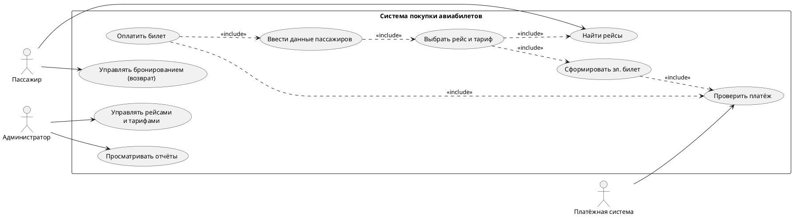

# Спецификация требований к программному обеспечению (SRS)

## Система покупки авиабилетов — тема 7 (вариант 7)

> Документ выполнен по критериям п. 3.5 «Самостоятельная работа»:
> (1) идентификация стейкхолдеров, (2) вопросы для сбора информации, (3) анализ и классификация требований, (4) сценарии для наблюдения за пользовательским поведением, (5) сценарии использования Use Cases.
>
> Структура соответствует SRS по IEEE 830 (прил. Ж): 1 — Введение, 2 — Общее описание, 3 — Специфические требования, 4 — Приложения.
>
> Трудоёмкость: 4 ак. часа (практика — 2, СРС — 2).

## 1. Введение

### 1.1 Назначение документа

Настоящий документ определяет функциональные и нефункциональные требования к «Системе покупки авиабилетов». Документ предназначен для:

- **заказчика** — согласование объёма, приоритетов и бюджета;
- **команды разработки** — основа для проектирования и оценки трудоёмкости;
- **тестировщиков** — основа тест-плана и критериев приёмки;
- **администраторов** — эксплуатационные требования.

### 1.2 Назначение и область действия системы

Система — веб-приложение с адаптивным мобильным интерфейсом, позволяющее пассажирам искать авиарейсы, сравнивать тарифы, оформлять и оплачивать билеты, получать маршрутные квитанции и управлять бронированиями.

**В области действия:**

- поиск рейсов и сравнение тарифов;
- регистрация, авторизация и личный кабинет пассажира;
- оформление, оплата и бронирование билетов (интеграция с GDS/авиакомпаниями), включая сверку платежей и автоматический возврат при сбое создания брони (reconciliation);
- формирование и доставка маршрутной квитанции (PDF);
- возврат/обмен билетов по правилам тарифа;
- уведомления об изменении статуса рейса;
- административная панель: управление рейсами, тарифами, акциями и отчётность.

**Вне области действия (первый релиз):** онлайн-регистрация на рейс (check-in), работа с багажом и грузами, кассы аэропортов, программы лояльности авиакомпаний, подбор отелей.

### 1.3 Определения и сокращения

| Термин               | Определение                                                                           |
| -------------------- | ------------------------------------------------------------------------------------- |
| SRS                  | Software Requirements Specification — спецификация требований к ПО                    |
| FR                   | Functional Requirement — функциональное требование                                    |
| NFR                  | Non-Functional Requirement — нефункциональное требование                              |
| Стейкхолдер          | Заинтересованное лицо, которое может влиять на систему или зависеть от неё            |
| PNR                  | Passenger Name Record — код бронирования пассажира                                    |
| GDS                  | Global Distribution System — глобальная система бронирования (Amadeus, Sabre и т. п.) |
| MoSCoW               | Метод приоритизации: Must / Should / Could / Won't                                    |
| Маршрутная квитанция | Электронный документ, подтверждающий покупку билета (PDF)                             |
| 3-D Secure           | Протокол подтверждения платёжных операций владельцем карты                            |
| ЛК                   | Личный кабинет пользователя                                                           |
| Одновременный пользователь | Пользователь с активной сессией, отправляющий ≥ 1 запрос к системе за 30 с (нагрузка измеряется в RPS) |
| Reconciliation (сверка) | Автоматическая сверка платежей и бронирований: обработка случаев «деньги списаны, бронь не создана» |

## 2. Общее описание (функции продукта)

**Контекст системы.** Пассажир через веб-интерфейс ищет рейсы и оформляет билеты. Система взаимодействует с: платёжным шлюзом (оплата, 3-D Secure), системами авиакомпаний/GDS (расписание, тарифы, бронирование), службой уведомлений (e-mail, SMS). Администратор управляет каталогом рейсов/тарифов и отчётностью.

**Основные функции продукта:**

1. Поиск и фильтрация рейсов;
2. Сравнение тарифов;
3. Регистрация/авторизация и личный кабинет;
4. Оформление билета и ввод данных пассажиров;
5. Онлайн-оплата и создание брони (PNR), включая обработку сбоев — сверку платежей и автоматический возврат (reconciliation);
6. Доставка маршрутной квитанции и уведомлений;
7. Возврат/обмен билетов;
8. Управление каталогом и отчёты (администратор).

**Ограничения:** первый релиз — только веб (адаптивный); оплата картами МИР/Visa/MasterCard и СБП; соответствие 152-ФЗ (персональные данные) и PCI DSS (платежи); языки интерфейса — русский и английский.

## 3. Специфические требования

_Раздел соответствует пяти пунктам самостоятельной работы (п. 3.5.1–3.5.5)._

### 3.1 Идентификация стейкхолдеров (п. 3.5.1)

| №   | Стейкхолдер                                                 | Тип                 | Интересы / влияние на систему                                                          |
| --- | ----------------------------------------------------------- | ------------------- | -------------------------------------------------------------------------------------- |
| 1   | Пассажиры (покупатели билетов)                              | Первичный           | Быстрый поиск, прозрачная итоговая цена, удобная оплата, быстрое получение билета      |
| 2   | Заказчик (владелец сервиса)                                 | Первичный           | Бюджет, сроки, ROI, рост конверсии и объёма продаж                                     |
| 3   | Авиакомпании / GDS                                          | Внешний (вторичный) | Актуальность расписаний и тарифов, корректные бронирования, соблюдение правил возврата |
| 4   | Платёжные провайдеры и банки                                | Внешний (вторичный) | Безопасность транзакций, соответствие PCI DSS, 3-D Secure, снижение доли отказов       |
| 5   | Администраторы системы                                      | Вторичный           | Надёжность, мониторинг, удобные инструменты управления каталогом                       |
| 6   | Служба поддержки                                            | Вторичный           | Инструменты поиска брони, история операций, быстрые шаблоны ответов                    |
| 7   | Разработчики и тестировщики                                 | Вторичный           | Ясность, однозначность и измеримость требований                                        |
| 8   | Регуляторы (Росавиация, ФАС, операторы персональных данных) | Внешний             | Соблюдение законодательства, прозрачность отображения цен, защита данных (152-ФЗ)      |

**Вывод:** помимо «очевидных» (пассажир, заказчик), проанализированы пропускаемые группы — внешние системы (платёжные, GDS), поддержка и регуляторы; их интересы учтены в нефункциональных требованиях (NFR-004, NFR-005).

### 3.2 Вопросы для сбора информации (п. 3.5.2)

**Блок 1. Заказчику (бизнес-цели):**

1. Какие показатели успеха (KPI) важны: конверсия, средний чек, доля повторных покупок?
2. Какие авиакомпании и GDS должны поддерживаться на старте?
3. Каковы прогнозные нагрузки (поисков в сутки, покупок в сутки)?
4. Каковы бюджет и сроки первого релиза?

**Блок 2. Пассажирам (пользователям):** 5. Что важнее при выборе билета: цена, время вылета, авиакомпания, число пересадок? 6. Какие данные и шаги оформления кажутся лишними или непонятными? 7. На каком устройстве чаще покупаете билет: телефон или компьютер? 8. Были ли проблемы с возвратом или изменением билета? Опишите сценарий.

**Блок 3. Платежи и безопасность:** 9. Какие способы оплаты обязательны (карты, СБП, рассрочка)? 10. Нужно ли хранить карты пользователя (токенизация) для быстрой повторной оплаты? _Решение зафиксировано в NFR-004: данные карты в системе не хранятся — используется токенизация платёжного шлюза._ 11. Когда запрашивать подтверждение 3-D Secure: всегда или по оценке риска?

**Блок 4. Администраторам и поддержке:** 12. Какие отчёты нужны и в каком виде (выручка, конверсия, отказы платежей)? 13. Как часто меняются тарифы и акции? Кто управляет каталогом? 14. Какой уровень поддержки и мониторинга (SLA) ожидается?

**Блок 5. Ограничения (нефункциональные требования):** 15. Какая допустимая недоступность сервиса (uptime) и время восстановления после сбоя? 16. Какие нормы законодательства критичны (152-ФЗ, PCI DSS, правила отображения полной цены)?

### 3.3 Анализ и классификация требований (п. 3.5.3)

**Методика.** Источники требований: интервью (вопросы п. 3.2), наблюдение за пользователями (сценарии п. 3.4), анализ аналогичных сервисов. Далее требования:

1. классифицированы на **функциональные** (что система делает) и **нефункциональные** (качества системы: производительность, надёжность, безопасность, масштабируемость);
2. проверены на **измеримость** (устранены расплывчатые формулировки);
3. приоритизированы по методу **MoSCoW**.

**Функциональные требования:**

| ID     | Требование                                                                                                                                                   | Приоритет (MoSCoW) |
| ------ | ------------------------------------------------------------------------------------------------------------------------------------------------------------ | ------------------ |
| FR-001 | Система должна выполнять поиск рейсов по параметрам: город вылета/прилёта, даты (включая «±3 дня»), число пассажиров, класс обслуживания                     | Must               |
| FR-002 | Система должна отображать результаты поиска: цена, время вылета/прилёта, длительность, число пересадок, авиакомпания                                         | Must               |
| FR-003 | Система должна выполнять сортировку и фильтрацию результатов (цена, время, длительность, пересадки, авиакомпания)                                            | Should             |
| FR-004 | Система должна отображать детали рейса и доступные тарифы с атрибутами (багаж, возвратность, обмен)                                                          | Must               |
| FR-005 | Система должна обеспечивать регистрацию, авторизацию и восстановление пароля по e-mail                                                                       | Must               |
| FR-006 | Система должна собирать данные пассажиров (ФИО, тип и номер документа, дата рождения, телефон, e-mail) с валидацией полей                                    | Must               |
| FR-007 | Система должна рассчитывать и отображать итоговую стоимость (тариф + сборы) до подтверждения оплаты                                                          | Must               |
| FR-008 | Система должна проводить оплату через платёжный шлюз с подтверждением 3-D Secure и отображать статус платежа                                                 | Must               |
| FR-009 | После подтверждения оплаты система должна создавать бронирование (PNR) в GDS/системе авиакомпании ≤ 1 мин                                                    | Must               |
| FR-010 | Система должна формировать маршрутную квитанцию (PDF) и доставлять её на e-mail и в ЛК ≤ 1 мин после оплаты                                                  | Must               |
| FR-011 | Система должна отправлять уведомления об изменении статуса рейса (e-mail/SMS) ≤ 5 мин после события                                                          | Should             |
| FR-012 | Система должна поддерживать отмену бронирования и возврат средств по правилам тарифа с расчётом удержаний, а также обмен билета на другой рейс/дату по правилам тарифа | Should             |
| FR-013 | Система должна хранить историю бронирований и позволять повторное скачивание документов                                                                      | Should             |
| FR-014 | Администратор должен создавать/редактировать рейсы, тарифы и акции; изменения доступны пользователям ≤ 1 мин                                                 | Must               |
| FR-015 | Администратор должен формировать отчёты по продажам за период (количество билетов, выручка, средний чек, конверсия, доля отказов платежей) с экспортом в CSV | Could              |
| FR-016 | Система должна вести журнал аудита всех операций с бронированиями (кто, когда, что изменил)                                                                  | Should             |
| FR-017 | При успешном списании средств, если бронирование (PNR) не создано (сбой GDS/недоступность), система должна автоматически повторять создание PNR; если PNR не создан ≤ 15 мин — выполнить автоматический возврат полной суммы ≤ 24 ч, уведомить пассажира (e-mail/SMS/ЛК) и зафиксировать операцию в журнале сверки (reconciliation) | Must               |
| FR-018 | Если создание PNR (FR-009) или доставка маршрутной квитанции (FR-010) не завершены за 1 мин, система должна отображать статус «обрабатывается» с ожидаемым сроком и уведомить пассажира в ЛК/e-mail по факту завершения; при незавершении > 15 мин — автоматически создать обращение в службу поддержки | Should             |

**Нефункциональные требования:**

| ID      | Категория          | Требование (измеримый критерий)                                                                            |
| ------- | ------------------ | ---------------------------------------------------------------------------------------------------------- |
| NFR-001 | Производительность | Отклик страниц сервиса ≤ 500 мс (P95) при штатной нагрузке                                                 |
| NFR-002 | Производительность | Поиск рейсов с обращением к внешним системам ≤ 3 с (P95)                                                   |
| NFR-003 | Надёжность         | Uptime ≥ 99,5% в месяц (простой ≤ 3,6 ч/мес)                                                               |
| NFR-004 | Безопасность       | Соответствие PCI DSS (целевая форма — SAQ A): данные карты (PAN, CVC/CVV) в системе не хранятся, оплата — через токены платёжного шлюза; шифрование каналов TLS 1.2+, хранение чувствительных данных — AES-256 |
| NFR-005 | Безопасность       | Обработка персональных данных в соответствии с 152-ФЗ; получение согласия пользователя при регистрации     |
| NFR-006 | Масштабируемость   | ≥ 10 000 одновременных пользователей (одновременный — пользователь с активной сессией, ≥ 1 запрос за 30 с; целевой профиль нагрузки: 100 RPS на поиск, 300 RPS суммарно); горизонтальное масштабирование без остановки сервиса |
| NFR-007 | Отказоустойчивость | Резервное копирование БД каждые 15 мин; RPO ≤ 15 мин, RTO ≤ 1 ч                                            |
| NFR-008 | Юзабилити          | Оформление билета — не более 5 шагов от выбора рейса до оплаты; адаптивная вёрстка для мобильных устройств |
| NFR-009 | Совместимость      | Браузеры Chrome/Firefox/Safari/Edge (2 последние версии); языки интерфейса RU/EN                           |
| NFR-010 | Сопровождаемость   | Автотестами покрыто ≥ 70% критической бизнес-логики; мониторинг доступности и времени отклика              |

**User Stories (примеры):**

| ID   | User Story                                                                                           | Связь                 |
| ---- | ---------------------------------------------------------------------------------------------------- | --------------------- |
| US-1 | «Как пассажир, я хочу искать рейсы по направлению и датам, чтобы быстро найти подходящий вариант»    | FR-001, FR-002, UC-01 |
| US-2 | «Как пассажир, я хочу видеть итоговую цену со сборами до оплаты, чтобы избежать скрытых платежей»    | FR-007, UC-02         |
| US-3 | «Как пассажир, я хочу получать маршрутную квитанцию на e-mail, чтобы предъявить её при посадке»      | FR-009, FR-010, UC-02 |
| US-4 | «Как пассажир, я хочу вернуть билет по правилам тарифа, чтобы не потерять деньги при отмене поездки» | FR-012, FR-013, UC-03 |
| US-5 | «Как администратор, я хочу видеть отчёты по продажам, чтобы контролировать выручку и конверсию»      | FR-015, UC-05         |

**Итог приоритизации MoSCoW:**

- **Must have:** FR-001, FR-002, FR-004–FR-010, FR-014, FR-017 — без них релиз невозможен (поиск, покупка, оплата, документы, управление каталогом, сверка/автозврат при сбое);
- **Should have:** FR-003, FR-011–FR-013, FR-016, FR-018 — важны, но не блокируют первый релиз;
- **Could have:** FR-015 — желательно (расширенная аналитика);
- **Won't have (этот релиз):** онлайн-регистрация (check-in), программы лояльности, подбор отелей.

### 3.4 Сценарии для наблюдения за пользовательским поведением (п. 3.5.4)

**Цель наблюдения:** выявить реальное (а не декларируемое) поведение пользователей и скрытые требования к процессу покупки билетов.

**Метод 1 — полевое «теневое» наблюдение (контекстное интервью):**

- Участники: 5 респондентов, покупавших авиабилеты за последние 6 месяцев.
- Условия: привычное устройство и место респондента, реальная задача.
- Задание: «Найдите и купите билет Москва — Казань на ближайшую пятницу для 2 взрослых пассажиров с багажом».
- Что фиксирует наблюдатель: последовательность шагов; используемые фильтры и сортировки; моменты сомнений и возвраты назад; вопросы респондента (например, «что такое возвратный тариф?»); время от начала до оплаты; прерванные («брошенные») шаги.
- Результат: список «болевых точек» → кандидаты в требования (например: «показывать цену сразу с багажом», «не требовать регистрацию до момента оплаты»).

**Метод 2 — юзабилити-тест прототипа (лабораторное наблюдение):**

| №   | Задание                                               | Целевое время |
| --- | ----------------------------------------------------- | ------------- |
| 1   | Найти самый дешёвый прямой рейс на заданную дату      | ≤ 60 с        |
| 2   | Оформить билеты на 2 пассажиров с багажом             | ≤ 3 мин       |
| 3   | Оплатить билет тестовой картой                        | ≤ 2 мин       |
| 4   | Найти купленный билет в личном кабинете и скачать PDF | ≤ 30 с        |
| 5   | Отменить бронирование и увидеть сумму возврата        | ≤ 2 мин       |

**Общие критерии сессии:** успешность выполнения заданий ≥ 90%; средняя субъективная оценка сложности заданий ≥ 4/5; опросник SUS ≥ 80 баллов.

**Шаблон протокола наблюдения:** участник и дата; время начала/конца задания; путь кликов; ошибки и возвраты; комментарии участника; оценка сложности (1–5); предложения участника.

### 3.5 Сценарии использования Use Cases (п. 3.5.5)

**Актёры:**

- **Пассажир** — основной пользователь: ищет рейсы, оформляет и оплачивает билеты, управляет бронированиями;
- **Администратор** — управляет рейсами, тарифами, акциями и отчётами;
- **Платёжная система** — внешняя система: подтверждает оплату;
- **Система авиакомпании/GDS** — внешняя система: расписание, тарифы, создание брони.

**Use Case диаграмма (PlantUML):**

**Рисунок 1 — Use Case Diagram: Система покупки авиабилетов.**

Диаграмма вариантов использования описывает функциональность системы покупки авиабилетов с двумя основными типами актёров: пассажир может найти рейсы, выбрать рейс и тариф, ввести данные пассажиров, оплатить билет и управлять бронированием; администратор управляет рейсами, тарифами и просматривает отчёты; платёжная система как внешний актёр подтверждает оплату. Связи <<include>>: UC3 включает UC2; UC2 — UC1 и UC6; UC4 — UC3 и UC5; UC6 — UC5. Таким образом, оформление билета включает ввод данных, оплату, проверку платежа и формирование электронного билета. Управление бронированием (UC7) выполняется пассажиром напрямую и формирование билета не включает — возврат не порождает выпуск нового билета.

**UC-01 «Поиск рейсов»**

- Актёр: Пассажир. Требования: FR-001, FR-002, FR-003.
- Предусловие: доступна главная страница.
- Основной поток: 1) вводит направление и даты; 2) выбирает число пассажиров и класс; 3) нажимает «Найти»; 4) система выводит список рейсов; 5) применяет фильтры/сортировку (при необходимости).
- Альтернативный поток 4а: рейсов нет — сообщение «Ничего не найдено» и предложения соседних дат.
- Альтернативный поток 4б: внешний сервис недоступен — сообщение об ошибке, авто-повтор через 30 с.
- Постусловие: список рейсов отображён.

**UC-02 «Оформление и оплата билета»**

- Актёры: Пассажир, Платёжная система. Требования: FR-005–FR-010, FR-017, FR-018.
- Предусловие: рейс и тариф выбраны; пользователь авторизован (или регистрируется по ходу).
- Основной поток: 1) выбор тарифа; 2) ввод данных пассажиров с валидацией (FR-006); 3) отображение итоговой стоимости (FR-007); 4) подтверждение заказа; 5) оплата через шлюз с 3-D Secure (FR-008); 6) создание PNR (FR-009); 7) формирование маршрутной квитанции и отправка на e-mail и в ЛК (FR-010).
- Альтернативные потоки: 5а — платёж отклонён: повторный ввод карты или другой способ, бронь удерживается 10 мин; 5б — таймаут шлюза: статус «ожидает подтверждения», фоновая проверка статуса каждые 30 с; 2а — ошибка валидации: подсветка поля и подсказка; 6а — оплата прошла, но PNR не создан (сбой GDS): статус «платёж принят, бронирование подтверждается», авто-повтор создания PNR, при неуспехе ≤ 15 мин — автоматический возврат полной суммы ≤ 24 ч и уведомление пассажира (FR-017); 7а — PNR или квитанция не готовы за 1 мин: статус «обрабатывается» с ожидаемым сроком, уведомление по факту готовности, > 15 мин — автообращение в поддержку (FR-018).
- Постусловие: бронирование в статусе «оплачено» и документ доставлен — либо средства полностью возвращены пассажиру (FR-017).

**UC-03 «Возврат билета»**

- Актёр: Пассажир. Требования: FR-012, FR-013.
- Предусловие: бронь в статусе «оплачено»; тариф допускает возврат.
- Основной поток: 1) в ЛК выбирает бронь; 2) нажимает «Вернуть билет»; 3) система показывает правила тарифа и сумму удержаний; 4) пользователь подтверждает; 5) возврат средств на карту ≤ 10 рабочих дней.
- Альтернативный поток: тариф невозвратный — денежный возврат недоступен, предлагается обмен билета на другой рейс/дату по правилам тарифа (FR-012); «кредиты»/бонусные счета не применяются (вне области действия первого релиза).
- Постусловие: бронь отменена, заявка на возврат создана.

**UC-04 «Управление рейсами и тарифами»**

- Актёр: Администратор. Требования: FR-014.
- Предусловие: администратор авторизован с ролью «администратор».
- Основной поток: 1) вход в админ-панель; 2) создание/редактирование рейса; 3) установка тарифов и акций; 4) публикация — изменения доступны пользователям ≤ 1 мин.
- Альтернативный поток: конфликт расписания — предупреждение и запрет сохранения до устранения.
- Постусловие: каталог обновлён.

**UC-05 «Просмотр отчётов»**

- Актёр: Администратор. Требования: FR-015.
- Основной поток: 1) выбор периода и типа отчёта; 2) формирование отчёта ≤ 30 с; 3) экспорт в CSV.
- Постусловие: отчёт отображён/выгружен.

**UC-06 «Уведомление об изменении рейса»**

- Актёр: Система (автоматический сценарий). Требования: FR-011.
- Основной поток: при получении события об изменении рейса от GDS система отправляет e-mail/SMS всем затронутым пассажирам ≤ 5 мин.
- Постусловие: уведомления отправлены, факт зафиксирован в журнале.

## 4. Приложения

### Приложение А. Трассировка требований

| User Story | Use Case | Функциональные требования |
| ---------- | -------- | ------------------------- |
| US-1       | UC-01    | FR-001, FR-002, FR-003    |
| US-2       | UC-02    | FR-007                    |
| US-3       | UC-02    | FR-009, FR-010            |
| US-4       | UC-03    | FR-012, FR-013            |
| US-5       | UC-05    | FR-015                    |

### Приложение Б. Критерии приёмки (подготовка к тестированию по разделу 3)

| №   | Тестовая проверка                            | Ожидаемый результат                                                           |
| --- | -------------------------------------------- | ----------------------------------------------------------------------------- |
| 1   | Поиск по несуществующему направлению         | Сообщение «Ничего не найдено» ≤ 1 с; отсутствует ошибка 500                   |
| 2   | Оплата картой-заглушкой с отказом            | Бронь в статусе «ожидает оплаты»; повторная попытка доступна в течение 10 мин |
| 3   | Некорректный номер документа                 | Поле подсвечено, понятный текст ошибки на русском                             |
| 4   | Покупка 2 билетов на один рейс               | Оба пассажира в одной брони; итоговая стоимость = 2 × тариф                   |
| 5   | Возврат по невозвратному тарифу              | Система показывает правила тарифа; денежный возврат недоступен, предлагается обмен (FR-012) |
| 6   | Изменение статуса рейса (задержка)           | Уведомление пассажиру ≤ 5 мин после события                                   |
| 7   | Нагрузка: 10 000 одновременных пользователей (профиль 100 RPS на поиск — см. NFR-006) | Поиск ≤ 3 с (P95), страницы ≤ 500 мс (P95); отсутствуют ошибки 5xx |
| 8   | Откат системы после сбоя                     | Восстановление ≤ 1 ч (RTO); потери данных ≤ 15 мин (RPO)                      |
| 9   | Списание прошло, бронь (PNR) не создана (сбой GDS) | Статус «платёж принят, бронирование подтверждается»; авто-повтор PNR; если не создан ≤ 15 мин — автозврат полной суммы ≤ 24 ч; пассажир уведомлён (FR-017) |
| 10  | PNR или квитанция не готовы > 1 мин          | Статус «обрабатывается» с ожидаемым сроком; уведомление по готовности; > 15 мин — автообращение в поддержку (FR-018) |
| 11  | Проверка хранения платёжных данных           | PAN/CVC в БД и логах отсутствуют; передаётся только токен шлюза (NFR-004)     |

### Приложение В. Контроль типичных ошибок (по методическим указаниям п. 3.2)

| Типичная ошибка          | Как устранена в документе                                                                   |
| ------------------------ | ------------------------------------------------------------------------------------------- |
| Расплывчатые требования  | Все FR/NFR измеримы: время отклика (мс), uptime (%), число шагов, сроки доставки документов |
| Пропущенные стейкхолдеры | Проанализированы 8 групп, включая внешние системы (платёжные, GDS) и регуляторов (п. 3.1)   |
| Отсутствие приоритизации | Каждое FR имеет приоритет MoSCoW, итоговая сводка приведена в п. 3.3                        |
| Пропущенные негативные сценарии | Описан сбой GDS после успешной оплаты (сверка/автозврат — FR-017), поведение при нарушении SLA (FR-018), запрет хранения данных карты (NFR-004) |

---

_Документ готов к сдаче и тестированию по разделу 3._
